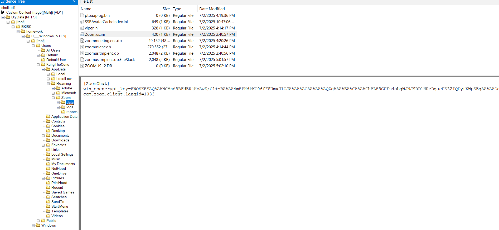
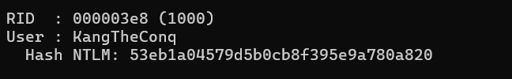
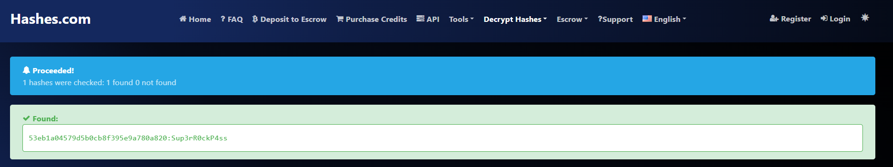
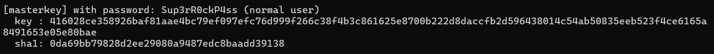
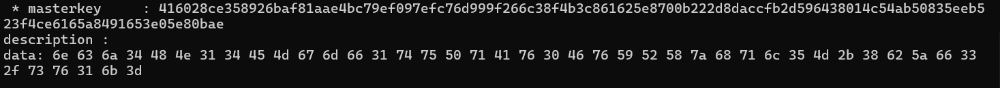
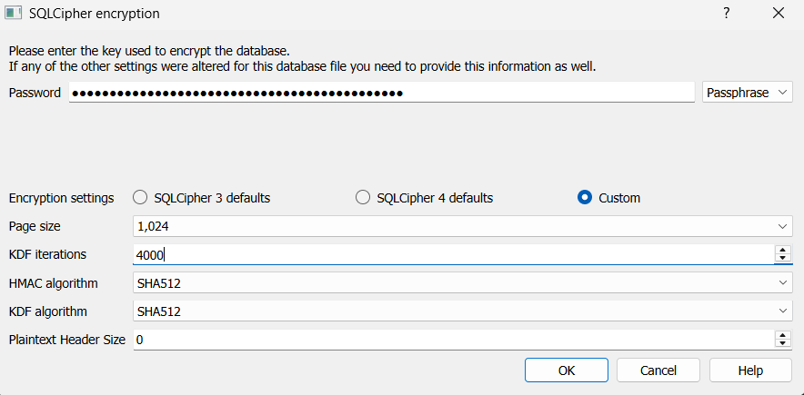
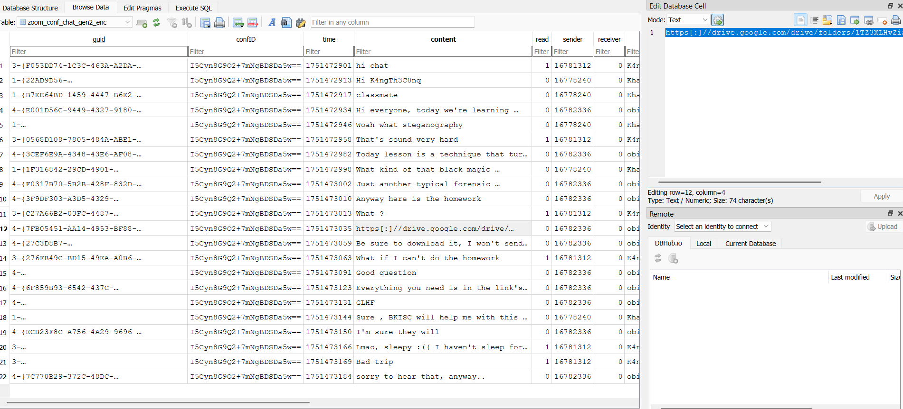
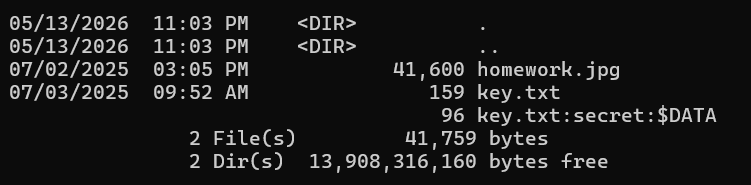
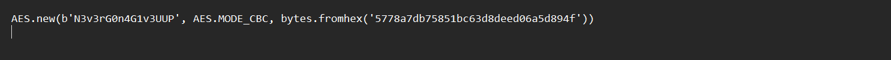
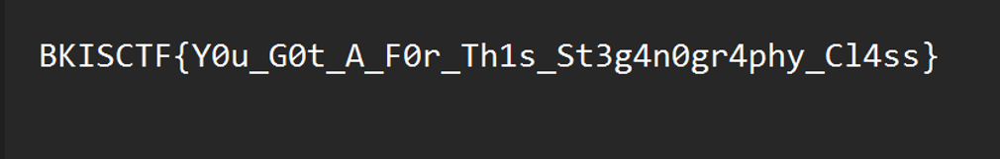

## Homework
### Đề bài
My friend and I were sleeping in our online class, when the session ended in group chat our teacher said the deadline is tomorrow, but we don't know what it is. Can you help us ?

Flag format is BKISC{}

### Giải
Sau khi tải về `chall.ad1`, sử dụng FTKimage để điều tra. Do đề bài nhắc tới việc học online nên mình nghĩ đến kiểm tra phần mềm Zoom. Các database đều đã được mã hóa nên cần tìm cách giải mã. Tại file `Zoom.us.ini` thì thấy win_osencrypt_key là khóa chính dùng để mã hóa các database này


Để trích xuất khóa này thì cần chuyển thành DPAPI blob bằng cách cắt đi phần tiền tố riêng của Zoom là `ZWOSKEY` và lưu lại thành file `zoom_blob`

Để có thể giải mã khóa chính của Zoom thì cần biết mật khẩu của user. Thực hiện trích xuất các file `Window\System32\config\SYSTEM` và `Window\System32\config\SAM` và dùng mimikatz để lấy hash mật khẩu user và dùng [hashes.com](https://hashes.com/en/decrypt/hash) để tìm ra mật khẩu user
```
lsadump::sam /system:C:Window\System32\config\SYSTEM
/SAM:C:Window\System32\config\SAM
```



Bằng mật khẩu user thì có thể tìm được master key tại `C:\Users\xxx\AppData\Roaming\Microsoft\Protect\<SID>\` sử dụng mimikatz để trích xuất master key (ở đây có 2 master key đều hoạt động nhưng mình chỉ làm trên cái đầu tiên)
```
dpapi::masterkey /in:C:\Users\xxx\AppData\Roaming\Microsoft\Protect\S-1-5-21-2185385569-2550479847-782288727-1000\1d4f66e2-0ad9-4e0b-9f17-c526c4920624 /sid:S-1-5-21-2185385569-2550479847-782288727-1000 /password:Sup3rR0ckP4ss
```



Lấy masterkey này để decrypt blob thì được khóa chính của Zoom
```
dpapi::blob /in:C:zoom_blob /masterkey:416028ce358926baf81aae4bc79ef097efc76d999f266c38f4b3c861625e8700b222d8daccfb2d596438014c54ab50835eeb523f4ce6165a8491653e05e80bae
```

passphrase: **ncj4HN14EMgmf1tuPqAv0FvYRXzhql5M+8bZf3/sv1k=**

Mình thử mở khóa cả `zoomus.enc.db` và `zoommeeting.enc.db` thì tại `zoommeeting.enc.db` tìm được lịch sử chat trong buổi học online dẫn đến link drive bài tập




Tải file `homework.rar` từ Google Drive và giải nén bằng Winrar thì được `homework.jpg` và `key.txt`. Ảnh homework là ảnh rickroll còn `key.txt` thì chứa gợi ý cho bước tiếp theo


```
You have learnt magic in recent online course, the magic that turn a JPG to a PNG, find the key here and do the homework !!!
All you need is in this rar file.
```

Khi kiểm tra ADS thì tìm được luồng `key.txt:secret`, trích xuất luồng này thì tìm được hướng dẫn mã hóa AES


```
notepad key.txt:secret 
```


Mã hóa `homework.jpg` thì được ảnh `flag.png` chứa flag


FLAG: **BKISC{Y0u_G0t_A_F0r_Th1s_St3g4n0gr4phy_Cl4ss}**

