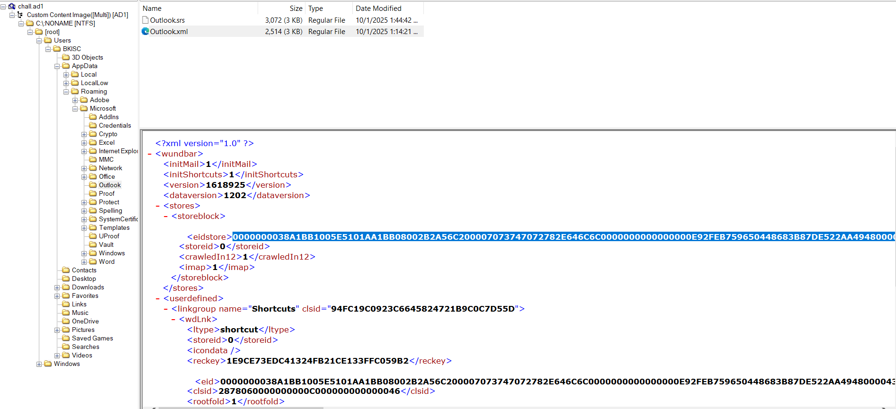
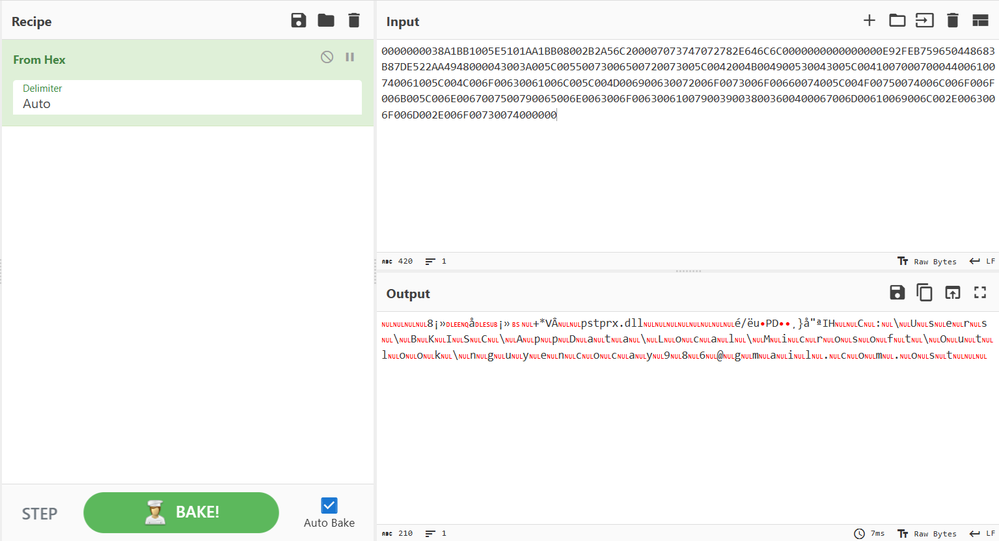
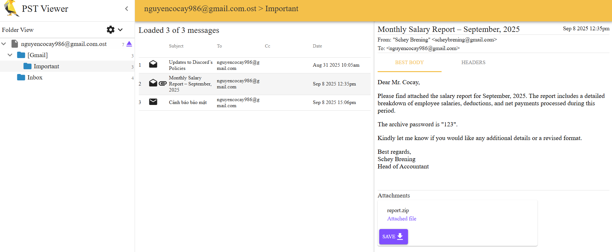
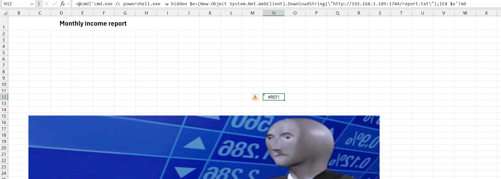
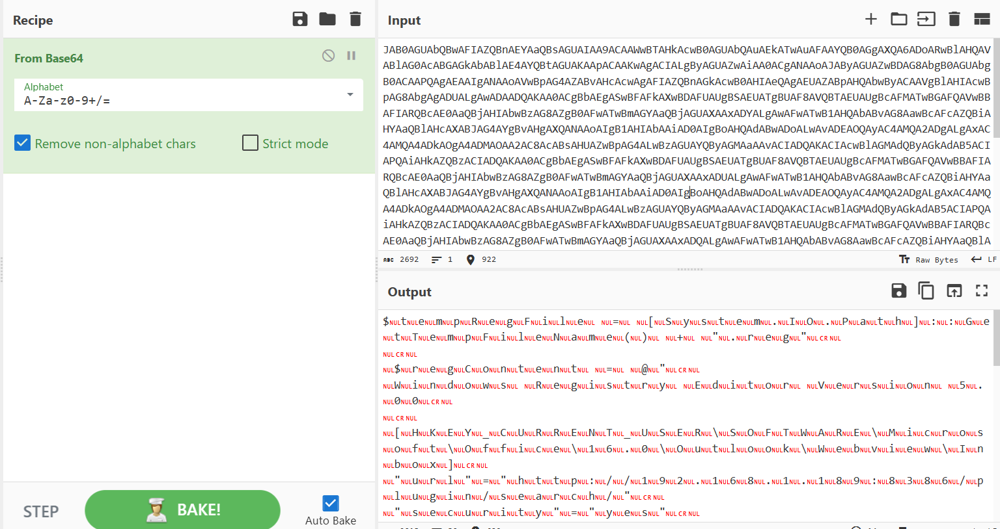
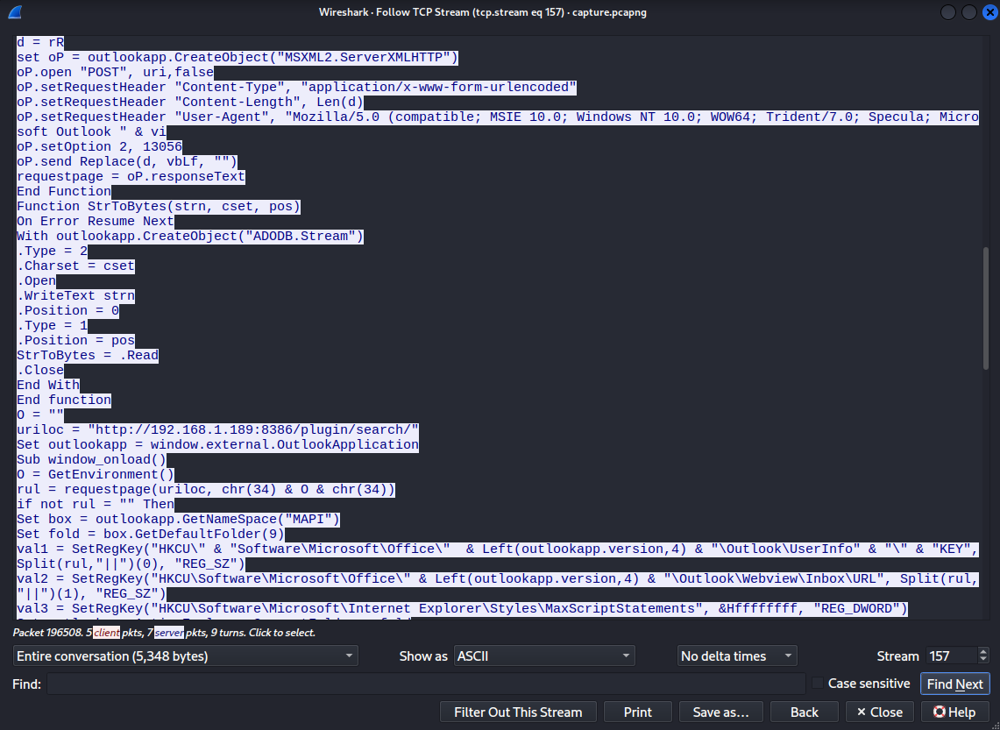
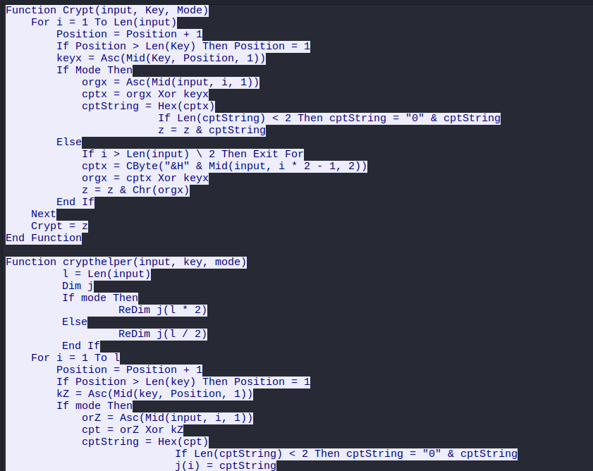
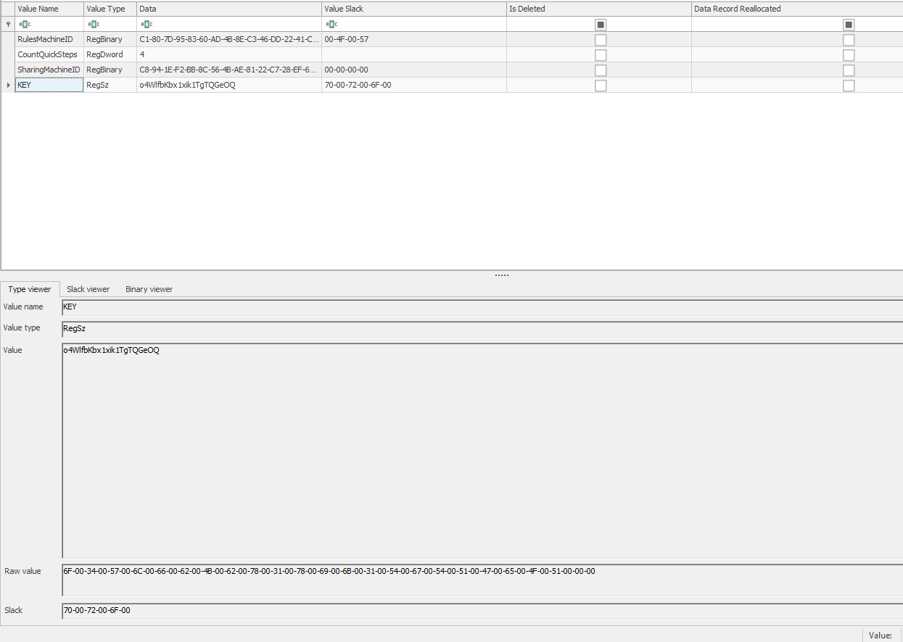

## Lookout
### Đề bài
While checking a monthly report sent by one of my employees, everything seemed ordinary. However, when I logged back in my mailbox the next day, something strange was happening on my computer

### Giải
Sau khi tải về thì được file `chall.ad1`, sử dụng FTKImager để mở file. Do đề bài nhắc đến việc nhận được báo cáo trước khi xảy ra sự cố nên tiến hành kiểm tra thư mục Outlook


Tại đây có thẻ `<eid>` lưu đường dẫn tuyệt đối tới file `.ost` dưới dạng hex

`C:\Users\BKISC\AppData\Local\Microsoft\Outlook\nguyencocay986@gmail.com.ost`


Di chuyển tới thư mục trên và extract file `nguyencocay986@gmail.com.ost`. Sử dụng công cụ `PST Viewer` thì có thể thấy được bản báo cáo mà người này nhận trước khi xảy ra sự cố. Tệp đính kèm là 1 file `.zip` mà bên trong chứa file excel `report.xlss`


File này không thể được giải nén nên mình tìm tiếp trong `chall.ad1` thì tìm được file này từ đường dẫn `C:\Users\BKISC\AppData\Roaming\Microsoft\Excel\report312080493576797376`. 

Trích xuất file excel này và mở ra thì tìm được ô chứa câu lệnh nằm sau tấm ảnh gọi đến `powershell.exe` để tải xuống `report.txt` từ ip và port `192.168.1.189:1704`



Mình có thử kiểm tra file Powershell nhưng không có gì, trong lúc tìm kiếm trong ổ đĩa thì có tìm được file `capture.pcapng` tại `C:\Users\BKISC\AppData\Desktop`.

Extract `capture.pcapng` và sử dụng wireshark để phân tích. Do câu lệnh phía trên tải xuống từ `192.168.1.189:1704` nên mình tìm và extract object http theo địa chỉ này thì có được file `report.txt`. Nội dung bên trong được mã hóa base64. Giải mã thì đoạn mã thực hiện thay đổi registry key bảo cho phép thiết lập chạy ActiveX không an toàn và khiến Outlook tải xuống trang web từ `192.168.1.189:8386`



Sử dụng wireshark filter `tcp.port == 8386`. Follow stream 157 thì thấy được nội dung trang html để khai thác Outlook Webview và VBScript. Nó thực hiện thu thập thông tin, mã hóa và gửi về máy chủ tấn công. Thiết lập kênh liên lạc C2 bằng `MSXML2.ServerXMLHTTP` để gửi dữ liệu thông qua phương thức `POST`. Thay đổi registry key: thêm khóa "KEY" trong `UserInfo` và cập nhật lại URL của `Webview\Inbox`



Follow stream 189 thì có những đoạn mã tải mã độc định kỳ và cơ chế thực thi lệnh từ xa. Thu thập giá trị của registry, thực hiện mã hóa XOR dữ liệu khi POST và GET. Cụ thể khi POST lên thì lấy dữ liệu XOR với "KEY" trong `UserInfo` đã thay đổi ở phía trên và chuyển thành hex



Quay lại `chall.ad1`, di chuyển đến `C:\Users\BKISC` để lấy file `NTUSER.DAT`, `ntuser.dat.LOG1` và `ntuser.dat.LOG2` để lấy registry key. Sử dụng RegistryExplorer để đọc giá trị "KEY": `o4WlfbKbx1xik1TgTQGeOQ`


Dịch nội dung POST từ hex rồi XOR với KEY thì tìm được script python sau. Chạy thì lấy được flag
```python
# Just run the code to get the flag lol

def RC4(key : bytes, plaintext : bytes):
    S = list(range(256))
    j = 0

    for i in range(256):
        j = (j + S[i] + key[i % len(key)]) % 256
        S[i], S[j] = S[j], S[i]  

    i = j = 0
    ciphertext = []
    for char in plaintext:
        i = (i + 1) % 256
        j = (j + S[i]) % 256
        S[i], S[j] = S[j], S[i]  
        t = (S[i] + S[j]) % 256
        k = S[t]
        ciphertext.append(char ^ k)

    return bytes(ciphertext)

key = b"lookalikechicken"
plaintext = b';fa\x98\xc9\x13\xc8\x89\xda\x04\xed\xb6\x19\x98\xfdgF-\x14S\xa8+\xf50\xc4p\xf90\xb2&j\x081'
print(RC4(key, plaintext).decode())
```

FLAG: **BKISC{l0oK_Ou7_f0R_0u71o0k_C2!!!}**