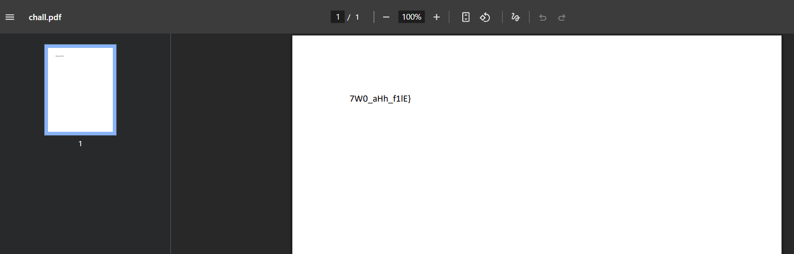
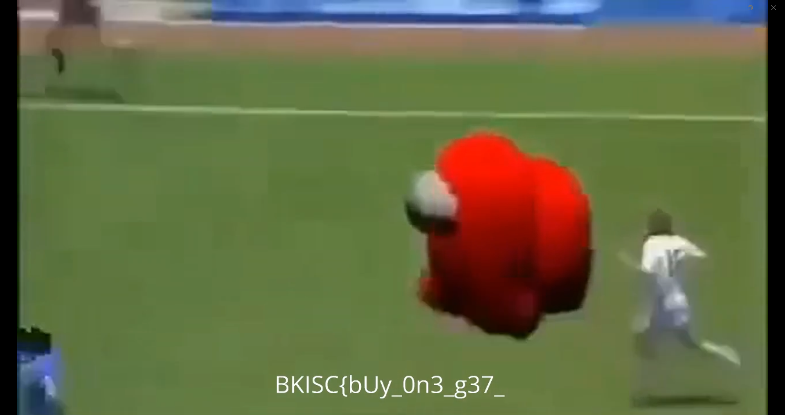

## Confusion
### Đề bài
Wdym you can "read" the image? "Play" the image too? Nah you capping bruh.

### Giải
Sau khi tải về được ảnh `chall.png`. Đề bài có nhắc tới read image và play image nên thực hiện kiểm tra hex thì thấy bên trong có header, footer của pdf và mp4. Thực hiện đổi extension thành ".pdf" và ".mp4" thì được 2 phần của flag

FLAG: **BKISC{bUy_0n3_g37_7W0_aHh_f1lE}**