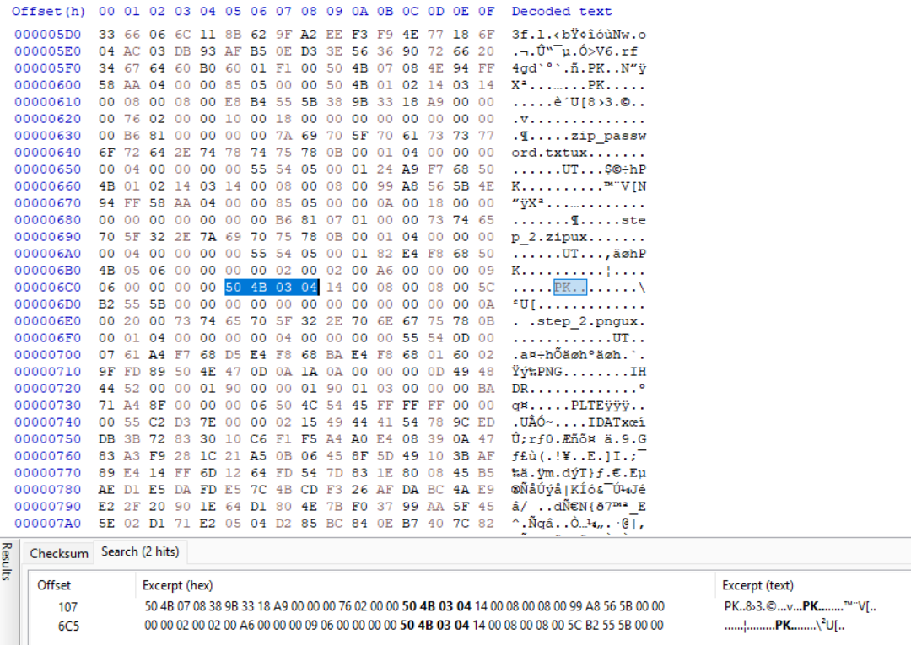
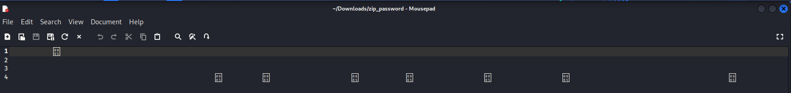
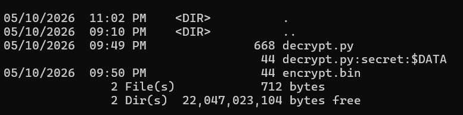

## Zopslop
### Đề bài
The flag is hidden inside the attachment.

### Giải
Sau khi tải về và giải nén thì được file `step_1.zip`. Thực hiện giải nén thì bên trong có QR dẫn đến youtube Rickroll. Thử sử dụng Hxd để xem hex thì thấy `step_1.zip` thực chất là 2 file zip được nối lại với nhau. Tách từ offset `0x6C5` thì được 2 file zip
 

file zip thứ 2 chứa QR của `step_1.zip`, giải nén file zip thứ nhất thì được `step_2.zip` và `zip_password.txt`. Khi thử giải nén bằng password này thì không được, kiểm tra thì thấy có những ký tự zerowidth, xóa đi những ký tự này thì được mật khẩu giải nén `step_2.zip` **Lưu ý: cần giải nén bằng winrar**

`super_duper_omega_very_secret_password_hehehehehehe_not_guessy_at_all_10957129085701395809137580139758013957813095713`

Giải nén ra được `step_3.zip` và `zip_password`. Bên trong chứa các ký tự trắng. Sử dụng poltergeist để decode thì được password giải nén `step_3.zip`

`white_space_encoding_is_not_that_guessy_right_or_is_it?_09178093762985078932p587892305873298057129851987513987`

Sau giải nén được script python `decrypt.py` dưới đây nhưng chưa thể chạy do thiếu "encrypt.bin".
```python
from cryptography.hazmat.primitives.ciphers import Cipher, algorithms, modes
from cryptography.hazmat.primitives import padding
from cryptography.hazmat.backends import default_backend
import base64

key = b"bkisctfisthebest"
iv = b"theremustbesmthg"

with open("encrypt.bin", "rb") as f:
    ciphertext = base64.urlsafe_b64decode(f.read())

cipher = Cipher(algorithms.AES(key), modes.CBC(iv), backend=default_backend())
decryptor = cipher.decryptor()
padded_plaintext = decryptor.update(ciphertext) + decryptor.finalize()
unpadder = padding.PKCS7(128).unpadder()
plaintext = unpadder.update(padded_plaintext) + unpadder.finalize()
print(plaintext)

```

Chạy cmd để xem Alternate Data Streams thì thấy có stream `secret` được đính kèm vào file `script.py`. Trích xuất dữ liệu từ luồng ẩn này re `encrypt.bin` và chạy script python thì được flag
```cmd
dir /r
expand decrypt.py:secret encrypt.bin
```


>[!Note] 
> Alternate Data Streams (ADS) là một tính năng đặc biệt của hệ thống tệp NTFS. Nó cho phép một file có thêm nhiều luồng dữ liệu khác bị ẩn đi

FLAG: **BKISC{h0w_d1d_y0u_gue55_1t?}**