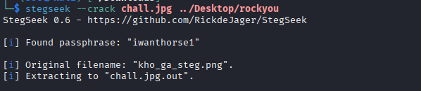
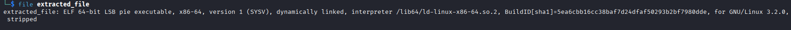

## Stegmaxxing
### Đề bài
Meme in the meme

### Giải
Sau khi tải về thì được ảnh `chall.jpg`. Sử dụng stegseek để bruteforce thì được ảnh `kho_ga.png`


Khi sử dụng exiftool trên ảnh mới này thì thấy comment `channel=g; n=3; M=7; bytes=84; digits=242` giống như hướng dẫn cho kỹ thuật ẩn tin EMD. Viết script để trích xuất dữ liệu
```python
from PIL import Image
import numpy as np

img = Image.open("chall.jpg.out").convert("RGB")
arr = np.array(img)

green_channel = arr[:, :, 1].flatten()

n = 3
m = 7
num_digits = 242
num_bytes = 84

digits = []
for i in range(0, num_digits * n, n):
    
    group = green_channel[i : i + n]
    
    weights = np.array([1, 2, 3])
    d = np.dot(group, weights) % m
    digits.append(d)

decimal_value = 0 
for d in digits:
    # Ép kiểu d sang int() của Python để tránh dùng numpy.int64
    decimal_value = decimal_value * 7 + int(d)

hex_val = hex(decimal_value)[2:]
if len(hex_val) % 2 != 0:
    hex_val = '0' + hex_val

try:
    decoded_bytes = bytes.fromhex(hex_val)
    # Lấy 84 bytes cuối
    print("Result:", decoded_bytes[-num_bytes:].decode('utf-8', errors='ignore'))
except Exception as e:
    print("Error decoding:", e)
```

Kết quả thu được là đường dẫn Google Drive `https://drive.google.com/drive/folders/1Cch5G0eNGiJu699OAW5-eszSstiHfSi3?usp=sharing` chứa file `stego.wav`. Tải file này về thì thấy đây là file âm thanh WAV định dạng stereo. Thử sử dụng kỹ thuật channel subtraction L - R bằng script dưới đây thì được file ELF
```python
import numpy as np
from scipy.io import wavfile

samplerate, data = wavfile.read('stego.wav')

left_channel = data[:, 0].astype(np.int32)
right_channel = data[:, 1].astype(np.int32)

diff = left_channel - right_channel

output_bytes = bytes([abs(b) % 256 for b in diff])

with open("extracted_file", "wb") as f:
    f.write(output_bytes)

print("Extract finished")
```


Sử dụng steg86 để extract thì có được flag
FLAG: **BKISC{y0u_ar3_a_g0d_st3g}**