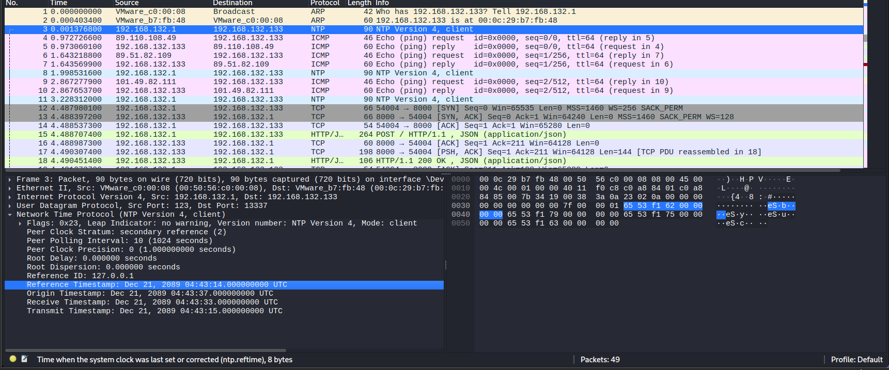

## Alright. Time Paradox
### Đề bài
To maintain a constant testing cycle, I simulate daylight at all hours and add adrenal vapor to your oxygen supply. So you may be confused about the passage of time. The point is, yesterday was your birthday. I thought you'd want to know.

*The pcap file contains a flag for each of the following challenges: "There will be cake", "Are you still there?", "Alright. Paradox time", and "Corrupted Cores".
If the flag you found doesn't work, then it most likely belongs to one of the other 3 challenges.
Hint: What protocol is associated with time?

### Giải
Sau khi tải về thì được file `GLaDOS_Network.pcapng`. Đề bài có gợi ý đến giao thức liên quan đến thời gian, ở đây là NTP

Có thể thấy các gói tin đến từ năm 2089, thời gian nhận còn trước cả thời gian gửi cho thấy phân timestamp này đã bị can thiệp. Giá trị thời gian này dưới dạng hex tạo thành các ký tự của flag `b` `y` `u` `c`. Ghép các ký tự lại thì được flag

FLAG: **byuctf{S0_My_P4r4d0x_!d34_D!dnt_W0rk}**

>[!Note] 
> Ý tưởng thực tế bài này có thể xem thêm [tại đây](https://github.com/evallen/ntpescape)