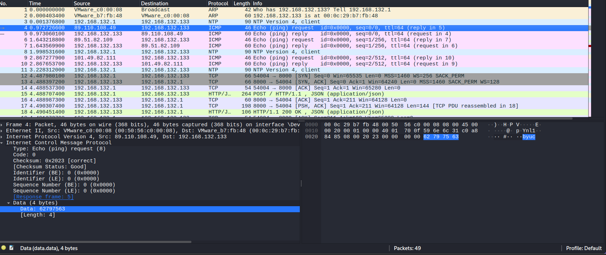

## Are You Still There?
### Đề bài
Forms FORM-55551-6: Personnel File Addendum Addendum:

One last thing:

Go ahead and leave me. I think I prefer to stay inside. Maybe you'll find someone else to help you. Maybe Black Mesa... THAT WAS A JOKE. HA HA. FAT CHANCE. Anyway, this cake is great. It's so delicious and moist. Look at me still talking when there's Science to do. When I look out there, it makes me GLaD I'm not you. I've experiments to run. There is research to be done. On the people who are still alive.

PS: And believe me I am still alive. PPS: I'm doing Science and I'm still alive. PPPS: I feel FANTASTIC and I'm still alive.

FINAL THOUGHT: While you're dying I'll be still alive.

FINAL THOUGHT PS: And when you're dead I will be still alive.

STILL ALIVE

Still alive.

*The pcap file contains a flag for each of the following challenges: "There will be cake", "Are you still there?", "Alright. Paradox time", and "Corrupted Cores".
If the flag you found doesn't work, then it most likely belongs to one of the other 3 challenges.
Hint: how would you remotely check if a server is online?

### Giải
Sau khi tải về thì được file `GLaDOS_Network.pcapng`. Đề bài có gợi ý đến việc kiểm tra server online/offline. Việc này có thể thực hiện thông qua các gói tin ICMP ping tới server

Có thể thấy 1 phần của flag `byuc` trong các gói tin request và reply, gép với nội dung của các gói tin ICMP còn lại thì được flag

FLAG: **byuctf{Turr3t_R3d3mpt!0n_L!n3s_4r3_N0t_R!d3s}**