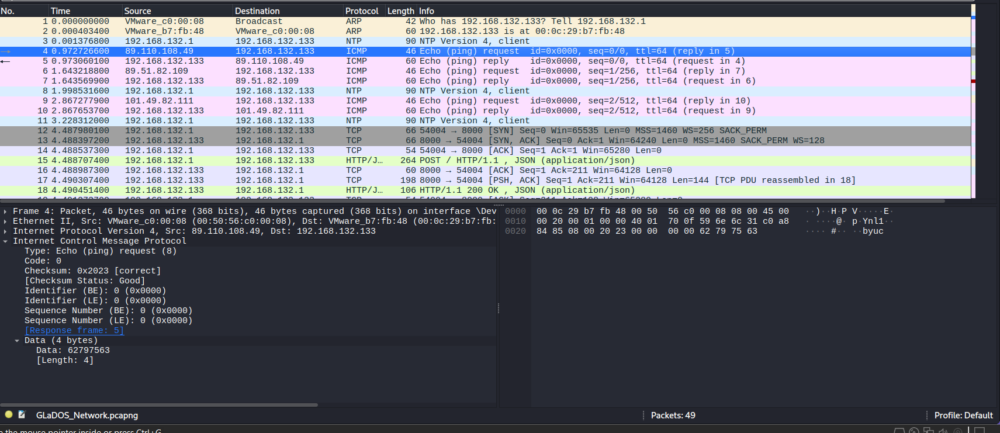

## Corrupted Cores
### Đề bài
"The scientists were always hanging cores on me to regulate my behavior. I've heard voices all my life. But now I hear the voice of a conscience, and it's terrifying, because for the first time it's my voice."

*The pcap file contains a flag for each of the following challenges: "There will be cake", "Are you still there?", "Alright. Paradox time", and "Corrupted Cores".
If the flag you found doesn't work, then it most likely belongs to one of the other 3 challenges.
Hint: the voices may not belong to a single identity Hint2: the arp packets are not part of this challenge.

### Giải
Sau khi tải về thì được file `GLaDOS_Network.pcapng`. Đề bài có gợi ý the voices không thuộc 1 thực thể duy nhất, khi xem lại các gói tin ICMP ping thì nhận thấy chúng có source IP khác nhau


Các octets trong địa chỉ source IP giống như đang biểu diễn các ký tự ASCII, thực hiện trích xuất và ghép lại thì được chuỗi flag được mã hóa base64

``` python
from scapy.all import rdpcap, ICMP, IP
import base64

packets = rdpcap("GLaDOS_Network.pcapng")


chars = []
for pkt in packets:
    if pkt.haslayer(ICMP) and pkt.haslayer(IP):
        if pkt[ICMP].type == 8:  # echo-request only
            src_ip = pkt[IP].src
            for octet in src_ip.split('.'):
                chars.append(chr(int(octet)))

b64_string = ''.join(chars)
decoded = base64.b64decode(b64_string + '==')
print("Flag:", decoded.decode(errors='ignore'))
```

FLAG: **byuctf{Th3_P4rt_Wh3r3_H3_K!lls_Y0u}**