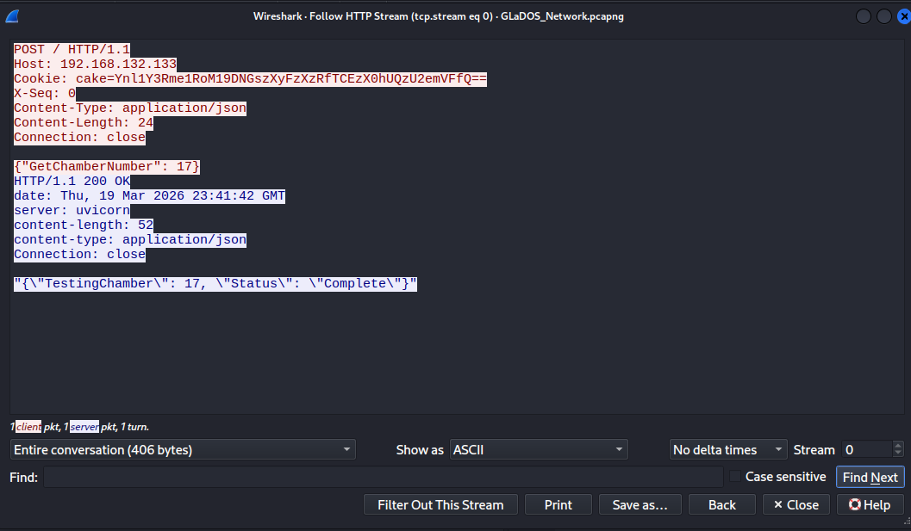

## There Will Be Cake
### Đề bài
The Enrichment Center is required to remind you that all test subject activity will be logged, analyzed, and stored for scientific purposes.

"Cake and grief counseling will be available at the conclusion of the test."

*The pcap file contains a flag for each of the following challenges: "There will be cake", "Are you still there?", "Alright. Paradox time", and "Corrupted Cores".
If the flag you found doesn't work, then it most likely belongs to one of the other 3 challenges.
Hint: what is a baked treat similar to a cake that you can find on almost any website?

### Giải
Sau khi tải về thì được file `GLaDOS_Network.pcapng`. Đề bài có nhắc đến cookie khi duyệt web, follow http thì tìm được cookie

Cookie ở đây là 1 đoạn base64, giải mã ra thì được flag

FLAG: **byuctf{Th3_C4k3_!s_4_L!3_HTC56zeE}** 