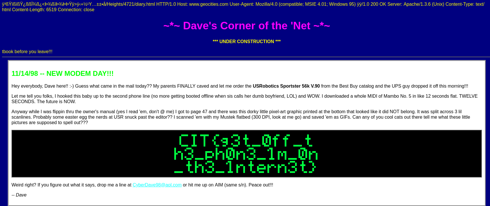

## Wiretap
### Đề bài
Ton, they're listening to the phones meet me down at the badabing.

### Giải
Sau khi tải về thì được file `beep_beep_boop.wav`
Sử dụng minimodem để trích xuất thì được 1 file `.html`
```
minimodem -a -f beep_beep_boop.wav 300 > flag.html
```

Mở file `.html` thì có được flag


FLAG: **CIT{g3T_0ff_th3_ph0n3_1m_0n_th3_1ntern3t}**