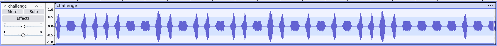

## Dog barking
### Đề bài
I recorded this audio at the dogpark the other day and I think the dogs were trying to tell me something???

### Giải
Sau khi tải về thì được file `challenge.wav`
Sử dụng Audocity mở ra thì thấy từng vạch biên độ theo các mốc 0.8, 0.7 và 2.5. Điều chế theo biên độ với 0.8 = ' ', 0.7 = 0 và 2.5 = 1 thì được chuỗi binary, dịch thì được flag

FLAG: **CIT{b4rking_up_th3_wr0ng_tr33}**