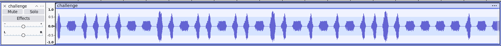

## Dog barking
### Đề bài
I recorded this audio at the dogpark the other day and I think the dogs were trying to tell me something???

### Giải
Sau khi tải về thì được file `challenge.wav`
Sử dụng Audocity mở ra thì thấy từng vạch biên độ theo các mốc 0.8, 0.7 và 2.5. Điều chế theo biên độ với 0.8 = ' ', 0.7 = 0 và 2.5 = 1 thì được chuỗi binary, dịch thì được flag

``` python
from scipy.io import wavfile
import numpy as np

sample_rate, samples = wavfile.read("challenge.wav")
if len(samples.shape) > 1:
    samples = samples[:, 0]

chunk_size = sample_rate // 100 # 10ms chunks
envelope = [np.max(np.abs(samples[i:i+chunk_size])) for i in range(0, len(samples), chunk_size)]
threshold = np.max(envelope) * 0.15
is_barking = [1 if e > threshold else 0 for e in envelope]

events = []
current_state = is_barking[0]
current_len = 0
for state in is_barking:
    if state == current_state:
        current_len += 1
    else:
        events.append((current_state, current_len))
        current_state = state
        current_len = 1
events.append((current_state, current_len))

words = []
current_pos = 0
for state, length in events:
    if state == 1:
        bark_samples = samples[current_pos * chunk_size : (current_pos + length) * chunk_size]
        w = np.fft.fft(bark_samples)
        freqs = np.fft.fftfreq(len(w))
        peak_freq = abs(freqs[np.argmax(np.abs(w))]) * sample_rate

        if peak_freq < 500:
            words.append("0")
        elif peak_freq > 550:
            words.append("1")
        else:
            words.append(" ")
    current_pos += length

binary = "".join(words)
flag = "".join(chr(int(b, 2)) for b in binary.split(" "))
print(flag)
```

FLAG: **CIT{b4rking_up_th3_wr0ng_tr33}**