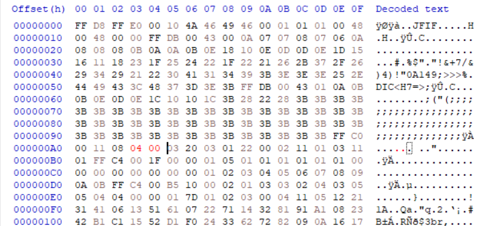
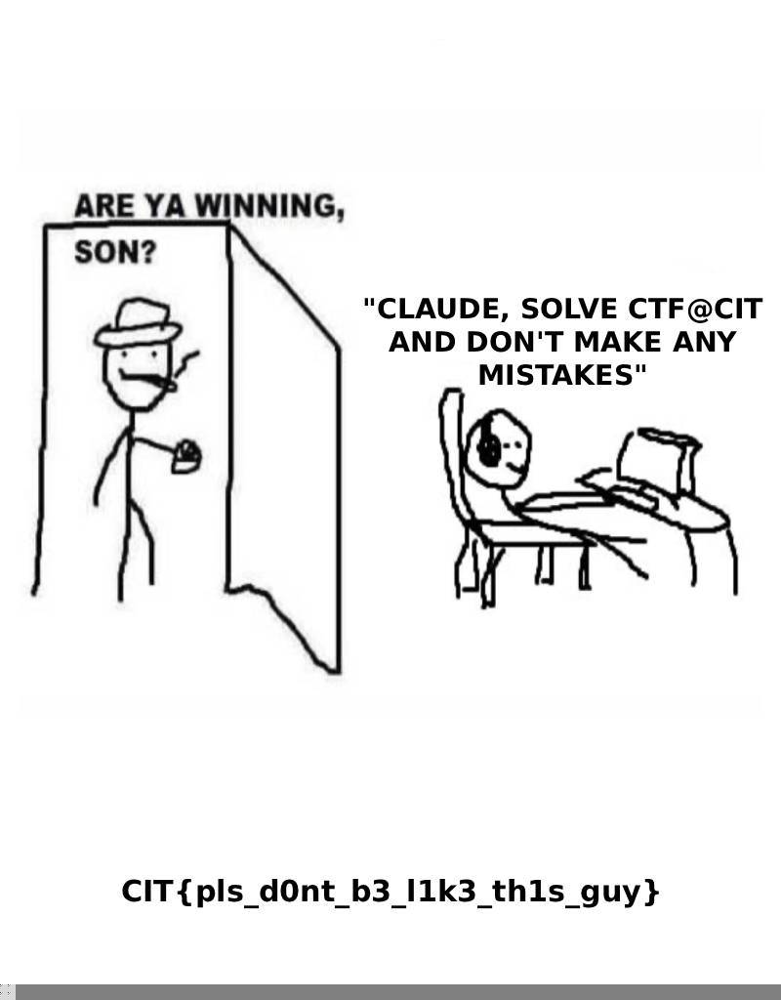

## Are ya wining, son?

Khi tải về được file ảnh `challenge.jpg`. Sử dụng các công cụ exiftool, binwalk, color planes, stegseek đều không thu được gì

Mình nghĩ đến kích cỡ thực tế của ảnh có thể lớn hơn kích cỡ hiển thị. Chỉnh sửa hex để thay đổi chiều cao ảnh từ `03 20` (800) thành `04 00` (1024)

Mở lại ảnh

FLAG: **CIT{pls_d0nt_b3_l1k3_th1s_guy}**
