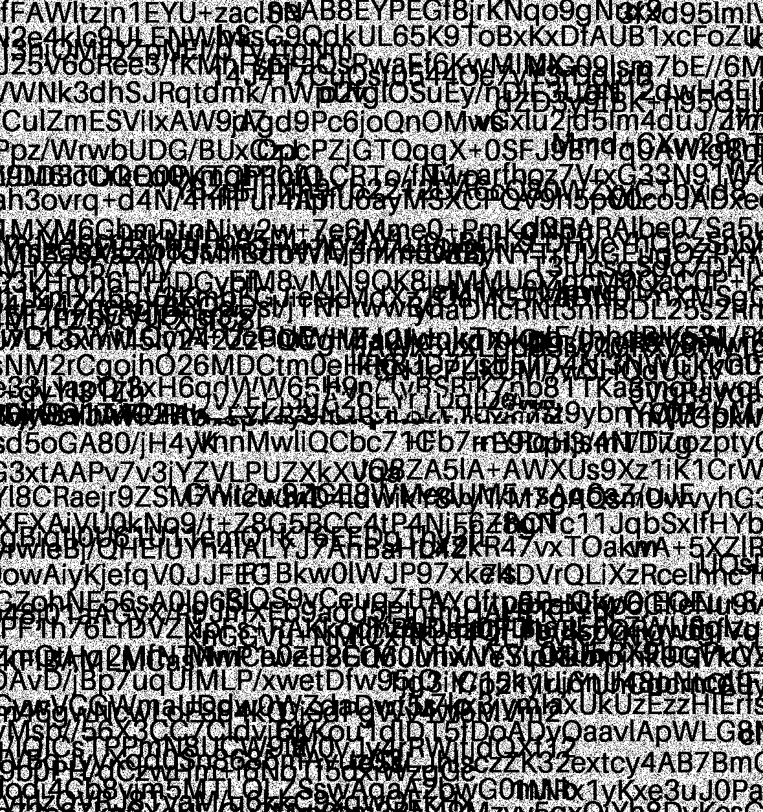
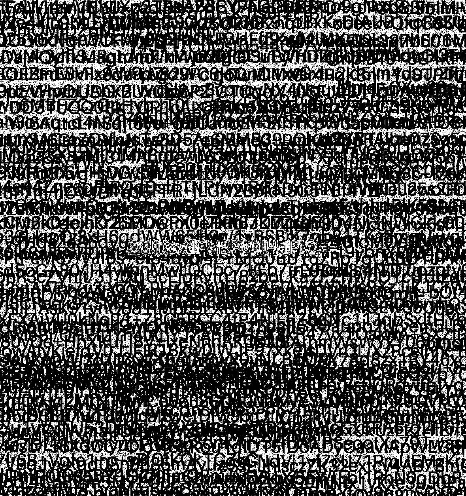
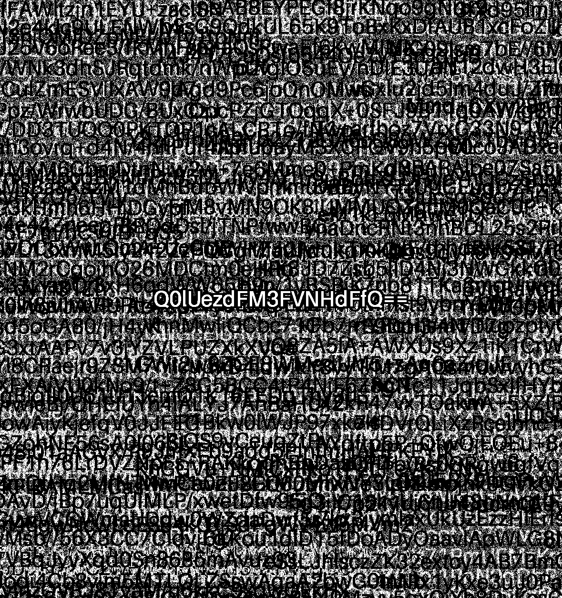

## Car crash

Khi tải về được file ảnh `car_crash.png`

Sử dụng stegonline thì plane 0 thu được bức hình chứa rất nhiều ký tự. Trong khi kênh blue và red thì chỉ là các ký tự đè lên nhau thì kênh alpha và green có thể thấy mã hóa base64 hơi mờ ở giữa và bị nhòe

Green plane 0:



Alpha plane 0:



Thử XOR 2 kênh này với nhau sử dụng script thì được 1 ảnh mới có đoạn base64 `Q0lUezdFM3FVNHdFfQ==` rõ ràng chính giữa, giải mã thì có được flag
``` python
from PIL import Image
import numpy as np

img = Image.open("car_crash.png").convert("RGBA")
arr = np.array(img)

lsb_alpha = arr[:, :, 3] & 1
lsb_green = arr[:, :, 1] & 1

xor = (lsb_green ^ lsb_alpha).astype("uint8")
res = xor * 255

Image.fromarray(res).save("revealed.png")
print("extract to revealed.png")
```



FLAG: **CIT{7E3qU4wE}**