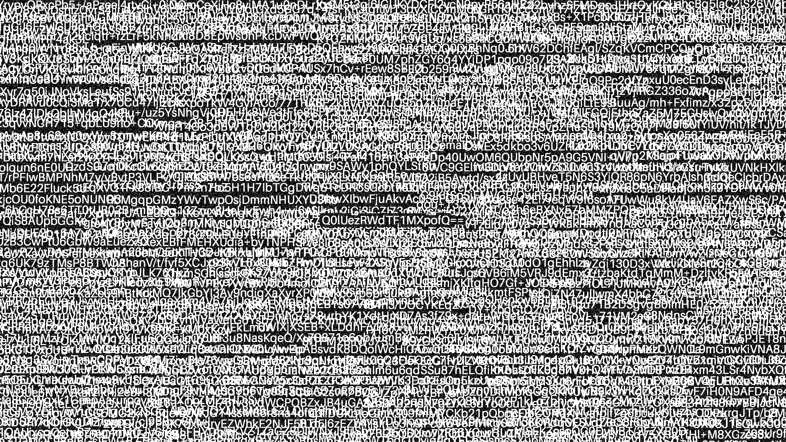

## Cool car

Khi tải về được file ảnh `cool_car.png`

Sử dụng stegonline thì alpha plane 0 thu được bức hình chứa rất nhiều ký tự, rõ nhất là chuỗi ở giữa được mã hóa base64 `Q0lUezRWdTF1MXpofQ==`, thực hiện giải mã thì thu được flag

FLAG: **CIT{4Vu1u1zh}**