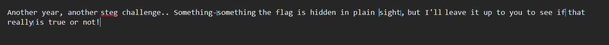
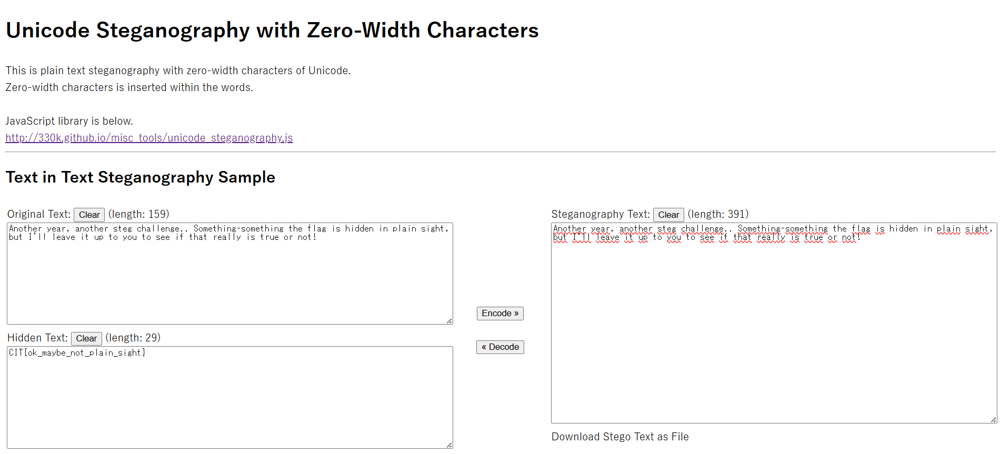

## There's no room left
### Đề bài
It almost feels like the walls are closing in. Digitally, that is ;)

### Giải
Sau khi tải về thì được file `flag.txt`. Thử kiểm tra nội dung thì thấy thực chất có rất nhiều ký tự zero wdith bên trong

Sử dụng Unicode Steganography with Zero-Width Characters để tìm nội dung ẩn bên trong thì được flag

FLAG: **CIT{ok_maybe_not_plain_sight}**