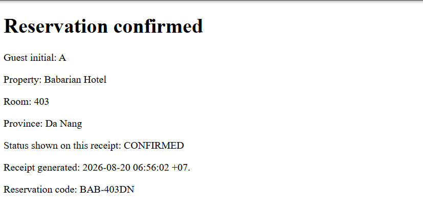
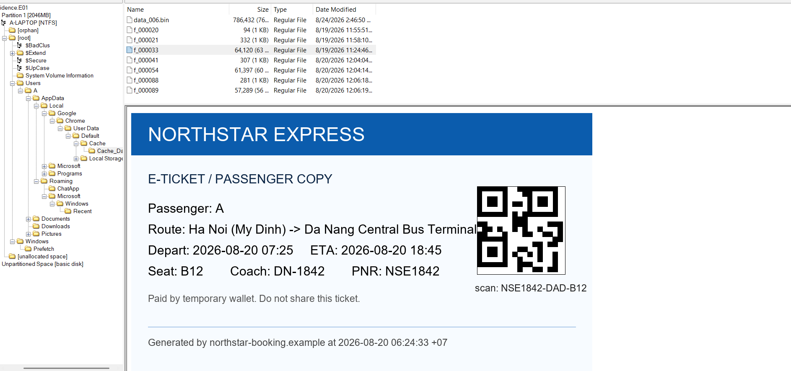
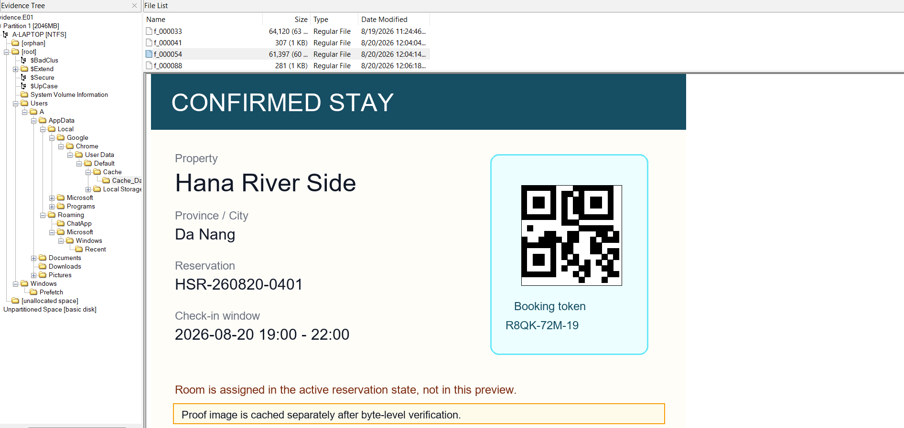
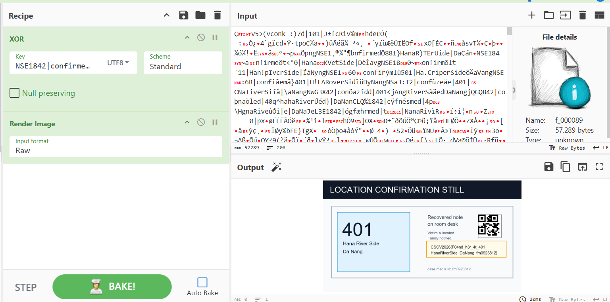

## Silent Room
### Đề bài
A 17-year-old girl named A left home for unclear reasons. After being unable to contact her for a while, her family reported the case to the authorities. You are given an image extracted from A's computer to look for traces that can identify A's current location.
Determine the most likely current room, hotel, and province/city. The final flag is recovered from the evidence image itself.

### Giải
Đề bài cho file disk image `evidence.E01` cùng với các file `.txt` chứa thông tin và hash artifact. Sử dụng FTK Imager tiến hành phân tích `evidence.E01`

Tại thư mục `Users\A\Downloads` thì thấy có các file:
- `notice_217.pdf`: thông báo yêu cầu xác minh tài khoản 
- `booking_BAB_403_receipt.html`: Xác nhận đặt chỗ. Mình có thử với flag này nhưng đây chỉ là decoy.
  
- `booking_HSR_260820_preview.png` và `ticket_DN1842.png` (đã bị xóa) 2 file hoàn toàn bị ghi đè bởi bit 0 dẫn đến không thể khôi phục.

Tiếp tục tìm kiếm thì trong thư mục `Users\A\AppData\Local\Google\Chrome\User Data\Default\Cache\Cache_Data` chứa các file `f_000033` và `f_000054` chính là cache của 2 ảnh đã bị xóa. Từ đó xác định được khách sạn Hana River Side tại thành phố Da Nang



Cũng tại thư mục này thì file `f_000088` chứa metadata của proof cùng với file `f_000089` có các byte hỗn loạn cho thấy có thể đã bị mã hóa. Metadata cho biết file này thực chất là ảnh PNG đã được XOR, key dưới dạng UTF-8 được lưu trữ trong tin nhắn ChatApp.
```
proof-cache-metadata
object=f_000089
content=image/png after byte transform
tool_hint=GCHQ public chef
operation=XOR
key_format=UTF-8
key_recipe=decrypt ChatApp messages before building the XOR key
note=the cache metadata only identifies the protected object and transform
```

Trích xuất ChatApp từ `Users\A\AppData\Roaming\ChatApp\msg_cache.db`. Bên trong chỉ có 1 đoạn chat với `Tổ điều tra tài chính` nhưng nội dung đã bị mã hóa. VD:
``` json
{"v":2,"kid":"chatapp-web-v2","alg":"AES-256-CBC","iv":"2dnsSOUVgMmRJHDW5I/QJw==","ct":"M/NK0bWvdXfiReHhnfS+7WSSUp5FVeM58WT/rHxdYZ7XL6mscg9IcAGZssyvbBjZtM8ACYSVTrB4noHDa/tW4bfcu/wLOhl07TugS5QAlFqA8/KQ37FtJwZ7gvEecgMNSaZuxvc/h3rza818WfkgdrWRdMMHMHCo+FLU2DeL1L4="}
```

Cách mã hóa có thể được tìm thấy trong `Users\A\AppData\Local\Programs\ChatApp\resources\app.bundle.js`.
``` javascript
const crypto = require("crypto");
const ChatAppCrypto = {
    kid: "chatapp-web-v2",
    deriveKey: function(peer, caseId) {
        return crypto.createHash("sha256").update([this.kid, peer, caseId].join("|"), "utf8").digest()
    },
    decryptBody: function(body, peer, caseId) {
        const m = JSON.parse(body);
        if (m.alg !== "AES-256-CBC") throw new Error("unsupported");
        const d = crypto.createDecipheriv("aes-256-cbc", this.deriveKey(peer, caseId), Buffer.from(m.iv, "base64"));
        return Buffer.concat([d.update(Buffer.from(m.ct, "base64")), d.final()]).toString("utf8")
    }
};
module.exports = ChatAppCrypto;
```

ChatApp được mã hóa bằng thuật toán aes-256-cbc với key được sinh ra theo format `sha256(kid|peer|caseId)` với kid được hardcode `chatapp-web-v2`. peer và caseId được tìm thấy tại `Users\A\AppData\Roaming\ChatApp\Local State`. Vậy key sẽ là `sha256(chatapp-web-v2|fi-operator-73|FI-217)`
``` json
{
  "profile": {
    "activePeer": "fi-operator-73",
    "caseId": "FI-217",
    "database": "msg_cache.db"
  },
  "install": {
    "resources": "C:\\Users\\A\\AppData\\Local\\Programs\\ChatApp\\resources\\app.bundle.js"
  }
}
```

Viết script thực hiện giải mã ChatApp
``` python
import sqlite3, hashlib, json, base64
from Crypto.Cipher import AES
from Crypto.Util.Padding import unpad
from datetime import datetime

key = hashlib.sha256("chatapp-web-v2|fi-operator-73|FI-217".encode()).digest()

conn = sqlite3.connect("msg_cache.db")
cur = conn.cursor()

cur.execute("""
    SELECT m.direction, m.body, m.created_at, c.display_name
    FROM messages m
    JOIN conversations c ON m.conversation_id = c.id
    ORDER BY m.created_at ASC
""")

for direction, body, ts, peer_name in cur.fetchall():
    try:
        m = json.loads(body)
        iv = base64.b64decode(m["iv"])
        ct = base64.b64decode(m["ct"])

        cipher = AES.new(key, AES.MODE_CBC, iv)
        plaintext = unpad(cipher.decrypt(ct), 16).decode("utf-8")

        time_str = datetime.fromtimestamp(ts).strftime("%Y-%m-%d %H:%M:%S")
        arrow = "<-" if direction == "in" else "->"
        print(f"[{time_str}] {arrow} {peer_name}: {plaintext}")

    except Exception as e:
        print(f"[Decrypt error:] {e}")

conn.close()
```
```
[2026-08-19 21:48:11] <- Tổ điều tra tài chính: Em không được để lại lời nhắn. Nếu gia đình biết, hồ sơ sẽ chuyển sang mức khẩn cấp.
[2026-08-19 21:50:22] <- Tổ điều tra tài chính: Họ tên, trường học, CCCD cũ và địa chỉ nhà của em đều nằm trong hồ sơ FI-217. Đừng thử thách hệ thống.
[2026-08-19 21:53:04] <- Tổ điều tra tài chính: Nếu tắt camera, gọi cho bố mẹ, hoặc rời màn hình quá 30 giây, biên bản sẽ ghi là tự ý cản trở điều tra.
[2026-08-19 21:55:37] <- Tổ điều tra tài chính: Em chỉ có một cách chứng minh trong sạch: làm đúng từng bước và giữ im lặng cho đến khi có lệnh mới.
[2026-08-20 06:18:44] <- Tổ điều tra tài chính: Tài khoản của em đang bị đồng bộ với ví trung gian. Một thao tác sai sẽ khóa tài sản của cả gia đình.
[2026-08-20 06:25:31] <- Tổ điều tra tài chính: Mở vé xe, xác nhận PNR rồi ghi nhớ. PNR là một phần khóa đối chiếu, không đọc cho ai.
[2026-08-20 06:26:58] <- Tổ điều tra tài chính: Sau khi xem xong vé và booking, xóa file tải về. Không cần xóa trình duyệt.
[2026-08-20 06:33:25] <- Tổ điều tra tài chính: Nếu có ai hỏi, nói em đang ra sân bay. Không đi theo điểm đỗ nếu chưa có lệnh mới.
[2026-08-20 06:58:46] <- Tổ điều tra tài chính: Ảnh đặt phòng cũ chỉ là bản chụp tại thời điểm đó. Trạng thái trong hệ thống mới là lệnh hợp lệ.
[2026-08-20 07:01:17] -> Tổ điều tra tài chính: Em run quá, em làm sai thì có bị bắt không?
[2026-08-20 07:02:02] <- Tổ điều tra tài chính: Bình tĩnh và làm nhanh. Em đang được đánh dấu là hợp tác, đừng đổi trạng thái từ xác nhận sang khẩn cấp.
[2026-08-20 07:05:06] -> Tổ điều tra tài chính: Em đã xóa vé và ảnh booking rồi.
[2026-08-20 07:05:44] <- Tổ điều tra tài chính: Chỉ làm theo mã còn hiệu lực trong trang đặt phòng. Đừng tin ảnh chụp cũ nếu hệ thống đã cập nhật.
[2026-08-20 07:06:21] <- Tổ điều tra tài chính: Ảnh chứng minh cuối đã khóa theo XOR bằng chuỗi đối chiếu. Nếu máy không mở được, tìm CyberChef và dùng key UTF-8.
[2026-08-20 07:06:37] <- Tổ điều tra tài chính: Thứ tự chuỗi đối chiếu: Mã PNR vé xe|trạng thái đặt phòng bằng chữ|Số phòng|tên nơi ở viết liền|tỉnh thành viết liền.
```

A đã được yêu cầu mã hóa ảnh chứng minh cuối bằng XOR với key `Mã PNR vé xe|trạng thái đặt phòng bằng chữ|Số phòng|tên nơi ở viết liền|tỉnh thành viết liền`. Tại thư mục `Users\A\AppData\Local\Google\Chrome\User Data\Default\Cache\Cache_Data` các file `f_00020` `f_00021` và `f_00041` chứa cache từ trang web đặt phòng:
```json
window.__STAYHUB_STATE__={1:'draft',2:'confirmed',4:'checked_in',7:'cancelled',9:'expired'};
```
```json
{
  "url": "https://stayhub.example/api/reservation/BAB-403DN",
  "reservation": "BAB-403DN",
  "state": 7,
  "previousState": 2,
  "updatedAt": "2026-08-20T06:58:09+07:00",
  "supersededBy": "HSR-260820-0401",
  "displayName": "Babarian Hotel",
  "room": "403",
  "cityCode": "DAD",
  "cacheSource": "reservation-sync"
}

```
```json
{
  "url": "https://stayhub.example/api/reservation/HSR-260820-0401",
  "reservation": "HSR-260820-0401",
  "state": 2,
  "lodgingRef": "R8QK-72M-19",
  "roomNumber": "401",
  "cityCode": "DAD",
  "checkinFrom": "2026-08-20T19:00:00+07:00",
  "geoHint": "16.071:108.229",
  "mapPinKey": "M-4412"
}
```

Đặt chỗ `BAB-403DN` có state 7 (cancelled) trong khi `HSR-260820-0401` thì state 2 (confirmed) cho thấy phòng A ở là 401. Từ đây mọi dữ kiện để tạo thành key XOR đã đủ:
- Mã PNR vé xe: `NSE1842`
- trạng thái đặt phòng bằng chữ: `confirmed`
- Số phòng: `401`
- tên nơi ở viết liền: `HanaRiverSide`
- tỉnh thành viết liền `DaNang`

Key: `NSE1842|confirmed|401|HanaRiverSide|DaNang`

XOR với `f_000089` thì tìm được flag


FLAG: **CSCV2026{F04nd_h3r_4t_401_HanaRiverSide_DaNang_fm0923812}**