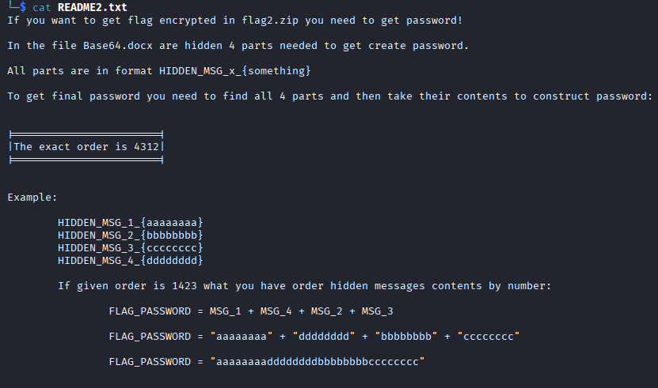
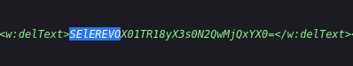
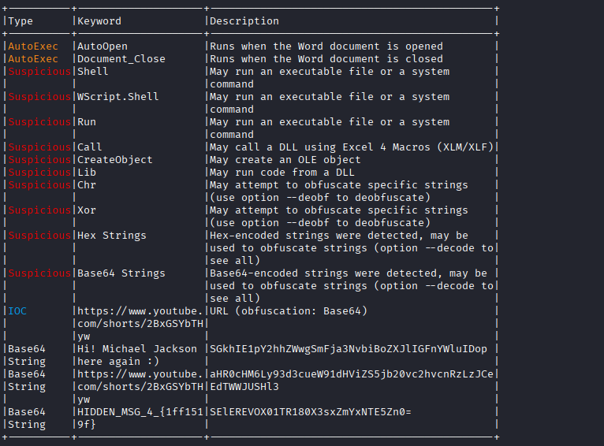
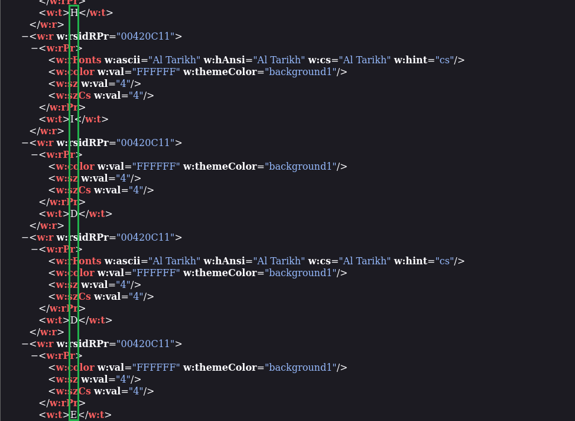

## Administrative tasks - Paragraphs
### Đề bài
We like Office documents, so what about this Base64 guide document ? Is something hidden here ? Please read README inside .zip file.
### Giải
Sau khi tải về và giải nén thì được:
- `Base64.docm`
- `flag2.zip`
- `README2.txt`

Đọc file `README2.txt` thì đây là hướng dẫn cách mở khóa `flag2.zip`


Kiểm tra metadata của file `Base64.docm` không có gì nên thử sử dụng `binwalk` để trích xuất các file bên trong. Sử dụng `grep` để thử tìm password thì k thu được gì, mở file `_Base64.docm.extracted/word/media` thì thấy ảnh `image39.png` chứa password


**HIDDEN_MSG_1_{03c77a9b}**

Xem nội dung của file `.docm` tại `_Base64.docm.extracted/word/document.xml`, nội dung nói về mã hóa base64 khiến mình nghĩ tới mật khẩu cũng có thể được mã hóa base64. Mã hóa base64 của cụm từ "HIDDEN" là "SElEREVO" và thử tìm trong file này thì thấy password được mã hóa. Giải mã base64 thì có được password



**HIDDEN_MSG_2_{47d0241a}**

Sau khi giải mã thì có 2 file `vbaData.xml` và `vbaProject.bin`. Đọc nội dung `vbaData.xml` thì thấy đây là macro tự động kích hoạt `vbaProject.bin`, sử dụng olevaba để xem thì có được password
```
olevba vbaProject.bin
```


**HIDDEN_MSG_4_{1ff1519f}**

Mảnh password cuối có thể được tìm thấy trong `_Base64.docm.extracted/word/footer1.xml` khi từng ký tự của password được tách lẻ ra


**HIDDEN_MSG_3_{47d0241a}**

Khi đã đủ 4 phần của password thì ghép lại theo thứ tự 4312 của `README2.txt` thì được password đầy đủ: `1ff1519f5caf69d603c77a9b47d0241a`. Mở khóa `flag2.zip` thì có `flag2.txt` chứa flag cần tìm

FLAG: **SK-CERT{M5W0RD_F0R3N51C5}**