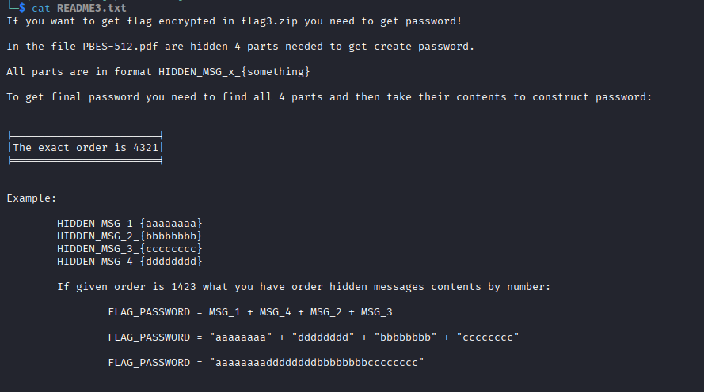
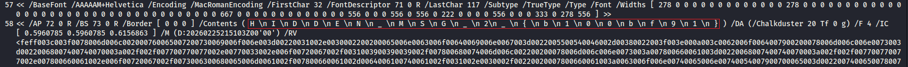
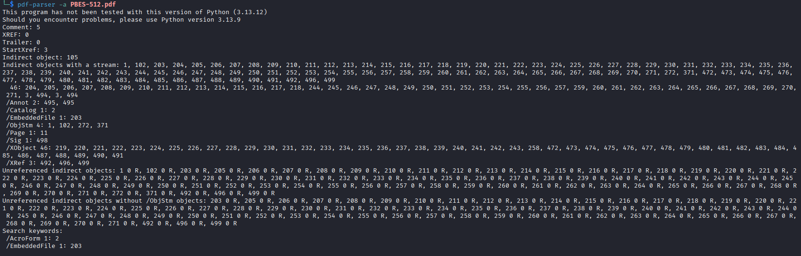
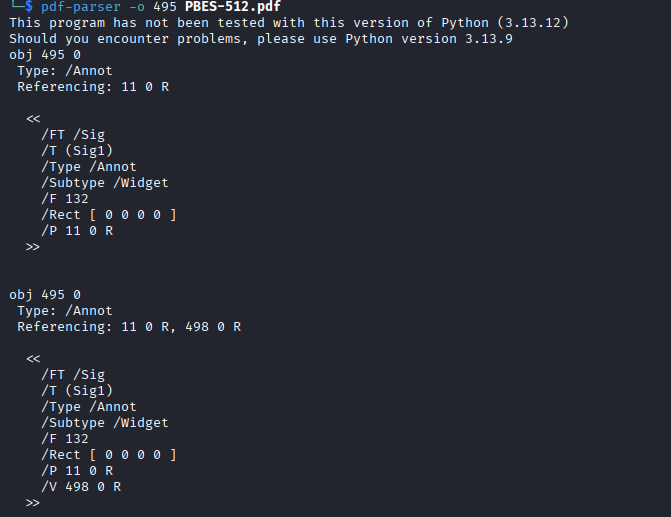
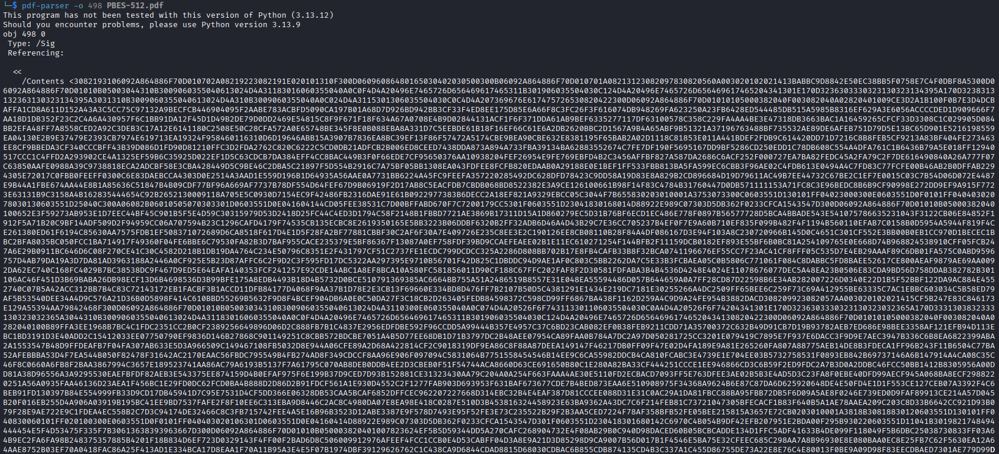
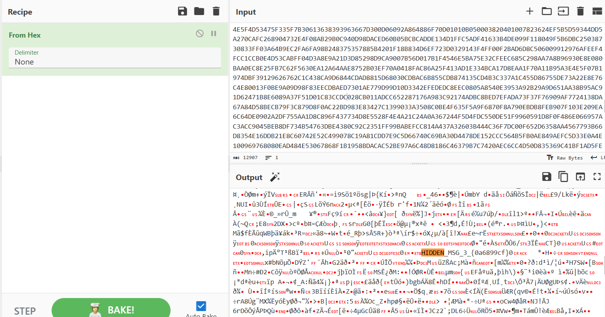
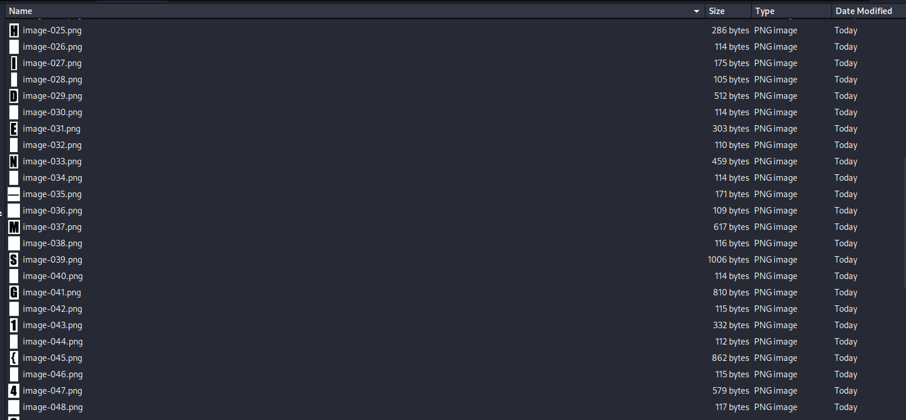

## Administrative tasks - Portable
### Đề bài
We probably got access to some new encryption standard before release! Can you inspect if it is real stuff or just another joke ? Please read README inside .zip file.
### Giải
Sau khi tải về và giải nén thì được:
- `PBES512.pdf`
- `flag3.zip`
- `README3.txt`

Đọc file `README3.txt` thì đây là hướng dẫn cách mở khóa `flag3.zip`


Kiểm tra metadata của file `PBES512.pdf` không có gì nên thử sử dụng `binwalk` để trích xuất các file bên trong. Sử dụng `grep` để thử tìm password thì k thu được gì. Bên trong có file `_PBES-512.pdf.extracted/1A92.zip`, giải nén thì có file `another_part.zip` là file zip cần mật khẩu và file `another_pass`

Đọc file `another_pass` thì có mật khẩu cho file zip là `verysecretpassword`, mở `another_part.zip` thì được `another_part.txt` và bên trong là password
**HIDDEN_MSG_4_{85add2c0}**

Đọc các file dạng plain text document còn lại thì tìm thấy password thứ 2 trong file `66`

**HIDDEN_MSG_2_{b100bf91}**

Sử dụng `pdf-parser` để xem các object bên trong. Kết quả trả về cho thấy bên trong có 2 annotation và rất nhiều ảnh
```
pdf-parser -a PBES-512.pdf
```


Thực hiện kiểm tra annotation object 495 thì thấy đây là loại Signature và tham chiếu đến object 498
```
pdf-parser -o 495 PBES-512.pdf
```


Kiểm tra object 498 thì bên trong chứa 1 đoạn hex rất dài, dùng `cyberchef` để chuyển về UTF-8 thì thấy chứa password bên trong



**HIDDEN_MSG_3_{0a6899cf}**

Sử dụng `pdfimages` để trích xuất ảnh từ `PBES512.pdf`, bên trong có thể thấy dấu vết của phần password còn lại. Các ảnh sau khi được trích xuất mang từng ký tự của password nhưng không tuân theo format `HIDDEN_MSG_1_{aaaaaaaa}` như trong `README3.txt` mà được sắp xếp lộn xộn
```
mkdir extracted_img
pdfimages -all PBES-512.pdf extracted_img/image
```


Do cũng đã biết những ký tự của password1 nên mình viết script để bruteforce theo các ký tự đã biết luôn. Password đầy đủ theo thứ tự 4321 của `README3.txt` đã có phần 432, phần 1 sẽ thử các chỉnh hợp từ các ký tự đã biết thì tìm ra được password đầy đủ `85add2c00a6899cfb100bf914abcc69f`
``` python
import zipfile
from itertools import permutations

first_part = "85add2c00a6899cfb100bf91"
chars = ['4', 'a', 'b', 'c', '6', '9', 'f', 'c']

zip_path = "flag3.zip"

permutations(chars)

for perm in permutations(chars):
    second_part = ''.join(perm)
    password = first_part + second_part
    
    try:
        with zipfile.ZipFile(zip_path, 'r') as zf:
            zf.extractall(pwd=password.encode())
        print(f"Password: {password}")
        break
    except (RuntimeError, zipfile.BadZipFile):
        pass
else:
    print("Wrong passwords")
```

Mở khóa `flag3.zip` thì có `flag3.txt` chứa flag cần tìm

FLAG: **SK-CERT{WHY_15_MJ_3V3RYWH3R3}**