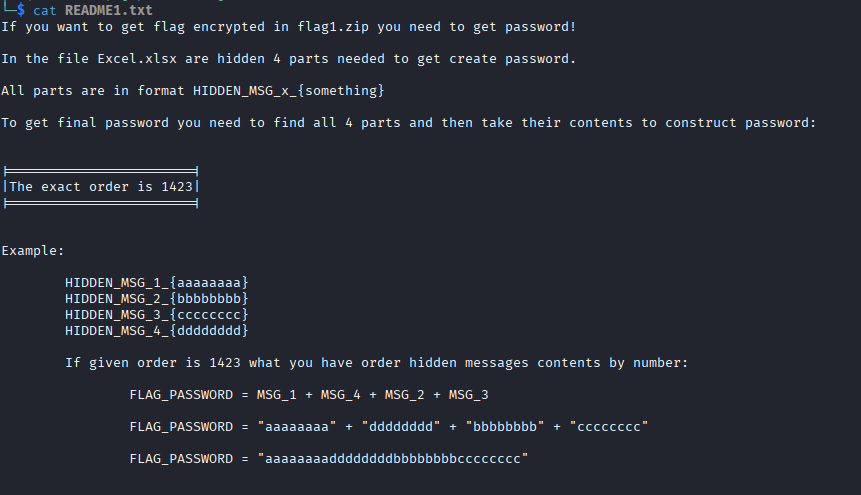
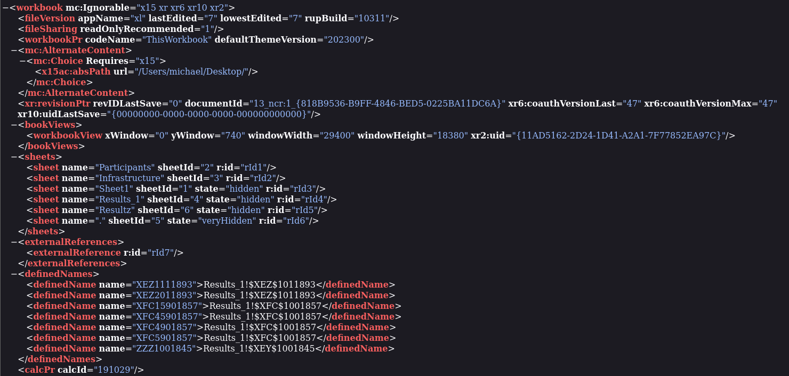
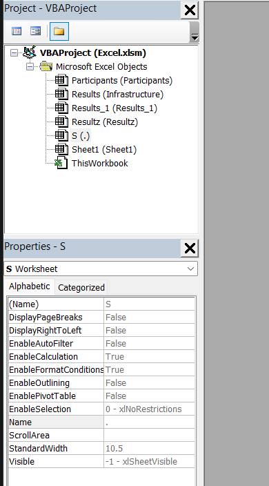
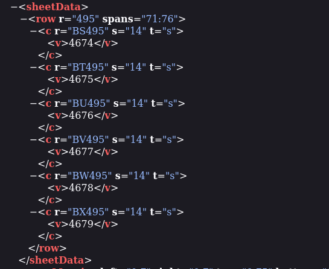
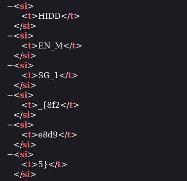
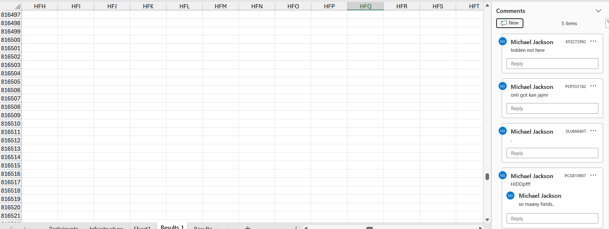
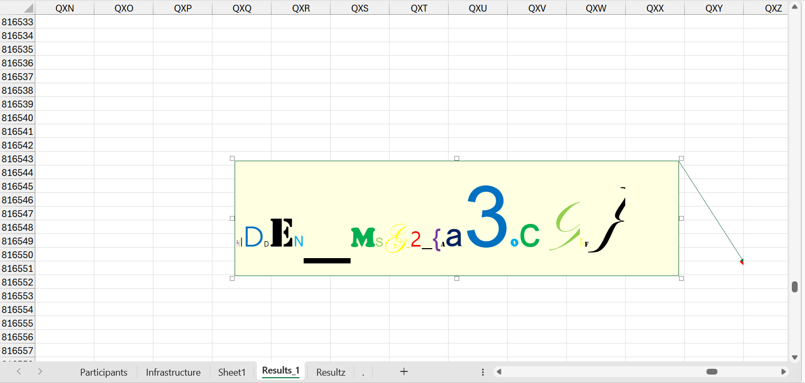
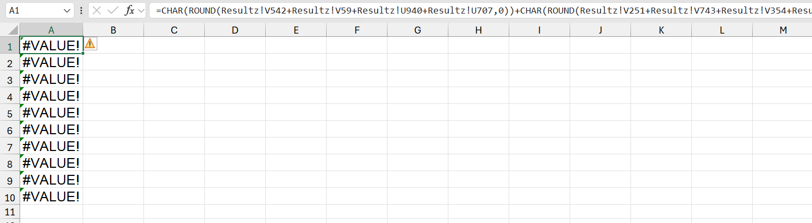

## Administrative tasks - Tables
### Đề bài
We got excel sheet with some hidden messages, are you able to extract them? Please read README inside .zip file.
### Giải
Sau khi tải về và giải nén thì được:
- `Excel.xlsm`
- `flag1.zip`
- `README1.txt`

Đọc file `README1.txt` thì đây là hướng dẫn cách mở khóa `flag1.zip`


Kiểm tra metadata của file `Excel.xlsm` không có gì nên thử sử dụng `binwalk` để trích xuất các file bên trong. Sử dụng `grep` để thử tìm password
```
grep -r 'HIDDEN_MSG' .
```


**HIDDEN_MSG_4_{83b44f09}**

Mở `_Excel.xlsm.extracted/xl/workbook.xml` thì thấy workbook có 6 sheet trong đó có 3 sheet bị ẩn và 1 sheet veryhide, sử dụng VBA (Alt + F11) và đổi Visible thành `-1 - xlSheetVisible`




Tại sheet `Sheet1` khi mở ra thì các ô thực ra là có ảnh đè lên, kiểm tra `_Excel.xlsm.extracted/xl/worksheets/sheet3.xml` thì có các ô dưới đây có data dạng string, tìm đến `sharedStrings.xml` theo ID đã có thì có được password




**HIDDEN_MSG_1_{8f2e8d95}**

Tại sheet `Results_1` khi mở ra thì thấy các comment khả nghi, kiểm tra trong `_Excel.xlsm.extracted/xl/comments1.xml` các comment và note thì thấy password trong note ở ô `QXY816551`




**HIDDEN_MSG_2_{aa30c9bf}**

Tại sheet `.` thì tại các ô có chứa func để viết thành ký tự nhưng đang bị lỗi `!VALUE#` do ký tự nối chuỗi của Excel là `&` chứ không phải `+`, sửa lại thì đây là 1 macro VBA thực hiện ghép chuỗi, lật ngược chuỗi và hiển thị kết quả qua hộp thoại là password

```
Sub run()
    Dim a As String
    Dim b As String
    a = "}6a0184c0{_3_GSM_"
    b = "NEDDIH"
    a = a & b
    if Len(a) > 0 Then
        MsgBox StrReverse(a)
    End If
End Sub
```
**HIDDEN_MSG_3_{0c4810a6}**

Khi đã đủ 4 phần của password thì ghép lại theo thứ tự 1423 của `README1.txt` thì được password đầy đủ: `8f2e8d9583b44f09aa30c9bf0c4810a6`. Mở khóa `flag1.zip` thì có `flag1.txt` chứa flag cần tìm

FLAG: **SK-CERT{L057_1N_3XC3L_5H3375}**