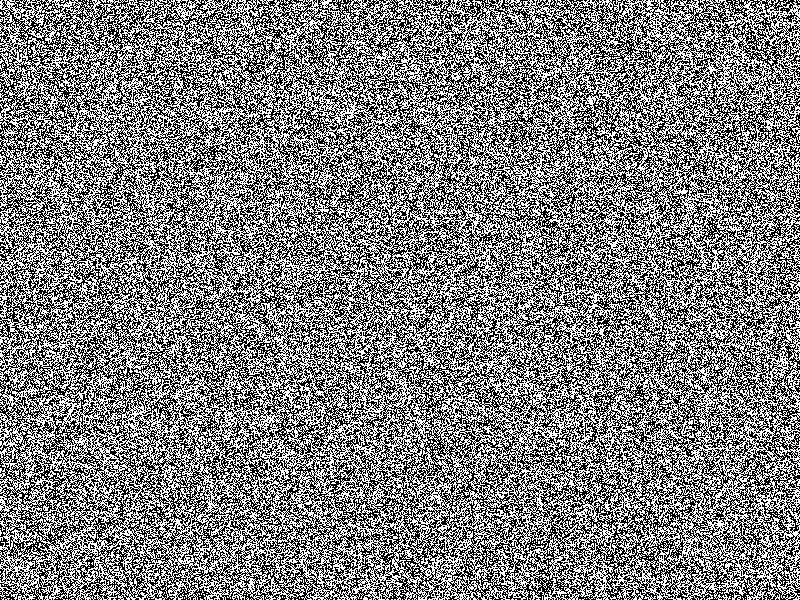
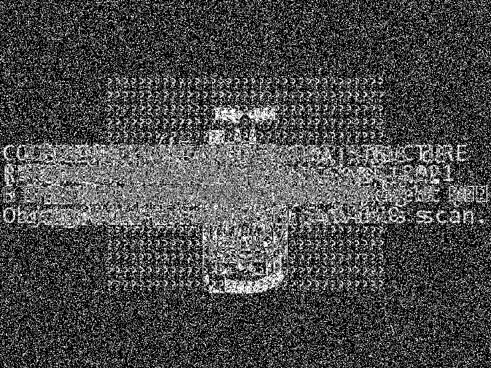
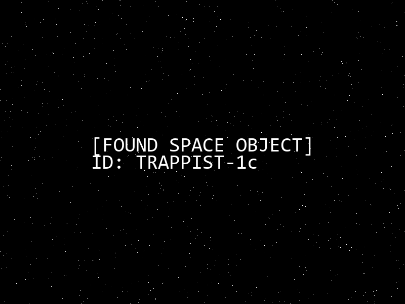
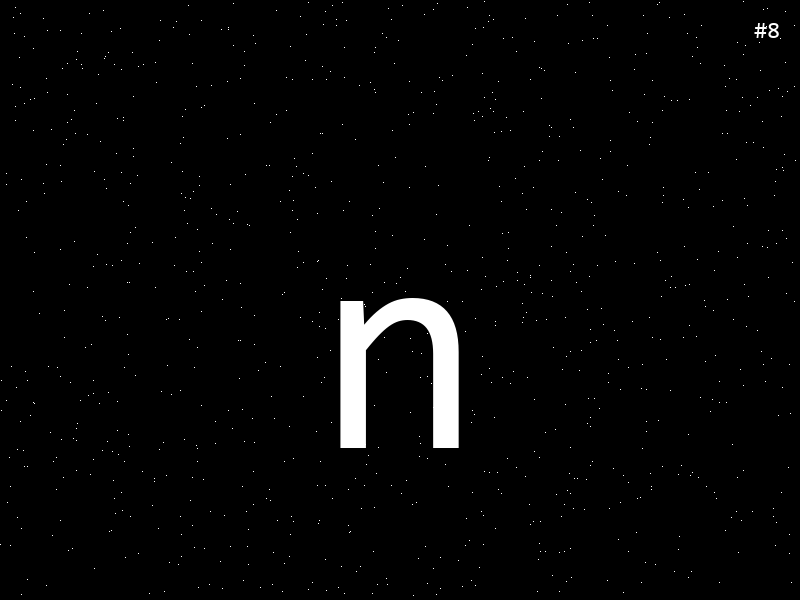
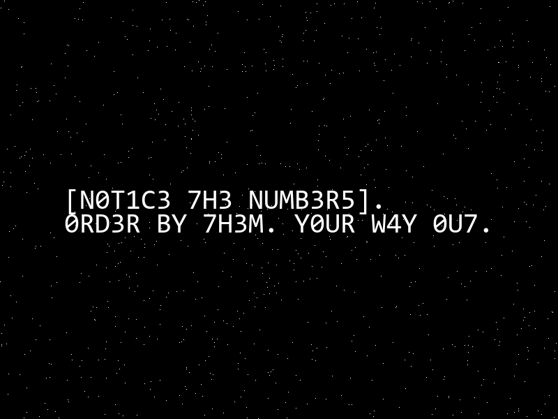

## Signals from the \<void>
### Đề bài
You work at the corporation, searching for signals from deep space. Suddenly, right before clocking out, the satellite caught a burst of random noise. Your peers think nothing of it, but you feel something is hidden in the noise.

### Giải
Sau khi tải về và giải nén thì được 256 ảnh đen trắng có dạng như sau



Do ảnh đen trắng bị nhiễu khá nặng nên mình nghĩ tới XOR. Thử XOR tất cả các ảnh thì cũng chưa được gì nhưng có thấy lờ mờ các chữ cái ở rìa ảnh nên khả năng hướng XOR ảnh là hướng đi đúng



Mình thử XOR ảnh 0 với từng ảnh từ 1 đến 255 thì có ảnh dưới đây là kết quả của ảnh 0 XOR với ảnh 245. Mình có thử tìm kiếm thông tin từ dữ kiện của ảnh cho thì đây là 1 hành tinh nhưng cũng k có thêm thông tin gì đáng chú ý.



Mình nghĩ tới kết quả khi XOR toàn bộ các ảnh với nhau trông còn rất nhiều ký tự lờ mờ khác nên mình nghĩ là vẫn có thể còn các tổ hợp XOR khác nên quyết định thử bruteforce XOR 2 ảnh với nhau bằng script
``` python
import os
from PIL import Image
import numpy as np

folder = "image"

image_files = sorted(f for f in os.listdir(folder))

for i in range(len(image_files)):
    result_folder = "result" + str(i)

    os.makedirs(result_folder, exist_ok=True)

    base_img = Image.open(os.path.join(folder, image_files[i])).convert('L')
    base_data = np.array(base_img, dtype=np.uint8)

    for j in range(0, len(image_files)):
        if (i == j):
            continue

        next_img = Image.open(os.path.join(folder, image_files[j])).convert('L')
        
        if next_img.size != base_img.size:
            next_img = next_img.resize(base_img.size)

        next_data = np.array(next_img, dtype=np.uint8)

        result_data = np.bitwise_xor(base_data, next_data)

        result_image = Image.fromarray(result_data)
        result_image.save(f"{result_folder}/xor_result{j}.png")
    
    print(f"finish result{i}")

```

Kết quả của script trên là 256x256 ảnh. Trong đó có rất nhiều ảnh mà bên trong là thông điệp trao đổi ngoài vũ trụ, về các thiên thể, điều kiện môi trường, mã morse, dãy nhị phân, ký tự lỗi nhưng chúng đều k mang ý nghĩa gì nổi bật. Tiếp tục tìm kiếm thì mình có thấy các bức ảnh chứa ký tự ở giữa, ở góc được đánh số thứ tự cùng với hướng dẫn dưới đây




Thực hiện thu thập tất cả các ký tự và lưu lại vào [result](result) và ghép lại theo thứ tự thì được flag cần tìm

FLAG: **SK-CERT{n07h1ng_15_45_17_533m5_1n_5p4c3}**