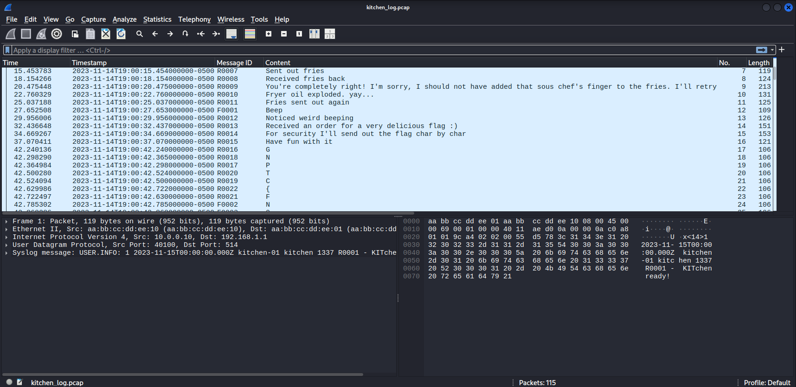

## Double Fried
### Đề bài
I was planning to go to dinner with a friend but somthing felt off.

Can you help me sort everything out?

### Giải
Sau khi tải về thì được file `kitchen_log.pcap`. Bên trong là log order của nhà hàng và có yêu cầu order flag được gửi từng chữ cái

Ban đầu mình có thử sort theo Timestamp nhưng các chữ cái của flag bị trộn lẫn với 1 thông điệp khác cũng được gửi từng chữ. Lúc này thử sort theo Message ID và với những ID bắt đầu bằng `R` tạo thành flag

FLAG: **GPNCTF{Nice, y0U F0und OUT wh0 d1D not 831oNG 7hEre}**
