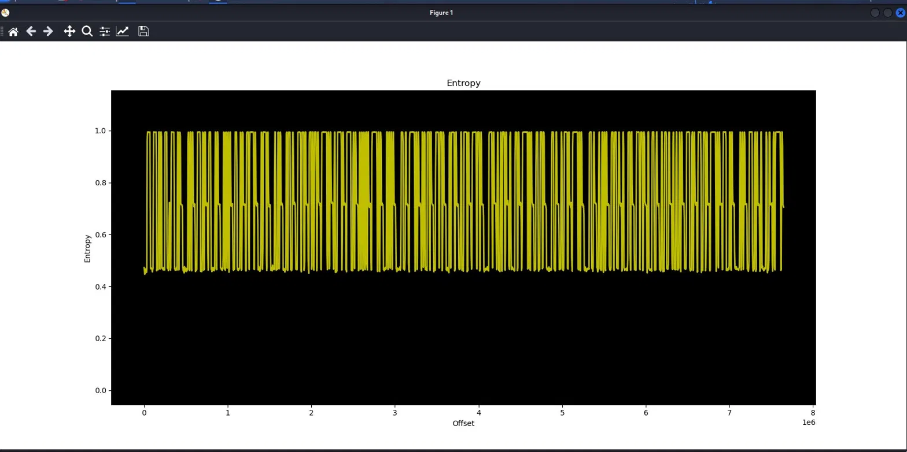

## Organized
### Đề bài
Wait, isn't this just a file of random data?

Well, maybe you just don't appreciate the organization in your life...
### Giải
Sau khi tải về thì được file `data` chỉ chứa raw data. Đề bài có nhắc đến sự tổ chức, điều này khiến mình nghĩ tới entropy - yếu tố đo sự hỗn loạn. Chạy `binwalk -E` thì thấy biểu đồ gồm các vạch lên xuống liên tục, có 3 mức chính nên có thể thông điệp được ẩn đi theo cách này


Khi kiểm tra hex, file được chia thành từng đoạn 12500 byte với mật độ bit khác nhau (mật độ bit thấp dẫn đến entropy thấp và ngược lại). Vì vậy viết script để trích xuất chuỗi này theo 3 mức entropy: 
- Low: 0
- Medium: 1
- High: 2

Sau phần đầu hỗn loạn thì phần sau tuân theo quy tắc cứ 10 bit 0 hoặc 2 sẽ được ngăn cách bới 2 bit 1. Với độ dài mỗi phân đoạn 10 bit khiến mình nghĩ đến 8N1 UART:
- bit 0: start bit
- bit 1-8: data LSB
- bit 9: stop bit

Trích xuất data bit và dịch sang ascii thì được flag
``` python
import numpy as np

data = np.frombuffer(open("data", "rb").read(), dtype=np.uint8)

popcount = np.unpackbits(data.reshape(-1, 1), axis=1).sum(axis=1)

T = 12500
n = len(data) // T
cells = popcount[:n * T].reshape(n, T).mean(axis=1)

levels = np.full(n, 1)        # default: 1
levels[cells < 1.2] = 0       # low: 0
levels[cells > 3.0] = 2       # high: 2
tern = "".join(map(str, levels))

print(tern)

frames = [g for g in tern.split("1") if len(g) == 10]

out = bytearray()
for g in frames:
    bits = [0 if c == "0" else 1 for c in g]
    val = sum(b << k for k, b in enumerate(bits[1:9]))
    out.append(val)

print(out.decode())
```

FLAG: **GPNCTF{tH4nk_yOU_T0_entropia_f0r_0R6an12INg_GPN!}**