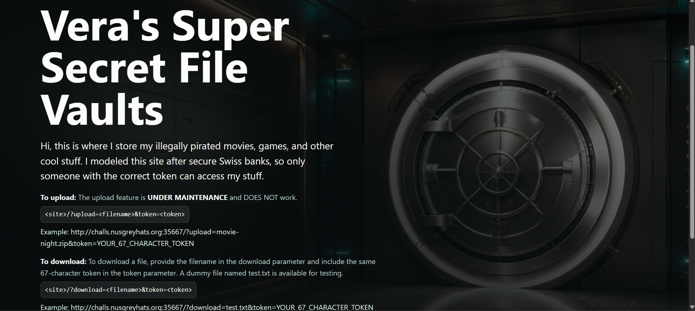
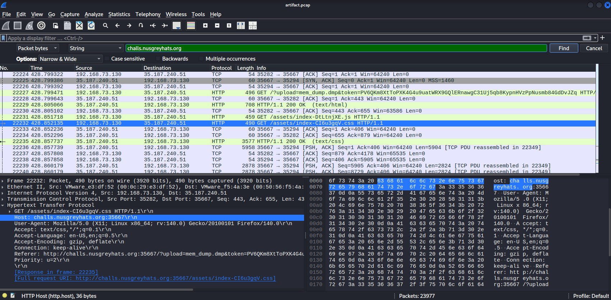
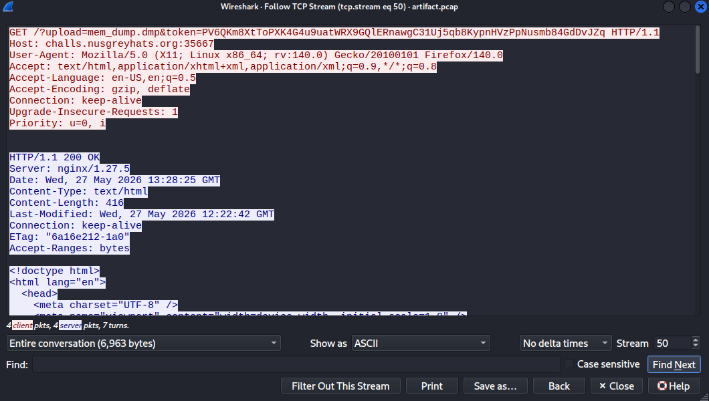
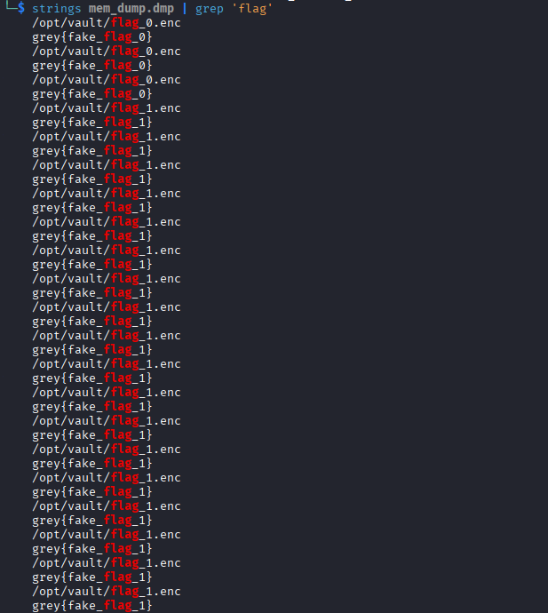
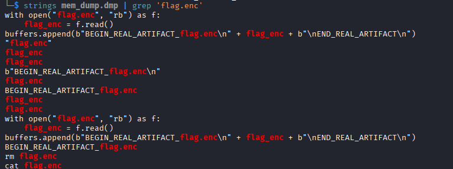
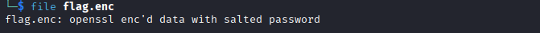
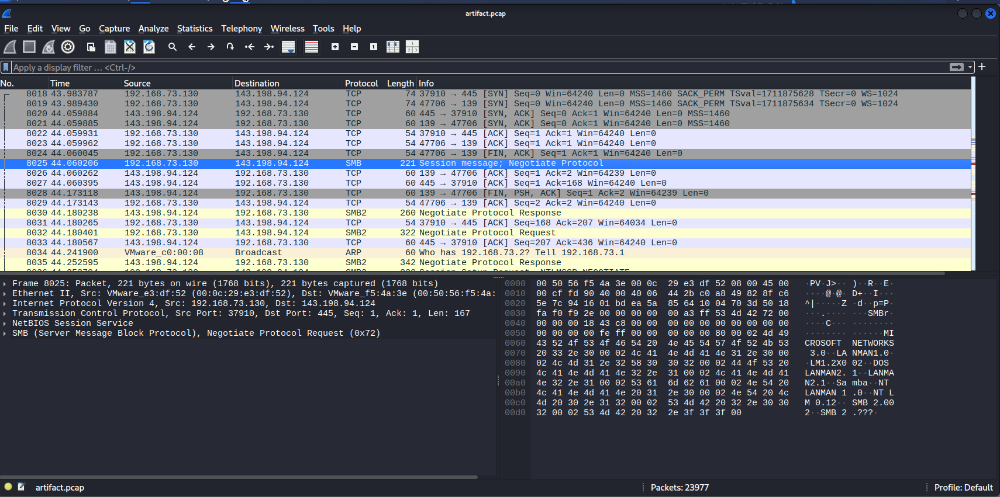
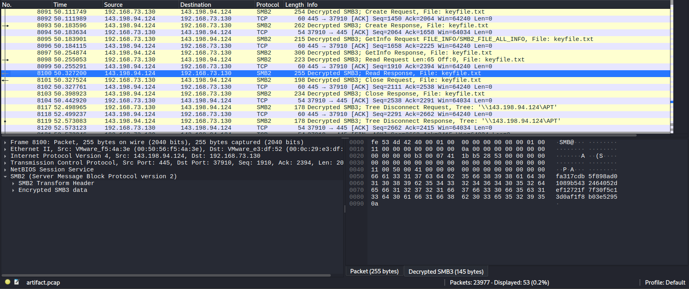

## APTV3R4_STRIKES_AGAIN
### Đề bài
Help! One of our club’s computers was breached. Somehow the APT got hold of the keyfile needed to decrypt our secret flag, but they still couldn’t find the encrypted file. Funny thing is, our flag vault keeps it open in the background. Can you help the APT finish the job?

### Giải
Đề bài cho đường dẫn đến host lưu trữ file, tại đây có hướng dẫn tải lên (chức năng trong quá trình bảo trì) và tải xuống file. Để thực hiện các thao tác trên cần biết tên file và token của trang web



Giải nén các file đề bài cho thì được `artifact.pcap`, thử tìm theo Host là trang web đề bài cho thì thấy các gói tin HTTP giữa server ip `192.168.73.130` và máy client ip `35.187.240.51`


Follow luồng HTTP trên thì thấy client có sử dụng chức năng tải file lên server. Mình tìm được cả tên file là: `mem_dump.dmp` và token: `PV6QKm8XtToPXK4G4u9uatWRX9GQlERnawgC31Uj5qb8KypnHVzPpNusmb84GdDvJZq`


Thực hiện tải xuống file `mem_dump.dmp` theo hướng dẫn của host. Sử dụng strings + grep 'flag' để tìm flag thì file dmp chứa 1 lượng lớn decoy flag. Bài có nhắc đến nhóm tấn công tìm thấy key giải mã nhưng không tìm được file mã hóa, vậy flag có thể đã được mã hóa, thử tìm cụm 'flag.enc' thì được đoạn code sau



Đoạn code thực hiện mở file flag.enc và chèn vào buffer giữa 2 marker `BEGIN_REAL_ARTIFACT_flag.enc\n` và `END_REAL_ARTIFACT\n`. Viết script trích xuất được flag.enc
``` python
with open("mem_dump.dmp", "rb") as f:
    data = f.read()

start_marker = b"BEGIN_REAL_ARTIFACT_flag.enc\n"
end_marker = b"\nEND_REAL_ARTIFACT\n"

start_idx = data.find(start_marker)
if start_idx == -1:
    print("start_marker NOT FOUND")
    exit()

start_idx += len(start_marker)

end_idx = data.find(end_marker, start_idx)
if end_idx == -1:
    print("end_marker NOT FOUND")
    exit()

flag_enc = data[start_idx:end_idx]

with open("flag.enc", "wb") as out:
    out.write(flag_enc)
```


Để giải mã flag.enc thì cần tìm keyfile mà đề bài nhắc đến. Tìm trong `artifact.pcap` thì thấy có các gói tin SMB được gửi từ server `192.168.73.130` đến địa chỉ bên ngoài là`143.198.94.124`. Điều này bất thường vì SMB thường chỉ được dùng để chia sẻ file và trao đổi trong mạng nội bộ. 


Khi kết nối tới máy chủ SMB, máy client sẽ chủ động gửi NTLM hash mật khẩu để xác thực theo sơ đồ sau. 
```
Client                          Server
  |                               |
  |--- Negotiate Request -------->|  (client hỏi: mày hỗ trợ giao thức gì?)
  |<-- Negotiate Response --------|  (server trả lời + gửi challenge ngẫu nhiên)
  |                               |
  |--- Session Setup Request ---->|  (NTLMSSP_NEGOTIATE)
  |<-- Session Setup Response ----|  (NTLMSSP_CHALLENGE: server gửi 8-byte challenge)
  |                               |
  |--- Session Setup Request ---->|  (NTLMSSP_AUTH: client gửi response đã hash)
  |<-- Session Setup Response ----|  (thành công/thất bại)
```
Từ đó mình tìm được:
- challenge (NTLMSSP_CHALLENGE) 
- NTProofStr, User name, Host name (NTLMSSP_AUTH)
- blob (NTLMSSP_AUTH, được viết trong phần NTLMv2 Response nối tiếp NTProofStr)

Để tạo chuỗi NetNTLMv2 Hash và lưu vào ntlmv2.hash: 
```
Username::Domain:Challenge:NTProofStr:blob

APT::WORKGROUP:de4223bdc2c58d00:29b10ec063eabb61b9e426ed94ff89b1:01010000000000006a4d9cccdbeddc01c80030cc79b2db8200000000020022005400520049005600490041004c002d0054004f002d00560045005200490054005900010022005400520049005600490041004c002d0054004f002d005600450052004900540059000400000003001c007400720069007600690061006c002d0074006f002d00610070007400070008006a4d9cccdbeddc010600040002000000080030003000000000000000000000000000000019c57cf48a48b5f9532f68132492f004f1347993c6214b9482bb6ff9936db4930a001000000000000000000000000000000000000900260063006900660073002f003100340033002e003100390038002e00390034002e0031003200340000000000
```

Sử dụng hashcat và wordlist `rockyou.txt` thì tìm được mật khẩu là `mypassword` từ đó tính ra SessionID: `1bb5285300000000` và SessionKey: `231ce1f973f7b1215b16c5b47035f030` và decrypt SMB2 thì tìm được keyfile.txt


Giải mã `flag.enc` thì tìm được flag
```
openssl aes-256-cbc -d -pbkdf2 -salt -in flag.enc -pass file:keyfile.txt
```

FLAG: **grey{7r1v14l_70_f0ll0w_7h3_5mb3_7r41l}**