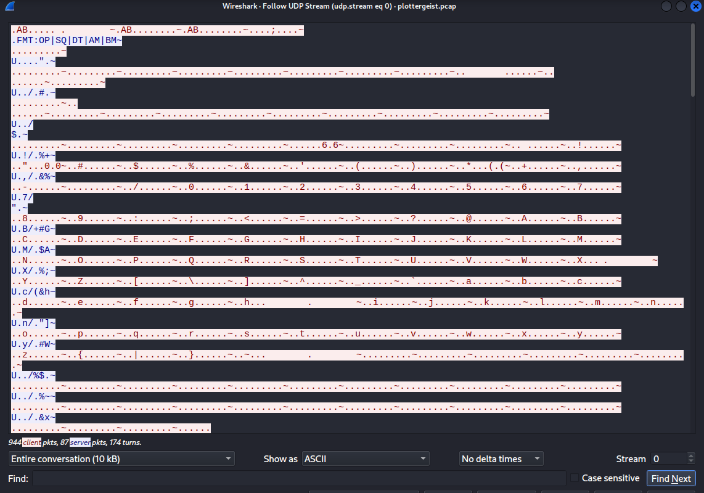
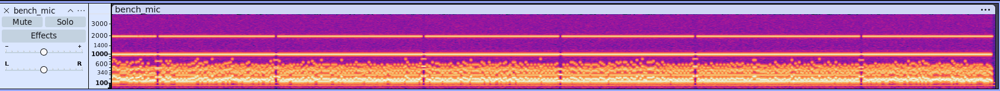

## Plottergeist
I built a one-of-a-kind custom CoreXY pen plotter using logic I designed myself. However, the pen plotter stopped working during the final bench test. The only remaining evidence is controller traffic logs and microphone recordings captured from the same workbench session.

The capture only shows motion traffic. It does not directly tell you which moves actually put ink on the page. The microphone recording may contain small but repeatable differences between move types.

Reconstruct what the machine drew and recover the flag.

Sau khi tải về và giải nén thì được 2 file: 
 - `bench_mic.wav` chứa âm thanh của máy khi hoạt động
 - `plottergeist.pcap` chứa log điều khiển của máy

Sử dụng wireshark phân tích `plottergeist.pcap` thì thấy có nhiều gói tin trao đổi giữa ip `10.13.37.10` và `10.13.37.42`. Theo luồng UDP này thì có thể tìm thấy format lệnh điều khiển của máy và cũng xác định được là ip `10.13.37.10` sẽ đóng vai trò điều khiển


Mở một số gói tin mà ip `10.13.37.10` chuyển đi thì có thể xác định được từng 
`a1000000050014000c7e`
`a100010004000000007e`

|Byte | Meaning |
| ---- | ----- |
| 1 | OP: opcode |
| 2 + 3 | SQ: Thứ tự lệnh |
| 4 + 5 | DT |
| 6 + 7 | AM: góc quay động cơ A |
| 8 + 9 | BM: góc quay động cơ B |
| 10 | ~ kết thúc lệnh|

Sử dụng audacity phân tích `bench_mic.wav`, khi mở spectrogram thì thấy có những thời điểm k có vạch âm thanh, tại những thời điểm này thì AM BM của gói tin trong `plottergeist.pcap` có AM và BM âm lớn (~ -360) nên có thể đây là những lúc máy xuống và quay lại đầu dòng


Khi đó DT = fe nên có thể đoán DT thể hiện cho hành động của coreXY pen, trong những gói tin còn lại thường DT có giá trị 4 hoặc 5 đại diện cho nhấc bút và hạ bút, xác định giá trị của DT =4 cho hành động hạ bút bằng cách thử cả 2 TH. Thực hiện viết script để vẽ lại
``` python
from scapy.all import rdpcap, UDP, IP
import matplotlib.pyplot as plt
import numpy as np
import struct

def coreXY(pcap_file):
    packets = rdpcap(pcap_file)
    
    # Khởi tạo ma trận Bitmap
    NUM_ROWS = 15 
    MAX_X = 1000
    bitmap = np.zeros((NUM_ROWS, MAX_X))
    
    row = 0
    current_x = 0

    for pkt in packets:
        if pkt.haslayer(UDP) and pkt[UDP].sport == 31337:
            payload = bytes(pkt[UDP].payload)
            
            if payload[0] == 0xa1 and payload[-1] == 0x7e:
                rest = payload[1:-1]
                
                try:
                    dt = rest[3]
                    am = struct.unpack('>h', rest[4:6])[0]
                    bm = struct.unpack('>h', rest[6:8])[0]
                    
                    if dt == 24:
                        row += 1
                        current_x = 0
                        continue
                    
                    dx = am 
                    new_x = current_x + dx
                    
                    if dt == 4 and row < NUM_ROWS:
                        # Xác định đoạn cần tô màu trên dòng hiện tại
                        x_start = int(min(current_x, new_x))
                        x_end = int(max(current_x, new_x))
                        
                        # Giới hạn trong phạm vi bitmap
                        x_start = max(0, min(x_start, MAX_X - 1))
                        x_end = max(0, min(x_end, MAX_X - 1))
                        
                        # Tô màu cho đoạn thẳng trên dòng
                        for x in range(x_start, x_end + 1):
                            bitmap[row, x] = 1.0
                            
                    current_x = new_x
                    
                except Exception as e:
                    continue

    # --- Hiển thị kết quả ---
    render_image = np.kron(bitmap, np.ones((1, 1)))
    
    plt.figure(figsize=(20, 5))
    plt.imshow(render_image, cmap='binary', interpolation='nearest')
    plt.title("Flag")
    plt.axis('off')
    plt.show()

coreXY('plottergeist.pcap')
```


FLAG: **hacktheon2026{the_plotter_reveals_its_secret_through_sound}**