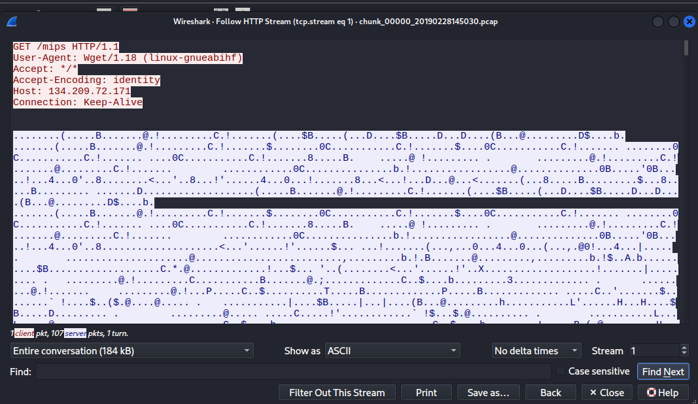
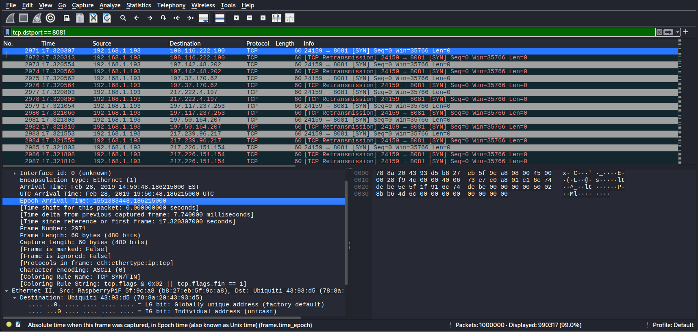
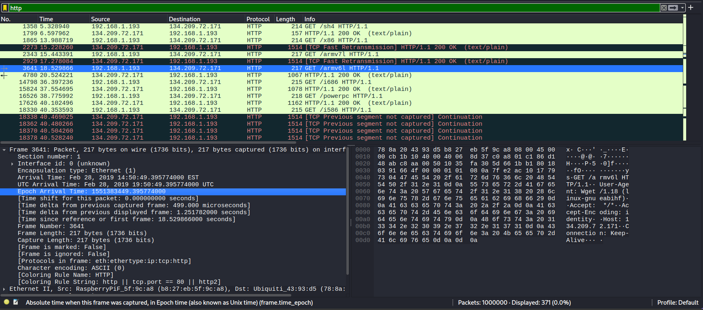
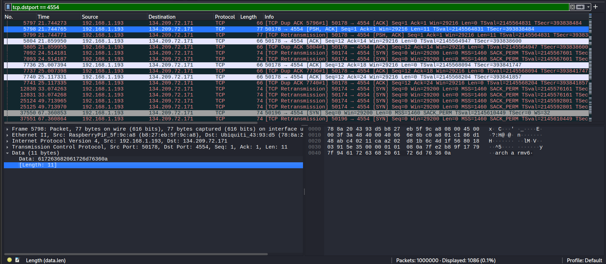
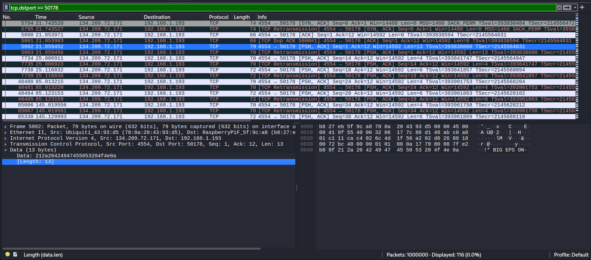
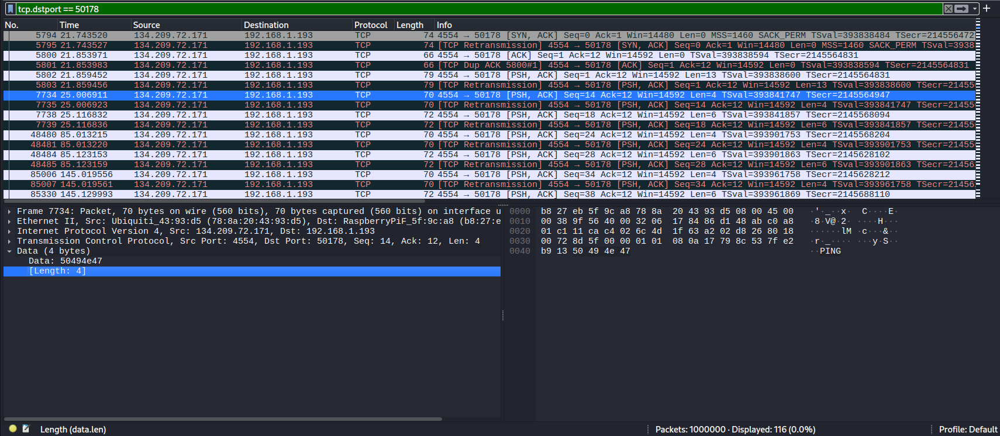
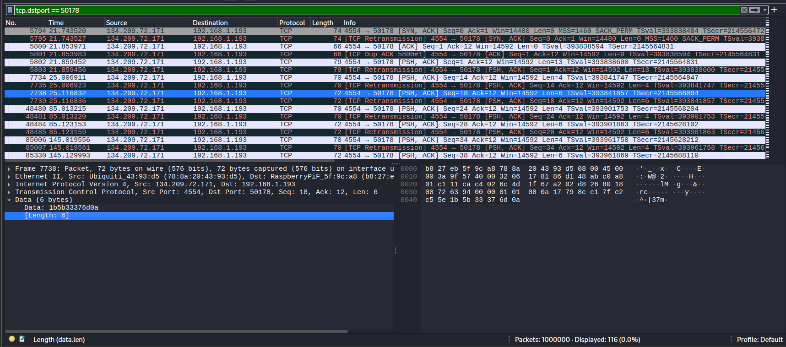

## After The Swarm
### Đề bài
We obtained a large network capture of an infected IoT device.
You need to reconstruct not a single artifact, but three linked stages of the infection chain:

The start of the first mass propagation wave on 8081/tcp.
The only HTTP object requested after that wave had already started.
The first successful 4554/tcp control-exchange that happened after that late HTTP request.
Then recover:

The name of the late HTTP object. <br>
The source TCP port of that HTTP request. <br>
The source TCP port of the control session. <br>
The size of the first client payload in that control session. <br>
The sizes of the first three server payloads in the same session. 

Flag: Format: grodno{artifact_httpport_c2port_c2len_s2len1_s2len2_s2len3} Example: grodno{arm_44444_55555_00_00_0_0}

### Giải
Sau khi tải về thì được file `mirai_revenge.pcap` rất nặng với hơn 18 triệu gói tin nên mình không thể sử dụng wireshark hay tshark phân tích trực tiếp mà phải tách thành các chunk 1 triệu gói tin
```
editcap -c mirai_revenge.pcap file_goc.pcap chunk.pcap
```

Tại chunk đầu tiên, thiết bị IOT bị nhiễm có ip `192.168.1.193` kết nối với C2 server ip `134.209.72.171` tải file binary cho các kiến trúc CPU khác nhau (mips, mipsel, sh4, x86, arm...)


Đề bài có nói đến gói tin HTTP sau khi có lượng lớn kết nối TCP tới port 8081, ta xác định được gói tin tới port 8081 đầu tiên là gói 2971 có epoch `1551383448.186215000`


Tìm gói tin HTTP request sau epoch này thì xác định được gói tin 3641.
- HTTP Object: armv6l
- TCP source port: 51370


Lệnh điều khiển sau đó trên tới port 4544 sau gói tin HTTP, tìm theo port 4544 thì xác định được source port 50178. Các gói tin đề bài yêu cầu:
- gói tin đầu tiên từ client:
    - payload: arch armv6\n
    - len: 11

    

- gói tin đầu tiên từ server:
    - payload: !* BIGEPS ON\n
    - len: 13

    

- gói tin thứ 2 từ server:
    - payload: PING
    - len: 4
    
    

- gói tin thứ 3 từ server:
    - payload: \x1b[37m\n
    - len: 6

    

FLAG: **grodno{armv6l_51370_50178_11_13_4_6}**
