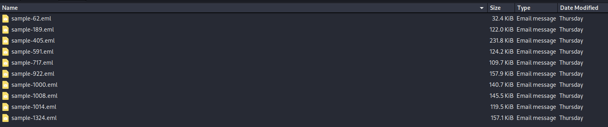
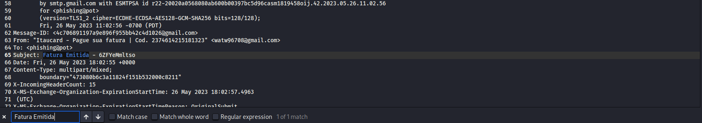
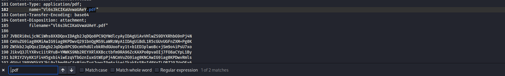

## Invoice Without A Bank
### Đề bài
Find the message where a PDF attachment is distributed under the guise of a banking notification. Recover:

The exact PDF attachment filename

The identifier from the subject after Fatura Emitida -

Flag:

Format: grodno{filename_subjectid}

Example: grodno{invoice.pdf_abcd1234}

### Giải
Sau khi tải về và giải nén thì được các file lưu trữ thư điện tử `.eml`

Từ khóa `Fatura Emitida` trong subject mà đề bài nhắc tới có thể được tìm thấy tại `sample-717.eml` và tìm được subject ID `6ZFYeMmltso` và  file name `Vl6s3kCIKaUvwaUAeY.pdf`

Thông tin thêm về email phishing:
- Message-ID: `<4c706891197a9e896f955bb42c4d1026@gmail.com>`
- Thời gian: `Fri, 26 May 2023 18:02:55 UTC`
- Từ: `watw96708@gmail.com` (IP: `65.52.33.69`)
- Đến: `phishing@pot`
- Giả mạo: `Itaucard - Pague sua fatura | Cod. 2374614215181323` (giả mạo thanh toán hóa đơn của Itaucard)
- Tiêu đề: `Fatura Emitida - 6ZFYeMmltso`
- Nội dung: `VEJA COMO UTILIZAR SEUS PONTOS PARA PAGAR SUA FATURA NO ARQUIVO EM ANEXO` (Tiếng Bồ Đào Nha: hướng dẫn cách dùng điểm thưởng để thanh toán hóa đơn trong tệp đính kèm)
- Tệp đính kèm: `Vl6s3kCIKaUvwaUAeY.pdf`
- Xác thực: 
    - spf = pass
    - dkim = pass
    - dmarc = pass

FLAG: **grodno{Vl6s3kCIKaUvwaUAeY.pdf_6ZFYeMmltso}**
