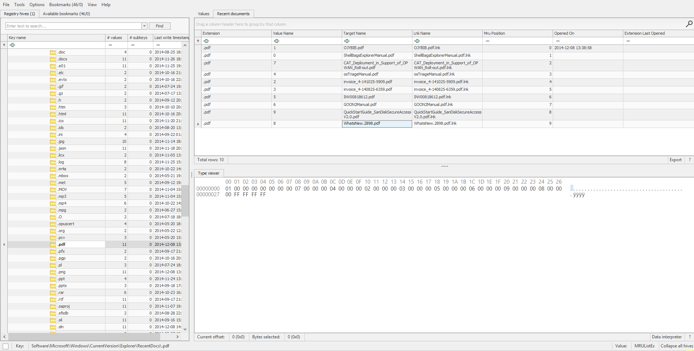
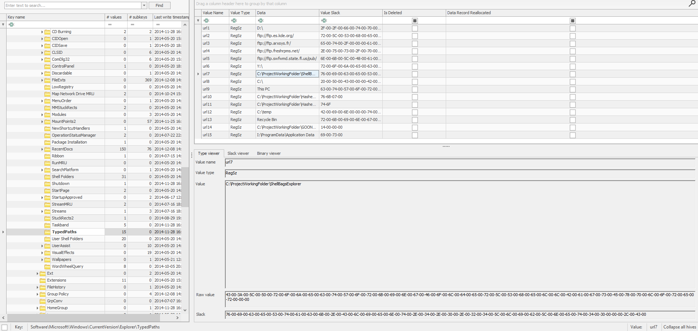

## Pinned to Yesterday
### Đề bài
You have a set of Windows artifacts from an analyst workstation. Recover three values:

The PDF filename that is first in RecentDocs\\.pdf  
The working folder name from TypedPaths associated with ShellBagsExplorer  
The executable filename from the sample Prefetch 

Flag: 
Format: grodno{pdf_folder_exe} 
Example: grodno{doc.pdf_tools_notepad.exe}

### Giải
Sau khi tải về và giải nén thì được 2 thư mục `JumpList.Test` và `Registry.Test`. Do đề bài nhắc đến file PDF trong mục `RecentDocs\.pdf` nên tiến hành phân tích registry key `NTUSER.DAT` thì xác định được file `WhatsNew.2898.pdf`

Tiếp tục tìm trong `NTUSER.DAT` thì xác định được folder trong TypedPaths: `ShellBagsExplorer`

Trong thư mục `JumpList.Test\Bad` tìm được file `CALC.EXE-3FBEF7FD.pf` vậy nên file thực thi cần tìm là `calc.exe`

FLAG: **grodno{WhatsNew.2898.pdf_ShellBagsExplorer_calc.exe}**