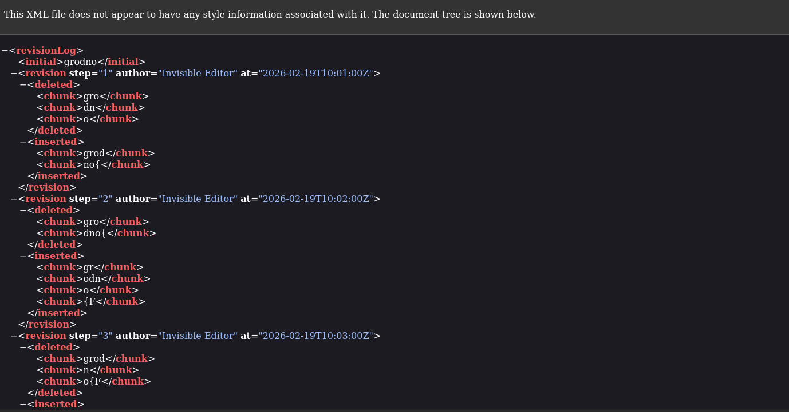

## Invisible Editor
### Đề bài
My teammate sent me a file with a flag, but i can't see it. Help me find it.

### Giải
Đề bài cho file `invisible_editor.docx`, sử dụng binwalk và bên trong thư mục `customXml` có file `item1.xml` nội dung file này chứa log sửa đổi của flag. Khôi phục lại flag bằng cách thêm và xóa ký tự theo log.

FLAG: **grodno{F1@g_W@5_H3r3_0nc3}**