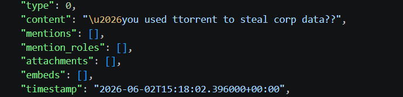
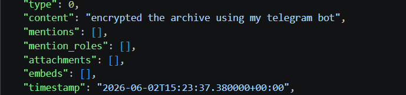
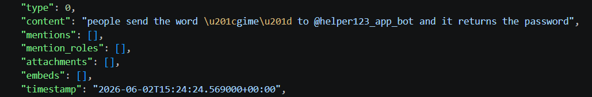

## L3ak APT
### Đề bài
A hacker recently bragged on a dark web forum about possessing "super secret data" and joining an APT. We think he's lying, so we've secured a copy of the system to determine if he's telling the truth or if he's a fraud.

### Giải
Sau Khỉ tải về và giải nén thì được thư mục `C` mô phỏng lại cấu trúc thư mục máy Windows. Máy có chứa 2 ứng dụng gồm `µTorrent` và `Discord`. Đọc cache của Discord bằng `ChromeCacheVIew.exe` tại thư mục `C\Users\Max\AppData\Roaming\discord\cache\Cache_Data` thì tìm được cuộc trò chuyện giữa 2 user `not_hacker_man` và `ammar4027` về cuộc tấn công rò rỉ dữ liệu. Kẻ tấn công đã sử dụng torrent để rò rỉ dữ liệu và sử dụng bot Telegram để lưu trữ dữ liệu được lấy



Sử dụng `Transmission` để tải các file `.torrent` tại thư mục `C/Users/Max/AppData/Roaming/utorrent/` thì có file `important files.7z` nhưng bị mã hóa. Từ cuộc trò chuyện tại `Discord` thì tìm được cách lấy mật khẩu


Nhắn cho bot như hướng dẫn thì được mật khẩu giải nén. Tại thư mục `important files\Projects\media` có chứa ảnh chứa flag


FLAG: **L3AK{For3nsics_hUm4n$_C4n_c00K_AI}**

<br>

>[!Note]
> Bài này có cách làm khác bằng cách giả định người dùng đã mở file `important files.7z` nên Windows đã tạo ra bản xem trước preview thumbnail và được lưu vào các file cơ sở hệ thống tên `thumbcache_*.db` (thường nằm ở `%LocalAppData%\Microsoft\Windows\Explorer`). Sử dụng công cụ Autopsy để tự động trích xuất hoặc dùng script

```python
import os
import re

path = r'.\L3AK_APT\C\Users\Max\AppData\Local\Microsoft\Windows\Explorer'
output_dir = r'.\extracted_thumbs'

os.makedirs(output_dir, exist_ok=True)

JPEG_START = b'\xFF\xD8\xFF'
JPEG_END = b'\xFF\xD9'
PNG_START = b'\x89PNG\r\n\x1a\n'
PNG_END_MARKER = b'IEND'

extracted_count = 0

for fname in sorted(os.listdir(path)):
    if re.match(r"^thumbcache_.*\.db$", fname):
        file_path = os.path.join(path, fname)

        with open(file_path, 'rb') as f:
            data = f.read()

        for match in re.finditer(JPEG_START, data):
            start = match.start()
            end = data.find(JPEG_END, start)
            if end != -1:
                end += 2  #2 bytes \xFF\xD9
                img_bytes = data[start:end]
                
                img_name = f"{fname}_{extracted_count}.jpg"
                with open(os.path.join(output_dir, img_name), 'wb') as dir:
                    dir.write(img_bytes)

                extracted_count += 1


        for match in re.finditer(PNG_START, data):
            start = match.start()
            end = data.find(PNG_END_MARKER, start)
            if end != -1:
                end += 8  #IEND + 4 bytes CRC
                img_bytes = data[start:end]
                
                out_name = f"{fname}_{extracted_count}.png"
                with open(os.path.join(output_dir, out_name), 'wb') as dir:
                    dir.write(img_bytes)

                extracted_count += 1
```
