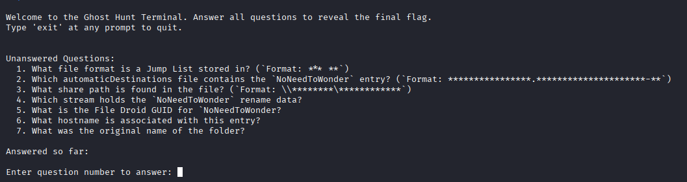

## TranscendentRenovation
### Đề bài
Yesterday I got on my computer and noticed a folder I've never seen before, NoNeedToWonder. Naturally, I started to wonder. Can you answer some questions about where it came from? All I have is the Jump Lists.

### Giải
Sau khi tải về và giải nén thì được file `Administrator_JumpLists.zip`, bên trong chứa 2 folder `AutomaticDestinations` và `CustomDestinations` bên trong chứa các file Jump Lists

Kết nối tới instance của của chall thì được bộ câu hỏi cần trả lời


#### Question 1: What file format is a Jump List stored in? (\`Format: *** **\`)
Dùng file thì được kết quả 
`Composite Document File V2 Document, Cannot read section info`

Answer: **ole cf**

#### Question 2: Which automaticDestinations file contains the `NoNeedToWonder` entry? (\`Format: \*\*\*\*\*\*\*\*\*\*\*\*\*\*\*\*.\*\*\*\*\*\*\*\*\*\*\*\*\*\*\*\*\*\*\*\*\*\-\*\*\`)
Sử dụng strings tại folder `AutomaticDestinations` để tìm file chứa cụm `NoNeedToWonder` thì tìm được file `f01b4d95cf55d32a.automaticDestinations-ms` chứa cụm này
```
grep -rnwl "NoNeedToWonder"
```

Answer: **f01b4d95cf55d32a.automaticDestinations-ms**

#### Question 3: What share path is found in the file? (\`Format: \\\\*\*\*\*\*\*\*\*\\\*\*\*\*\*\*\*\*\****\`)
Sử dụng JLEcmd để phân tích file Jump List chứa cụm `NoNeedToWonder` và trích xuất kết quả ra excel để phân tích
```
.\JLECmd.exe -f "f01b4d95cf55d32a.automaticDestinations-ms" --csv "output"
```

Thấy có duy nhất 1 đường dẫn mạng UNC (Universal Naming Convention) `\\tsclient\HauntedHouse` cho thấy đây là thư mục được chia sẻ

Answer: **\\\tsclient\HauntedHouse**

#### Question 4: Which stream holds the `NoNeedToWonder` rename data?
Sử dụng 7z để tách các stream
```
7z x -o./extracted_streams f01b4d95cf55d32a.automaticDestinations-ms
```

Sử dụng strings để tìm stream chứa cụm `NoNeedToWonder` thì xác định được là stream 46
```
grep -rnwl "NoNeedToWonder"
```

Answer: **46**

#### Question 5: What is the File Droid GUID for `NoNeedToWonder?
Từ file excel trích xuất được bằng JLECmd thì xác định được File Droid GUID của `NoNeedToWonder` là `ec2ab952-7e4d-11f1-89ad-a2dead7852ad`

Answer: **ec2ab952-7e4d-11f1-89ad-a2dead7852ad**

#### Question 6: What hostname is associated with this entry?
Từ file excel trích xuất được bằng JLECmd thì xác định được hostname là `logging-vm`

Answer: **logging-vm**

#### Question 7: What was the original name of the folder?
strings stream 46 thì xác định được tên trước đó của `NoNeedToWonder` là `SoulSearch`

Do lỗi cài đặt của chall mà đáp án được chấp nhận cần thêm `ing` vào phía sau

Answer: **SoulSearching**

Sau khi trả lời tất cả thì có được flag

FLAG: **L3AK{P4r4n0rm4l_P4r4ll3l_P47h5}**