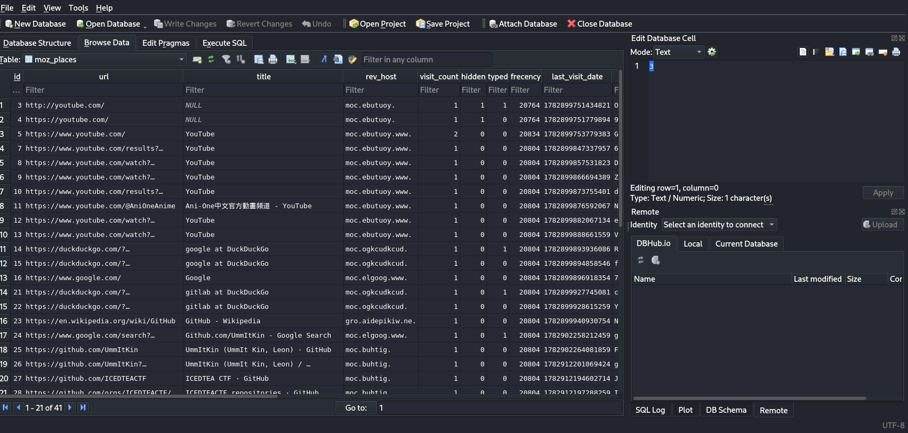
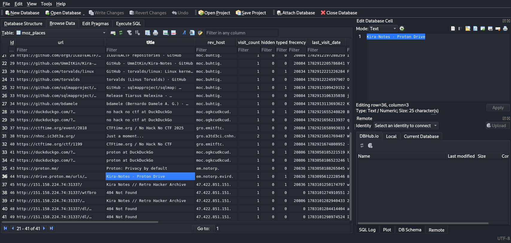

## Kira-Notes
### Đề bài
Please don't use AI to solve this question

Learn instead of letting the agent do it :(

What is the category? Once you play it, you will know.

### Giải
Đề bài cho file `places.sqlite` là lịch sử duyệt web

Do đề bài nhắc đến Kira-Notes nên mình có để ý đến trang web `Kira Notes // Retro Hacker Archive` nhưng đây chỉ là decoy, trang web không có gì giúp giải challenge. Tìm thêm thì tìm được `Kira-Notes - Proton Drive`

Drive chứa 2 ảnh `noth_____.png`, `Some Backup 01.png` và disk image `of.img`

Phân tích `of.img` thì thấy trong file slack có 2 file trong đó gồm 1 file ảnh và 1 file zip chứa `flag.txt`. Trích xuất file ảnh thì được ảnh khôi phục của `noth_____.png`

file zip thì cần mật khẩu để giải nén và mật khẩu chính từ mảnh giấy trong ảnh khôi phục được: `0x0kira1337`. Giải nén và lấy được flag

FLAG: **NHNC{n0w_y0u_kn0w_h0w_t0_f0r3ns1c_0x00000Easyyyyyyyyy}**