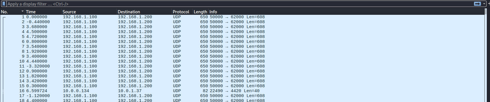
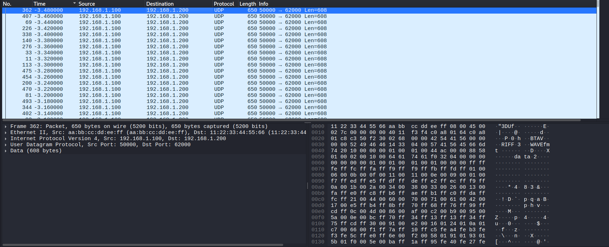
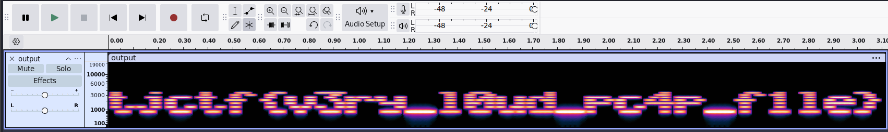

## loud-packets
### Đề bài
I was transferring a file with very sensitive info over bluetooth, but someone got ahold of the packets...

### Giải
Sau khi tải về thì được file `chall.pcap`. Sử dụng wireshark để phân tích thì thấy các gói tin được xếp không xếp theo thứ tự thời gian đến


Thực hiện xếp lại theo thời gian đến và kiểm tra gói tin đầu tiên thì thấy header của file WAV


Các file từ `192.168.1.100:50000` đến `192.168.1.200:62000` đều có 8 magic byte ở đầu gồm `42 54 41 56` (BTAV) `00 00` và 2 byte seq sau đó mới là data của file WAV. Thực hiện trích xuất file âm thanh này
``` python
from scapy.all import rdpcap, UDP, IP
import struct

packets = rdpcap("chall.pcap")

btav = []
for pkt in packets:
    if pkt.haslayer(UDP) and pkt[UDP].sport == 50000:
        raw = bytes(pkt['Raw'].load)
        seq = struct.unpack('>I', raw[4:8])[0]
        payload = raw[8:]
        btav.append((seq, payload))

btav.sort(key=lambda x: x[0])

ordered_data = b''.join(p[1] for p in btav)

with open("output.wav", 'wb') as f:
    f.write(ordered_data)
```
Xem Spectrogram của `output.wav` thì tìm thấy flag


FLAG: **tjctf{v3ry_l0ud_pc4p_f1le}**