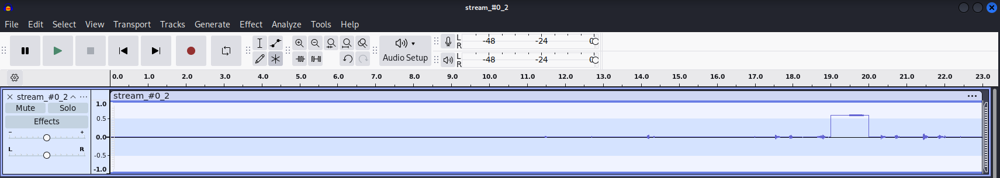

## nesting
### Đề bài
Who doesn’t like some forensics? Especially one about nests! :)

### Giải
Sau khi tải về thì được file `nesting.mp4` khi dùng lệnh file kiểm tra thì đây thực chất định dạng file là Matroska

>[!Note] 
> Matroska (extension `.mkv`) bản chất không phải là codec video mà là một multimedia container có thể chứa nhiều stream video, audio, phụ đề, có hệ thống quản lý chapters,..


Sử dụng `ffprobe -hide_banner nesting.mp4` để xem bên trong file Matroska này thì thấy gồm 12 chapter có độ dài đều bằng 0, các luồng stream chứa video, âm thanh và phụ đề. Trong đó có tới 50 mono PCM track
```
Input #0, matroska,webm, from 'nesting.mp4':
  Duration: 00:00:23.06
  Chapters:
    Chapter #0:0: start 0.624000, end 0.624000
    Chapter #0:1: start 0.998000, end 0.998000
    ...
    Chapter #0:11: start 22.505000, end 22.505000
  Stream #0:0: Video: h264, 1280x720
  Stream #0:1: Audio: aac, 48000 Hz, stereo
  Stream #0:2-51: Audio: pcm_f32le, 16000 Hz, mono
  Stream #0:52: Subtitle: ass
```

Thử dùng ffmpeg trích xuất 50 file PCM này ra thì thấy mỗi file chứa một xung vuông tại các thời điểm khác nhau 
```
for i in {2..51}; do ffmpeg -i nesting.mp4 -map 0:$i -c:a copy "stream_#0_$i.wav" -y; done
```



Mix các đoạn âm thanh này với nhau thì được 1 file `mixed.wav` chứa tiếng người đọc từng ký tự (âm thanh rất nhỏ)
```
ffmpeg $(for i in {2..51}; do echo -n "-i stream_#0_${i}.wav "; done)  -filter_complex "amix=inputs=50:duration=first:dropout_transition=2" "mixed.wav"
```
Các ký tự mà người này đọc: ``=+.:)/9)r?>q4F%.`8$`\`` Đây giống như chuỗi ký tự đã bị XOR, do biết phần đầu flag là `tjctf{` nên khi thử XOR với chuỗi trên thì mình thu được phần đầu key `IAMNOT`

Khi trích xuất phụ đề bằng ffmpeg, phụ đề gồm các đoạn có từ 1 đến 3 ký tự, thời lượng mỗi phụ đề 0.05 giây
```
ffmpeg -i nesting.mp4 -map 0:52 -c:s copy "subtitle.ass" -y
```
```
Dialogue: 0,0:00:00.00,0:00:00.05,Default,,0,0,0,,K,
Dialogue: 0,0:00:00.05,0:00:00.10,Default,,0,0,0,,ENF
Dialogue: 0,0:00:00.10,0:00:00.15,Default,,0,0,0,,ED
Dialogue: 0,0:00:00.15,0:00:00.20,Default,,0,0,0,,IRV
Dialogue: 0,0:00:00.20,0:00:00.25,Default,,0,0,0,,R
```

Nhận thấy các chapter thực chất đánh dấu những khoảng thời gian trong phụ đề chứa key, kết nối từng phần này lại thì thu được key `IAMNOTTHEFLAG.NOTYET!`

XOR với ký tự được đọc thì lấy được flag

FLAG: **tjctf{ma7yr0shka4aa4}**
