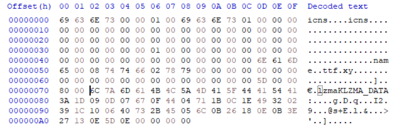

## obscure-crusher-1
### Đề bài
What if I make it so you need 3 keys to unlock the flag...

### Giải
Sau khi tải về thì được file `chall.bin` gồm nhiều header của icns, ttf và lzma. Trong phần LZMA_DATA có chuỗi `1D 09 0D 07 67 0F 44 04 71 1B 0C 1E 49 32 02 39 1C 10 06 40 73 2B 45 05 6C 0B 26 18 0E 0B 3E 27 13 0E 5D 0E` có thể là dữ liệu đã được mã hóa XOR

Do biết phần đầu flag có dạng `tjctf` nên thử XOR với chuỗi trên thì tìm được 1 phần key

- Byte 1: `0x1D` $\oplus$ `0x74` (t) = `0x69`
- Byte 2: `0x09` $\oplus$ `0x66` (f) = `0x6F`
- Byte 3: `0x0D` $\oplus$ `0x63` (c) = `0x6E`
- Byte 4: `0x07` $\oplus$ `0x74` (t) = `0x73`
- Byte 5: `0x67` $\oplus$ `0x66` (f) = `0x01`

Có thể thấy phần này chính là phần nằm sau header và length của icns. Làm tương tự với ttf và lzma thì được key
`69 63 6E 73 01 74 74 66 02 78 79 6C 7A 6D 61 4B`. Thực hiện XOR với phần dữ liệu thì được flag

FLAG: **tjctf{0bscur3_crush3r_1cns_ttf_lzm3}**