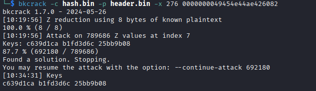

## Skeleton
### Đề bài
I zipped up a picture of the flag, but I forgot the password. Luckily, I saved the zip2john hash. Can you recover the image?

### Giải
Sau khi tải về thì được duy nhất file `hash.txt` nội dung như sau
```
flag.zip/flag.png:$pkzip2$1*1*2*0*12c*120*c8a6617a*0*26*0*12c*c8a6*81bd*36bee62e49e2b2c41f6260bdc2e5fdd8cabd38956eb51f1d8a48c8f6228fd7392a8c53f3199068e3017e11c65e32cd55ea33033ab8b2fb52c4f86373098af1732591290e5c99a2a74239243b67108f232def15a73aac1537e75a593abe81fb3a8b0338afeb00835c67f8a31896a5f73facd1f481fd5ebc8882b5b183819f9b71c89506b3ae7d17bc07ab187ece8413a88af072018ccdc8a2db425082cec0715fd5aa3b3c47bb4f5c93b397154eb2212ffd593d0e4e614d83dafba289710be2e538f4610e8cb53c025aa722bfe832ec4d6cbe33350c09b690c92560292893f72c7e9894a50efaaf9635d64c86b053053b861a00e1717d7b2b963782ea4fe407008153d2d0564e2cbe3792eaa0dacd611b9eaf9d3e7d5b54ab63ae9906b62c830ef4b873d954c25c22e8a221c9*$/pkzip2$:flag.png:flag.zip::flag.zip
```

Có thể thấy trường compression type = 0 tức là ảnh bên trong không được nén mà chỉ được lưu. File ảnh ban đầu kích thước `0x120` = 288 byte dữ liệu. Sau khi nén thì thành `0x12c` = 300 byte, tăng 12 byte = header ZipCrypto. Thực hiện lấy phần hash chuyển thành binary và lưu lại vào file `hash.bin`

Biết rằng ảnh PNG có header `89 50 4e 47 0d 0a 1a 0a 00 00 00 0d 49 48 44 52` ở đầu và footer `00 00 00 00 49 45 4E 44 AE 42 60 82` tại byte 288 - 12 = 276 nên thực hiện Known plaintext attack bằng bkcrack
```
echo '89504e470d0a1a0a0000000d49484452' | xxd -r -p > header.bin
bkcrack -c hash.bin -p header.bin -x 276 0000000049454e44ae426082
```



Sử dụng key `c639d1ca b1fd3d6c 25bb9b08` để trích xuất `flag.png`
```
bkcrack -c hash.bin -k c639d1ca b1fd3d6c 25bb9b08 -d flag.png
```


FLAG: **tjctf{1ts_4ll_ab0ut_th3_keys}**