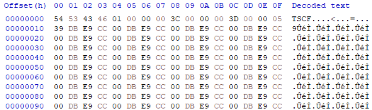
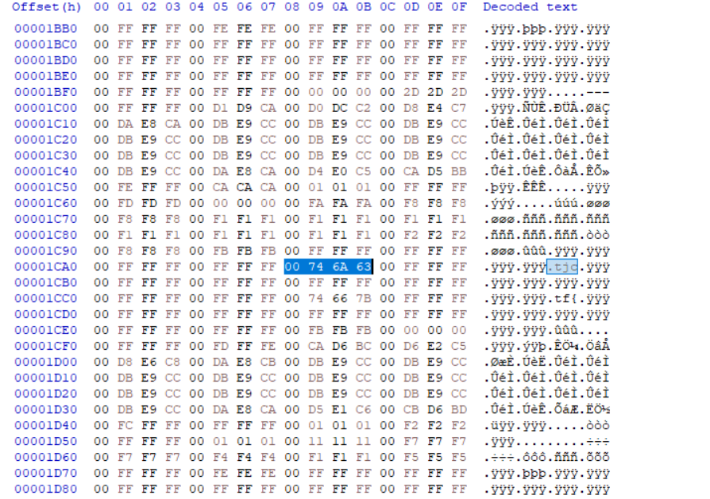

## thomas-schools-of-china
### Đề bài
I infiltrated our rival counterpart in china and found this file on one of the computers... never heard of this filetype before... hm.

### Giải
Khi tải về được file `chall.tsc` là định dạng lạ


QUa hex có thể thấy file chứa nhiều cụm 4 byte lặp lại khiến mình nghĩ đến đây là các giá trị RGBA của ảnh. Phần đầu file bắt đầu bằng header `TSCF`, kích thước `0x3C` * `0x3C` và giá trị điểm ảnh bắt đầu từ `0x10`. Thực hiện trích xuất ảnh này
``` python
import struct
from PIL import Image
 
with open("chall.tsc", "rb") as f:
    data = f.read()
 
width = struct.unpack_from("<H", data, 8)[0]
height = struct.unpack_from("<H", data, 12)[0]
pixel_data = data[16:]
 
img = Image.frombytes("RGBA", (width, height), pixel_data)
img.save("duck.png")
```


Hình ảnh có một số pixel màu xanh sẫm hơn bình thường. Khi kiểm tra hex thì có thấy 1 phần flag bên trong tại các giá trị g, b, a


Thực hiện trích xuất g, b, a của ảnh, lọc bỏ các pixel có giá trị g, b, a bằng nhau và các giá trị ASCII không in được. Chuyển kết quả thành thành ASCII và in ra
``` python
from PIL import Image

img = Image.open("duck.png")

flag_bytes = []
width, height = img.size

for y in range(height):
    for x in range(width):
        r, g, b, a = img.getpixel((x, y))

        if (g == b == a):
            continue
    
        flag_bytes.extend([g, b, a])

    
flag = "".join(chr(b) for b in flag_bytes if 32 <= b <= 126)
print(flag)
```

Chạy script thì tìm được flag 
```
[ZZJ%r8|=M'{:{?>;{7<=676?>===B>@?@@=?@@`)tjctf{c0ngr4ts_u_s0lv3d_my_f1st_CTF_chall!_btw_1_l1ke_b1rds}}=@<<z=|<}={>|9~;s:>x<|:@?=z;>|;};?|<|:{;|>>?@=|<;{;@>|;;@@={;{:?{<z?=??>{?>@k{?=HxW<|=
```

FLAG: **tjctf{c0ngr4ts_u_s0lv3d_my_f1st_CTF_chall!_btw_1_l1ke_b1rds}**