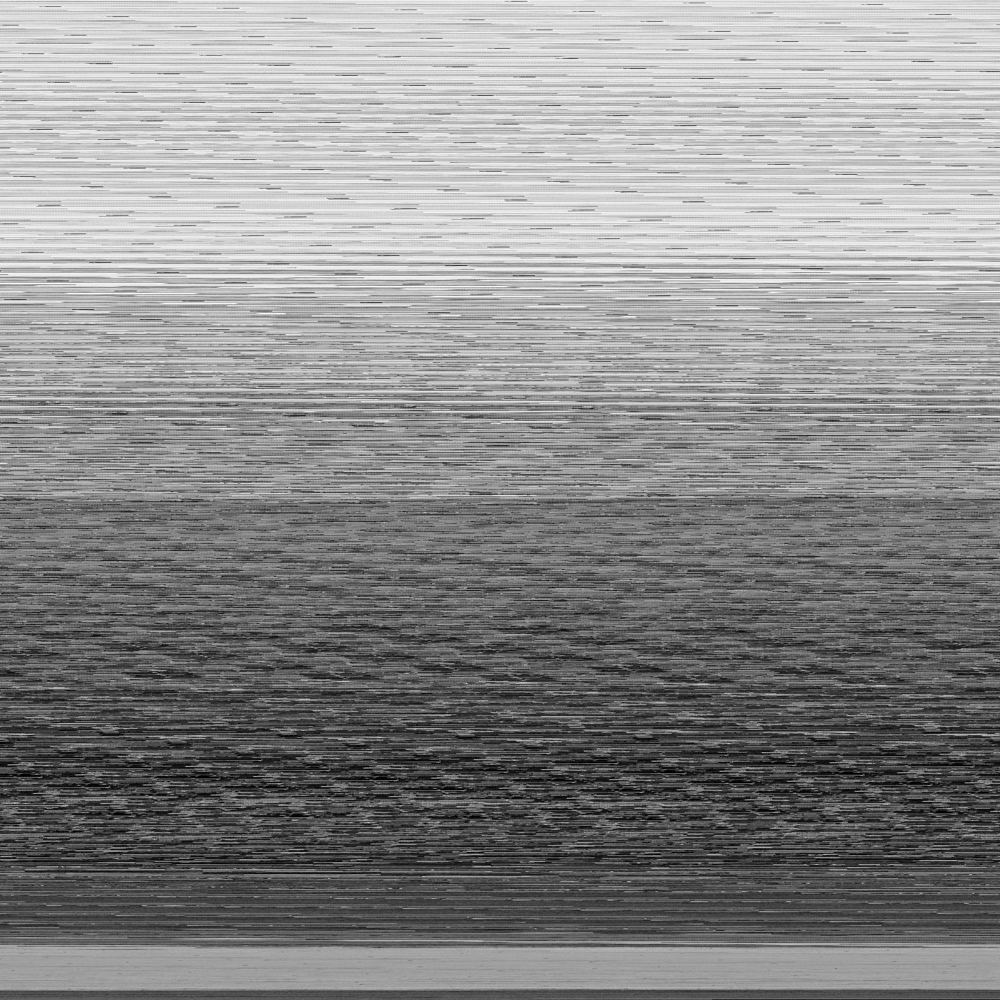
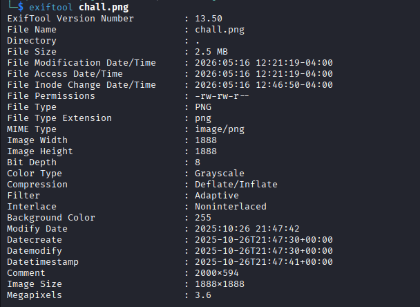
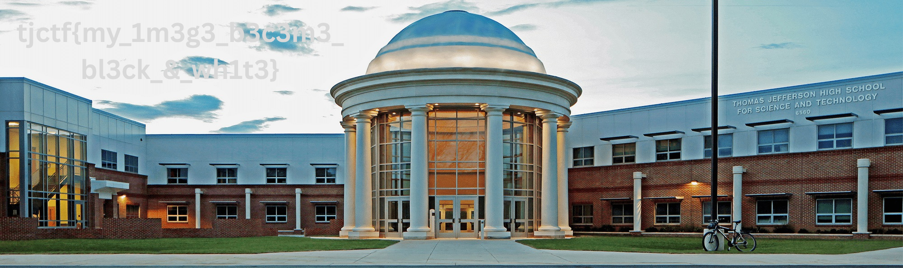

## triplets
### Đề bài
I was messing around with my image and it got really messed up... I see patterns...

### Giải
Sau khi tải về thì được ảnh `chall.png`


Sử dụng exiftool để xem metadata của ảnh thì phần comment có gợ ý về kích thước thật của ảnh là 2000 * 594


Ảnh chall.png là ảnh greyscale có tổng số byte dữ liệu thô là:
`1888 * 1888 * 1 = 3564544 bytes` 

Nếu ảnh gốc là ảnh RGB thì tổng số byte dữ liệu thô là:
`2000 * 594 * 3 = 3564000 bytes`

Viết scỉpt bỏ đi phần byte thừa và resize lại để khôi phục kỳ gốc
``` python
from PIL import Image

try:
    img = Image.open('chall.png')
    
    raw_bytes = img.tobytes()
    
    target_width = 2000
    target_height = 594
    required_bytes = target_width * target_height * 3
    
    rgb_payload = raw_bytes[:required_bytes]
    
    img_restored = Image.frombytes('RGB', (target_width, target_height), rgb_payload)
    
    output_name = "result.png"
    img_restored.save(output_name)
    

except Exception as e:
    print(Exeption occurs)  
```



FLAG: **tjctf{my_1m3g3_b3c3m3_bl3ck_&_wh1t3}**