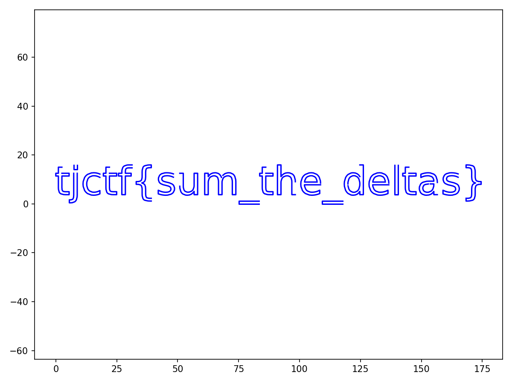

## delta-doodle
### Đề bài
i was calibrating the new AR airbrush for our maker faire booth by doodling the flag in midair. the headset, unfortunately, only logged the raw data. can you accumulate the motion trail and figure out what message we were trying to spray-paint?

### Giải
Tải về được file excel `trackpad_deltas` có các cột lưu thông tin thời gian, dx, dy, nhấc/ hạ bút. Viết script để vẽ lại theo log này
``` python
import pandas as pd
import matplotlib.pyplot as plt

df = pd.read_csv("trackpad_deltas.csv")

x, y = 0.0, 0.0
segments_x, segments_y = [[]], [[]]

for _, row in df.iterrows():
    if row["pen_down"] == 0:
        x += row["dx"]
        y += row["dy"]
        segments_x.append([])
        segments_y.append([])
    else:
        x += row["dx"]
        y += row["dy"]
        segments_x[-1].append(x)
        segments_y[-1].append(y)

plt.figure(figsize=(8, 6))
for sx, sy in zip(segments_x, segments_y):
    if sx:
        plt.plot(sx, sy, "b-", linewidth=1.5)

plt.axis("equal")
plt.tight_layout()
plt.savefig("output.png", dpi=150)
plt.show()
print("Saved")

```


FLAG: **tjctf{sum_the_deltas}**