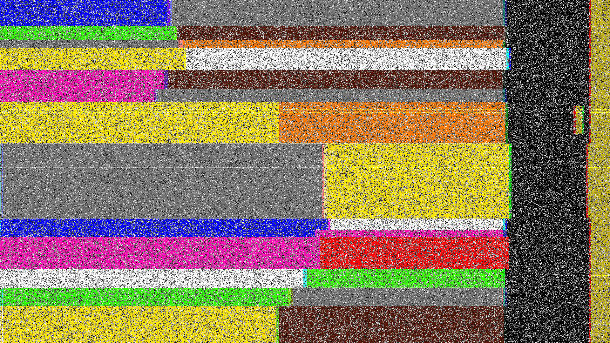

## g̵͕̗͑̅l̶̢̂̚ḭ̶̐͗t̴͔̞̒͐c̸̭͈̄h̷̨̞͊͠
### Đề bài
Do not resist the g̵͕̗͑̅l̶̢̂̚ḭ̶̐͗t̴͔̞̒͐c̸̭͈̄h̷̨̞͊͠. Wrap flag in tjctf{}

### Giải
Sau khi tải về thì có ảnh `g̵͕̗͑̅l̶̢̂̚ḭ̶̐͗t̴͔̞̒͐c̸̭͈̄h̷̨̞͊͠..png`


Ảnh sử dụng mã màu điện trở để mã hóa

>[!Note] 
> Trong điện tử, màu sắc trên điện trở tương ứng với chữ số:

| Màu | Chữ số |
| --- | ------ |
|Black| 0 |
|Brown|1|
|Red|2|
|Orange|3|
|Yellow|4|
|Green|5|
|Blue|6|
|Violet|7|
|Gray|8|
|White|9|

Dữ liệu được mã hóa bằng 1 cặp màu tạo thành số 2 chữ số chuyển thành ký tự ASCII. Kết quả:
``` python
digits = {
    "black": "0",
    "brown": "1",
    "red": "2",
    "orange": "3",
    "yellow": "4",
    "green": "5",
    "blue": "6",
    "violet": "7",
    "gray": "8",
    "white": "9",
}

pairs = [
    ("blue", "gray"),      # 68 -> D
    ("green", "brown"),    # 51 -> 3
    ("gray", "orange"),    # 83 -> S
    ("yellow", "white"),   # 49 -> 1
    ("violet", "brown"),   # 71 -> G
    ("violet", "gray"),    # 78 -> N
    ("yellow", "orange"),  # 43 -> +
    ("gray", "yellow"),    # 84 -> T
    ("blue", "white"),     # 69 -> E
    ("blue", "violet"),    # 67 -> C
    ("violet", "red"),     # 72 -> H
    ("white", "green"),    # 95 -> _
    ("green", "gray"),     # 58 -> :
    ("yellow", "brown"),   # 41 -> )
]

message = "".join(chr(int(digits[a] + digits[b])) for a, b in pairs)

print(message)
print(f"tjctf{{{message}}}")
```

FLAG: **tjctf{D3S1GN+TECH_:)}**