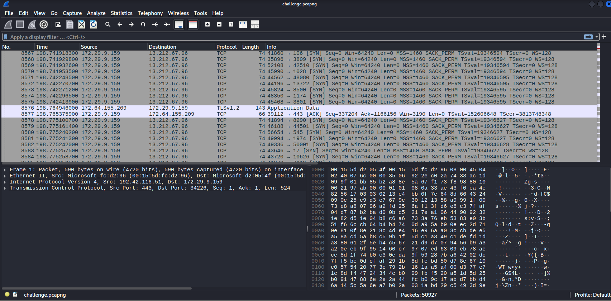
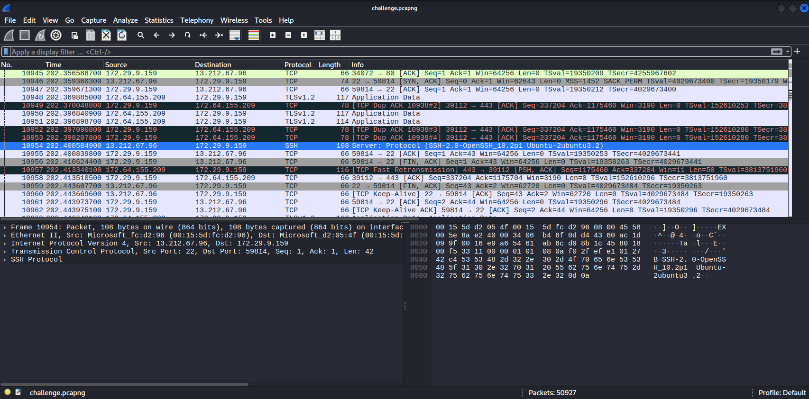
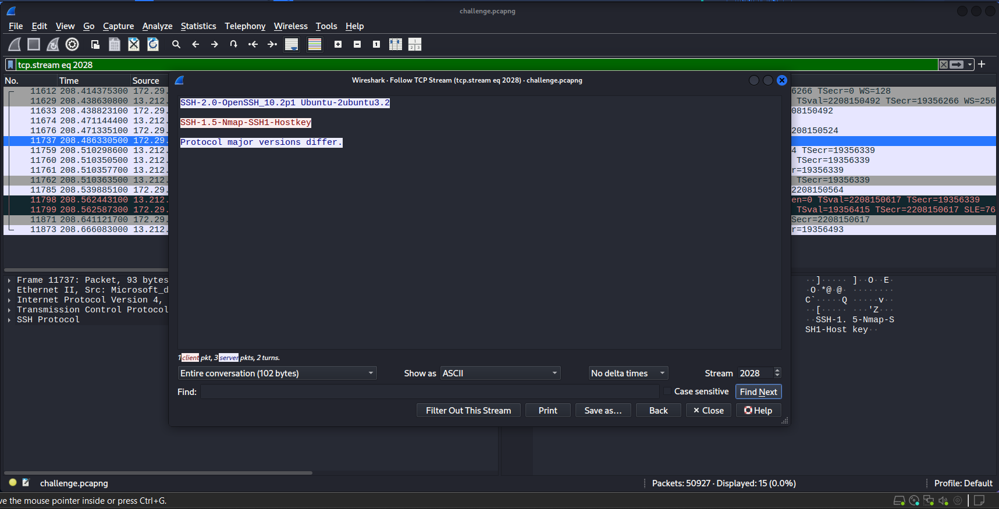
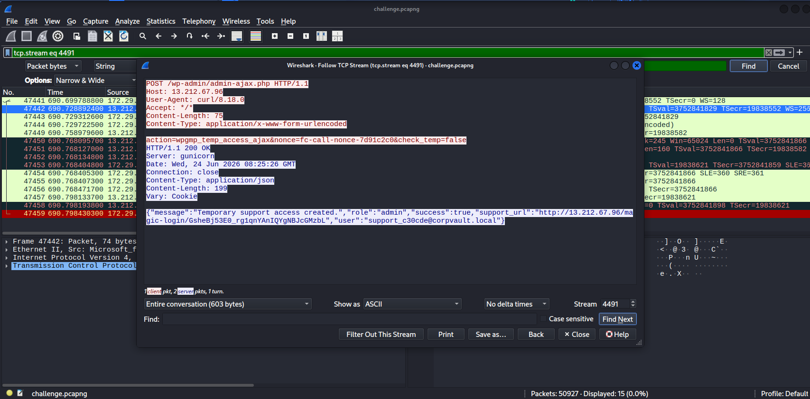
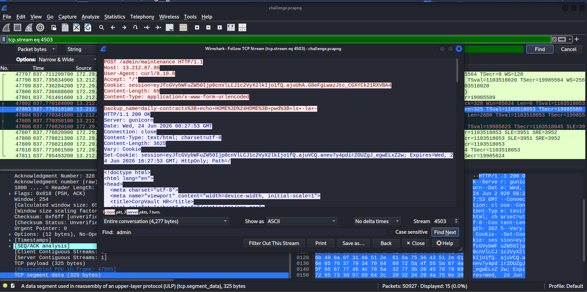
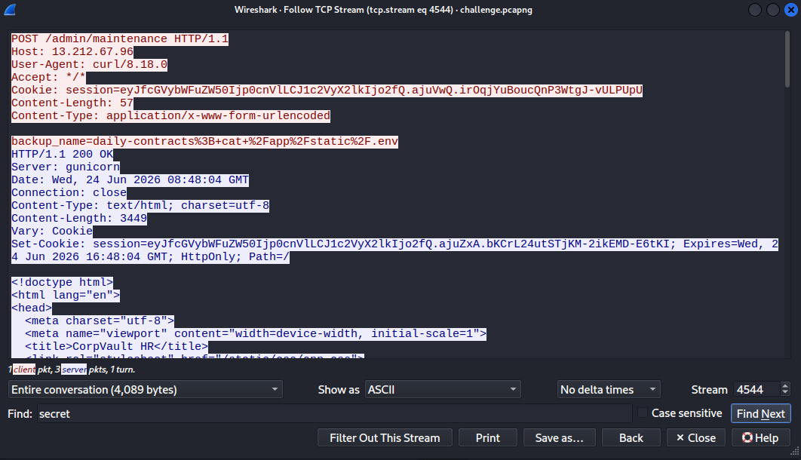
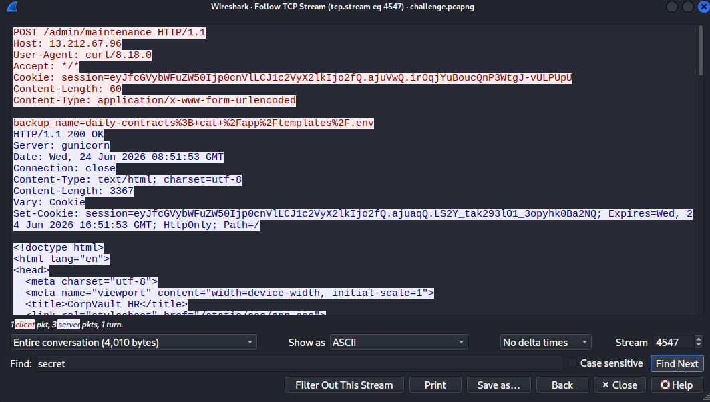

## BasicQnA
### Đề bài
An amateur attacker’s perspective. Answer all questions to get the flag.

### Giải
Đề bài cho 1 file `challenge.pcapng` cùng với đường dẫn đến trang web để trả lời câu hỏi

#### Question 1/9
- What are the attacker IP address and victim IP address?
- Format: attackerIP,victimIP

Có thể thấy có rất nhiều kết nối được khởi tạo từ ip `172.29.9.159` đến các cổng khác nhau của ip `13.212.67.96` (quét cổng giai đoạn reconnaissance)

Answer: **172.29.9.159,13.212.67.96**

#### Question 2/9
- What SSH service/version is running on the victim?
- Format: service_version distro_version

Sau giai đoạn quét cổng thì attacker mở kết nối ssh đến victim và victim trả về phiên bản ssh của server

Answer: **OpenSSH_10.2p1 Ubuntu-2ubuntu3.2**

#### Question 3/9
- What tool did the attacker use for reconnaissance?

Khi mở kết nối ssh thì attacker cung cấp phiên bản ssh của mình (Nmap)

Answer: **Nmap**

#### Question 4/9
- Which TCP stream shows that the attacker successfully created a temporary admin account?
- Format: tcp.stream eq XXXX

Tài khoản admin được tạo thông qua lỗ hổng plugin WordPress

Answer: **tcp.stream eq 4491**

#### Question 5/9
- What is the temporary admin account created by the attacker?
- Format: username@domain

Answer: **support_c30cde@corpvault.local**

#### Question 6/9
- What is the CVE of the abused technique?

Answer: **CVE-2026-8732**

#### Question 7/9
- Which user-controlled parameter in the backup feature was abused to achieve RCE?

Answer: **backup_name**

#### Question 8/9
- What are the two files that the attacker read to obtain the victim's information after gaining command execution?
- Format: path1,path2

Tìm theo cụm `cat+` thì được 3 file `/var/tmp/secret.txt`, `/app/templates/.env`, `/app/static/.env` trong đó `secret.txt` được tạo cùng lúc với RCE

Answer: **/app/templates/.env,/app/static/.env**

#### Question 9/9
- What is the found Github ID?
- final magic string

Answer: **Ich1ck3nPlus**

FLAG: **v1t{llm_c0uld_s0lv3_th1s_ez_chall3ng3!!!}**

