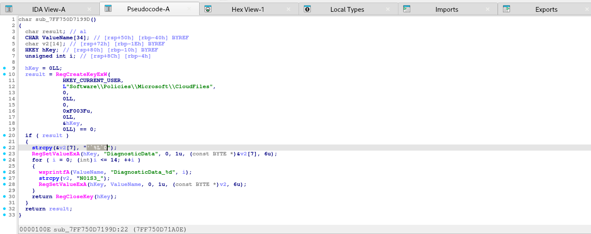
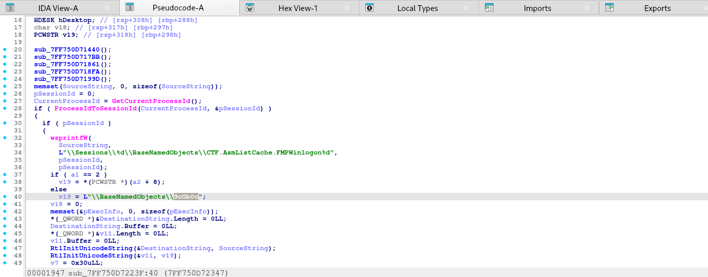
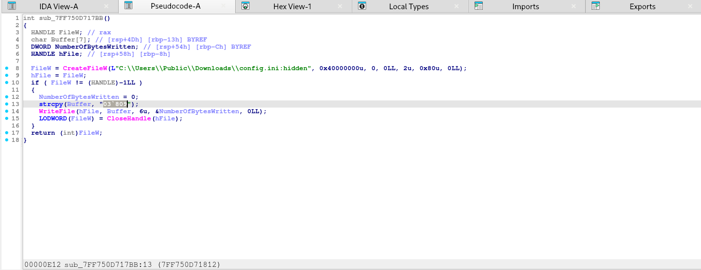
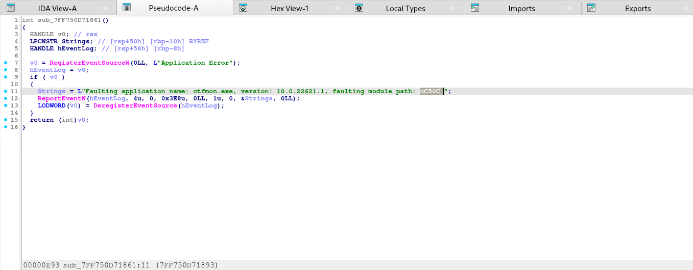
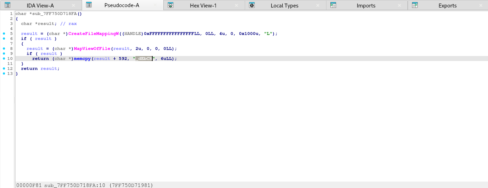

## Green Goblin
### Đề bài
The Green Goblin harnessed a secret Dark Energy to attack our system. Fortunately, our defenses froze his payload mid-execution, shattering his Dark Energy into 5 fragments scattered across the OS internals (R, KO, D, EL and M). Can you recover all 5 fragments and assemble them in the correct order to seal his power forever?

### Giải
Sau khi tải về và giải nén thì được file `GreenGoblin.raw` là file dump memory. Khi dùng `strings GreenGoblin.raw | grep "GreenGoblin"` thì xác định được các thông tin:
- file: `GreenGoblin (1).exe`
- path: `C:\Users\trtr5\Downloads\GreenGoblin (1).exe`

Xác định vị trí offset của file `GreenGoblin (1).exe` và thực hiện dump
```
# Xác định vị trí offset là 0xaa083c41b650
vol -f GreenGoblin.raw windows.filescan | grep -i "GreenGoblin" 

# dump file tại vị trí offset đó
vol -f GreenGoblin.raw windows.dumpfiles --virtaddr 0xaa083c41b650
```

Đưa file vào ida để thực hiện phân tích và dịch ngược, tại đây thì flag được tách thành 5 mảnh OS (R, KO, D, EL, M) được xác định như sau:
- R (Registry) `sub_7FF750D7199D`:

flag fragment: **'\`%L\`0**

- KO (Kernel Object) `sub_7FF750D7223F`:

flag fragment: **9cGb0c**

- D (ADS) `sub_7FF750D7177B`:

flag fragment: **03`809**

- EL (Event Log) `sub_7FF750D71861`:

flag fragment: **cC50C_**

- M (Memory) `sub_7FF750D718FA`:

flag fragment: **_dEbCN**

Ghép các mảnh lại:
```
'`%L`09cGb0c03`809cC50C__dEbCN
```

ROT47 thì được flag
FLAG: **V1T{1_h4v3_4_b1g_h4rd_r005t3r}**