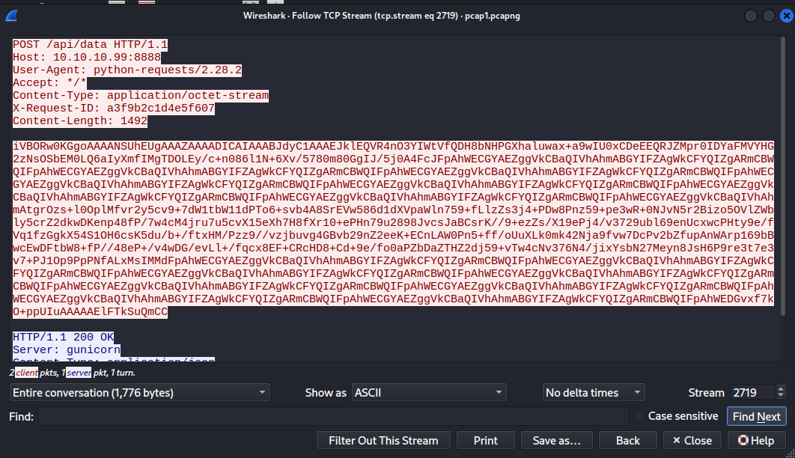
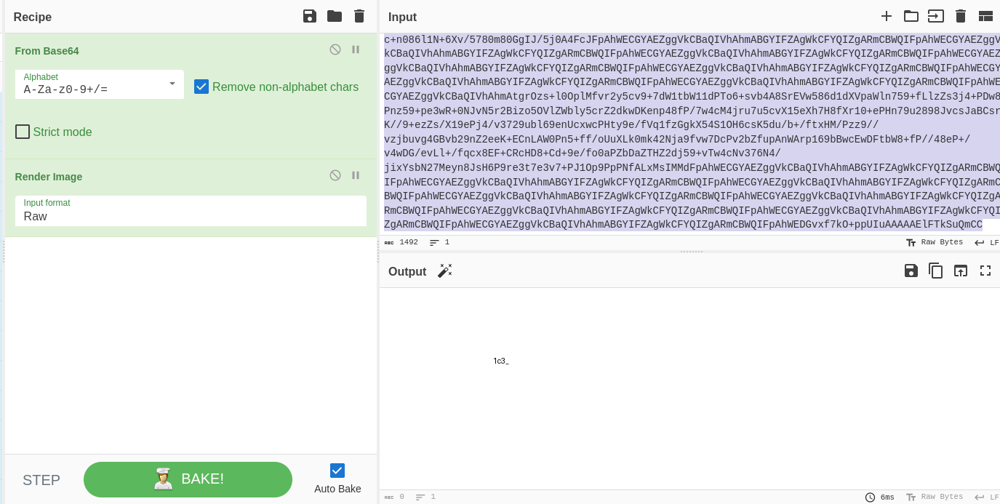
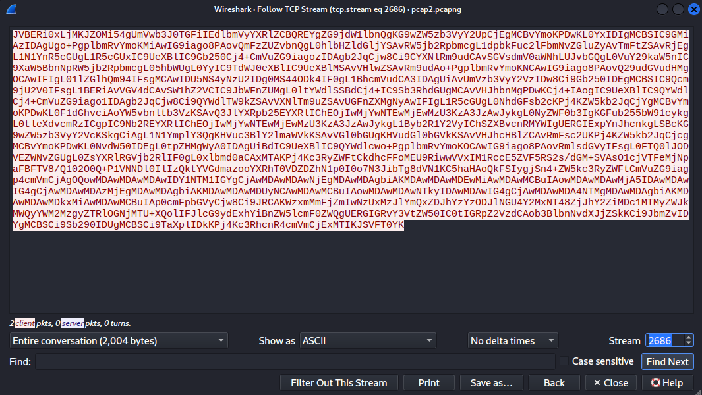
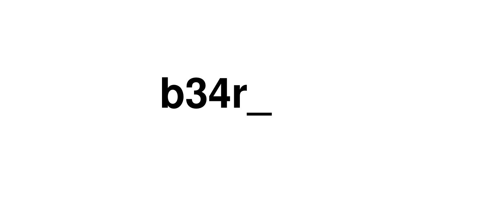
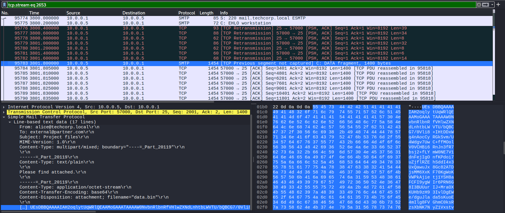
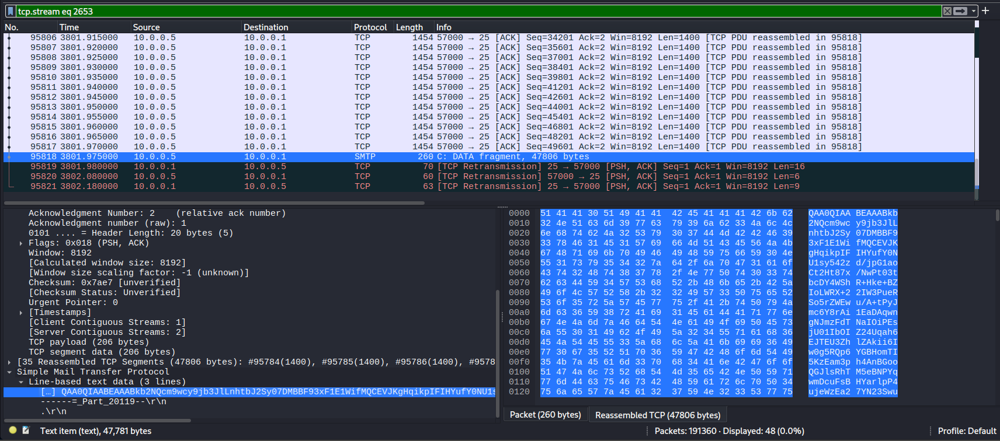
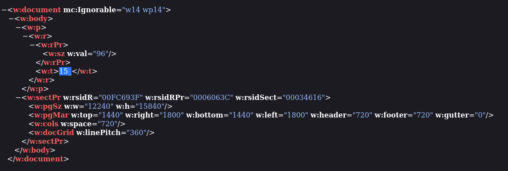
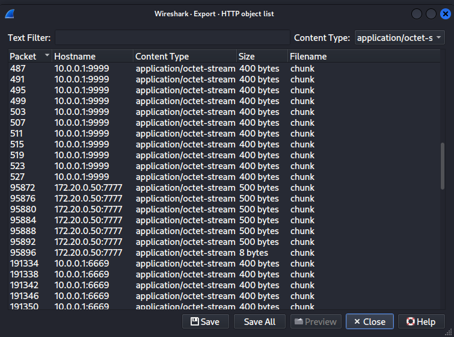
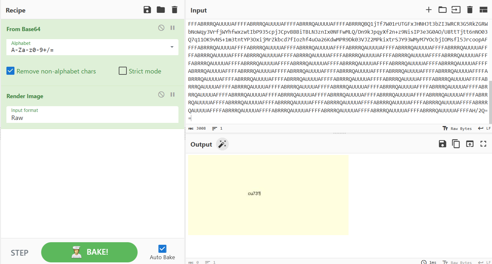

## Polar Fragment
### Đề bài
Fragments of evidence were recovered from a corrupted system and network captures.
Reconstruct what was hidden.

### Giải
Sau khi tải về thì được các file `challenge.E01`, `locked.zip`, `pcap1.pcapng`, `pcap2.pcapng`, `pcap3.pcapng`, `pcap4.pcapng`, `pcap5.pcapng`

#### file `challenge.E01`
Tại đây tìm được `investigation_notes` báo cáo điều tra hoạt động khả nghi tài khoản Alice
```
Bob's Investigation Notes
=========================
Found suspicious activity on Alice's account.
Checked $RECYCLE.BIN - saw some weird ZIP files.
photo_009.png flagged by StegAnalyzer but extract failed.
Tried passwords: whiskers2019, alice123, Tr0ub4dor
None worked on the encrypted_notes_backup.zip

TODO: Check FTP logs for outbound transfers
TODO: Analyze pcap files from Nov 14
TODO: Ask IT about SvcHost32 service

IMPORTANT: Key might be hidden in offset of one of the images
           Check hex editor on ALL images not just obvious ones
```

Tới `$RECYCLE.BIN` thì tìm được các file zip:
- `system_backup_nov.zip`
- `recovery_keys.zip`
- `encrypted_notes_backup.zip`
- `$IDOCBAK.zip`

Trong đó có `system_backup_nov` có thể giải nén mà không có mật khẩu (các file zip khác chỉ là decoy), tại đây tìm thấy file `large.zip` cùng với các bức ảnh `photo_001.png` đến `photo_0010.png`

Tại ảnh `photo_009.png` mà `investigation_notes` nhắc đến thực hiện strings thì tìm được cụm `ASCII-aGFoYV84Mzg2`, decrypt base64 đoạn phía sau thì được `haha_8386`


kiểm tra hex file `large.zip` thì file đã bị hỏng khi bị mất đi phần header và EOCD, sửa lại thì có thể mở khóa bằng password `haha_8386`. File nén chứa thư mục `inner` gồm ảnh, file nén `small.zip` và `README.txt` chứa gợi ý giải
```
The archive contains some interesting files.

Look carefully at all the images...
One of them is hiding something.
Chloe is our best friend and the house is where we met.

Good luck!
```

Sử dụng Opensteg để trích xuất thử từng ảnh trong `inner`: `panda.png`, `nomnom.png`, `house.png`, `icy.png`, `chloe.png` và `grizzly.png`

- tại ảnh `icy.png` trích xuất được `flag.txt` chứa 1 phần flag

FLAG FRAGMENT: **V1t{d0_**

- tại ảnh `chloe.png` thì chứa `key.txt` có nội dung `z3v\4k2mh\`
- tại ảnh `house.png` thì trích xuất được `Screenshot 2026-05-10 121445.png` gợi ý sử dụng XOR


Sử dụng key đã tìm được và XOR bruteforce thì tìm được 1 phần flag khi XOR với `0x03`

FLAG FRAGMENT: **y0u_7h1nk_**

#### file `pcap5.pcapng`
Tại đây tìm được các luồng HTTP được gửi từ `172.16.0.5` đến `10.10.10.50` là các giá trị 0 và 1, dịch từ binary thì được cụm `hihi_6969`
``` python
from scapy.all import rdpcap

packets = rdpcap("pcap5.pcapng")

payload = b""

for packet in packets:
    if packet.haslayer('TCP') and packet.haslayer('IP'):
        if packet['IP'].src == '172.16.0.5' and packet['IP'].dst == '10.10.10.50':
            if packet.haslayer('Raw'):
                raw_bytes = packet['Raw'].load

                parts = raw_bytes.split(b"\r\n\r\n", 1)
                body = parts[1].strip()
                payload += body


with open('payload5', 'wb') as f:
    f.write(payload)
```

Sử dụng cụm tìm được thì có thể mở khóa `locked.zip` chứa `hint.txt` có nội dung gợi ý
```
Congratulations! You found the key.
There is something hidden in 4 PCAP files. Look carefully into them.

Good luck!
```

#### file `pcap1.pcapng`
Tại đây tìm được các luồng HTTP trong đó tìm được raw của bức ảnh được mã hóa base64, khôi phục thì tìm được 1 phần flag



FLAG FRAGMENT: **1c3_**

#### file `pcap2.pcapng`
Tại đây tìm được các luồng FTP trong đó có lệnh `STOR secret_data.bin`, nội dung của `secret_data.bin` cũng đã được mã hóa base64, giải mã thì được file pdf chứa 1 mảnh flag



FLAG FRAGMENT: **b34r_**

#### file `pcap3.pcapng`
Tại đây tìm được các luồng SMTP trong đó có file `data.bin` được truyền thông qua MIME
>[!Note] 
>SMTP cổ điển là một giao thức 7-bit ASCII nên để có thể truyển file ảnh, tệp tin thì cần MIME. MIME thực hiện mã hóa base64 nội dung file, thêm header để SMTP có thể gửi đi

Ghép payload của 2 gói tin và decrypt thì được file `.docx`, binwalk thì tại `document.xml` chứa 1 phần flag




FLAG FRAGMENT: **15_**

#### file `pcap4.pcapng`
Tại đây có rất nhiều luồng HTTP POST gửi đến `/api/chunk`, các object được chia thành nhiều phần nên cần dựa vào `X-Chunk-Index` và `X-Chunk-Total` để khôi phục. Sử dụng src, des IP, des port để nhóm các gói tin của 1 object


``` python
from scapy.all import rdpcap
import re
import os

os.makedirs("./payload4", exist_ok=True)
packets = rdpcap("pcap4.pcapng")

groups = {}

for packet in packets:
    if packet.haslayer('TCP') and packet.haslayer('IP') and packet.haslayer('Raw'):
        raw_bytes = packet['Raw'].load
        
        if b"POST /api/chunk" in raw_bytes:
        
            flow_id = f"{packet['IP'].src}:{packet['IP'].dst}:{packet['TCP'].dport}"
            
            raw_text = raw_bytes.decode('utf-8', errors='ignore')
            
            idx_match = re.search(r"X-Chunk-Index:\s*(\d+)", raw_text)
            total_match = re.search(r"X-Chunk-Total:\s*(\d+)", raw_text)
            
            
            chunk_idx = int(idx_match.group(1))
            chunk_total = int(total_match.group(1))
                
            parts = raw_bytes.split(b"\r\n\r\n", 1)
            if len(parts) > 1:
                body = parts[1].strip()
                    
                group_key = (flow_id, chunk_total)
                if group_key not in groups:
                    groups[group_key] = {}
                    
                groups[group_key][chunk_idx] = body
                

for (flow_key, total), chunks in groups.items():
    
    sorted_fragments = b""

    for idx in sorted(chunks.keys()):
        sorted_fragments += chunks[idx]

    flow_key = flow_key.replace(":", "_")

    with open(f"./payload4/fragment{flow_key}", "wb") as f:
        f.write(sorted_fragments)
```

Sau khi chạy thì có `fragment172.20.0.5_172.20.0.50_7777` sau decrypt base64 thì được ảnh JPEG chứa mảnh flag cuối


FLAG FRAGMENT: **cu73?}**

ghép các mảnh lại thì được flag
FLAG: **V1t{d0_y0u_7h1nk_1c3_b34r_15_cu73?}**