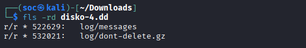

## DISKO 4
Sau khi tải về và giải nén thì được file `disko-4.dd`.
Do đề bài có nhắc đến file đã bị xóa nên sử dụng lệnh `fls -rd` để liệt kê ra các file bị xóa


Trong đó file `log/messages` đã bị ghi đè một phần/cấu trúc bị phá vỡ dẫn đến không thể khôi phục. Thực hiện khôi phục file `log/dont-delete.gz` và giải nén thì thu được file text và bên trong chứa flag
```
icat disko-4.dd 532021 > deleted.gz

gunzip -d deleted

cat deleted
#Here is your flag
#picoCTF{d3l_d0n7_h1d3_w3ll_4b0a805d}
```
FLAG: **picoCTF{d3l_d0n7_h1d3_w3ll_4b0a805d}**