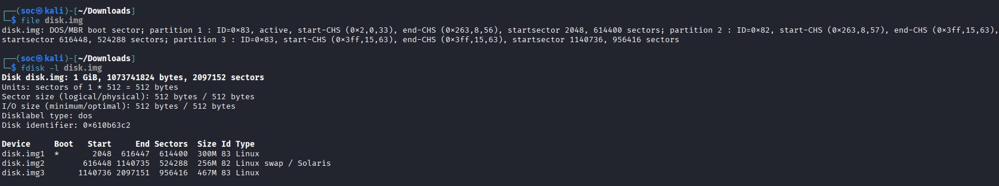
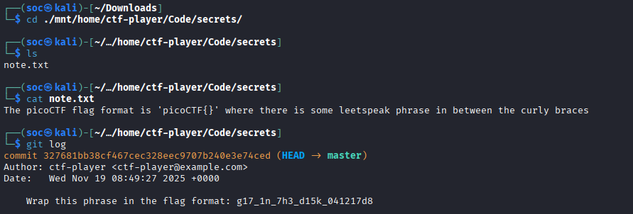

## Forensics Git 0
Sau khi tải về và giải nén thì được file `disk.img`
Kiểm tra `disk.img` thì đây là một disk image sử dụng bảng phần vùng chuẩn MBR, gồm 3 phân vùng. Trong đó phân vùng 3 là lớn nhất nên có thể đây chính là phân vùng Root File System (/)



Thực hiện tính `offset = Start_sector * Sector_size` (với MBR thì Sector_size=512) và mount phân vùng 3 ra file `mnt`
```
mkdir mnt
sudo mount -o loop,offset=584056832 disk.img mnt/
```


Do đề bài có nhắc đến git khiến mình nghĩ đến tìm file `.git` trong ổ đĩa:
```
find . -name ".git" -type d 2>/dev/null        
#./mnt/home/ctf-player/Code/secrets/.git
```


Di chuyển đến file `secrets`, tại đây có 1 file `note.txt`, thực hiện trích xuất file này thì được hướng dẫn format flag. Sử dụng `git log` để xem lại lịch sử commit thì thu được flag


FLAG: **picoCTF{g17_1n_7h3_d15k_041217d8}**
