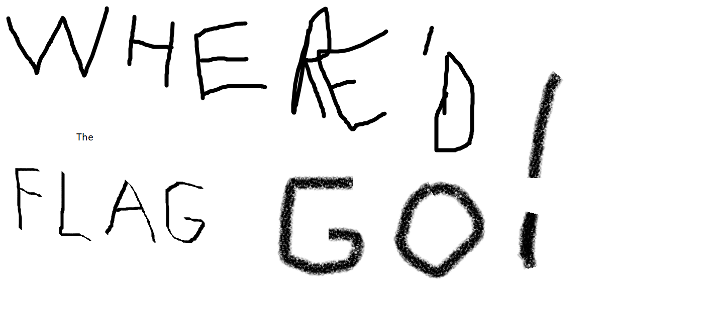
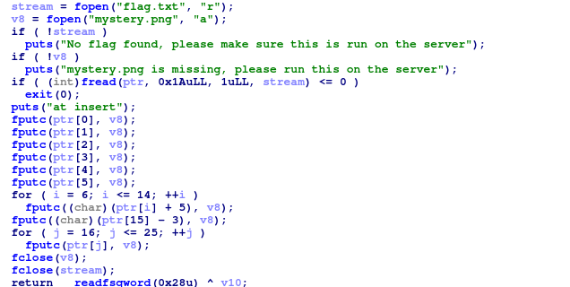
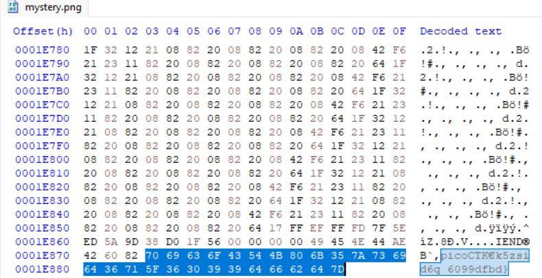

## Investigative Reversing 0
### Đề bài
We have recovered a binary and an image. See what you can make of it. There should be a flag somewhere.

### Giải
Sau khi tải về thì được file `mystery` là file thực thi ELF và file `mystery.png`.


Sử dụng IDA dịch ngược file `mystery`. Chương trình thực hiện đọc file `flag.txt` và ghi vào cuối file `mystery.png` theo quy tắc sau:
- index 0-5: ghi trực tiếp ký tự từ `flag.txt`
- index 5-14: ghi ký tự từ `flag.txt` được tăng 5 giá trị
- index 15: ghi ký tự từ `flag.txt` được giảm 3 giá trị
- index 16-25: ghi trực tiếp ký tự từ `flag.txt` 



Mở ảnh bằng HXD thì tìm thấy phần flag được xáo


Viết script khôi phục flag
```python
data = b"\x70\x69\x63\x6F\x43\x54\x4B\x80\x6B\x35\x7A\x73\x69\x64\x36\x71\x5F\x36\x30\x39\x39\x64\x66\x62\x64\x7D"

flag = ""

for i in range (0, 6):
    flag += chr(data[i])

for i in range (6, 15):
    flag += chr(data[i] - 5)

flag += chr(data[15] + 3)

for i in range (16, 26):
    flag += chr(data[i])

print(flag)
```

FLAG: **picoCTF{f0und_1t_6099dfbd}**