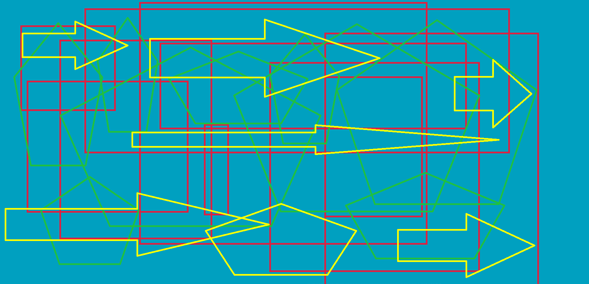
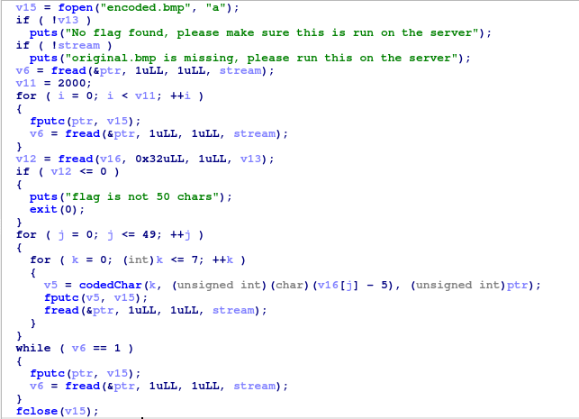
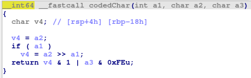

## Investigative Reversing 0
### Đề bài
We have recovered a binary and an image See what you can make of it. There should be a flag somewhere.

### Giải
Sau khi tải về thì được file `mystery` là file thực thi ELF và file `encoded.bmp`.


Sử dụng IDA dịch ngược file `mystery`. Chương trình thực hiện ẩn file `flag.txt` vào `original.bmp` tạo thành `encoded.bmp` từ byte index 2000


Chương trình ẩn tin theo LSB: lấy từng giá trị ASCII của `flag.txt` trừ đi 5 rồi thay vào bit cuối từ byte 2000 đến byte 2000 + 50 * 8 = 2400


Viết script trích xuất flag
```python
with open("encoded.bmp", "rb") as f:
    f.seek(2000)
    data = f.read(400)

flag = ""
for j in range(50):
    char_code = 0
    for k in range(8):
        bit = data[j * 8 + k] & 1
        char_code |= (bit << k)
    
    flag += chr(char_code + 5)

print(flag)
```

FLAG: **picoCTF{n3xt_0n300000000000000000000000009e6b130d}**
