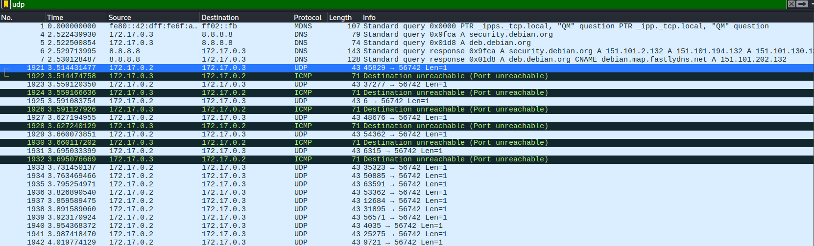
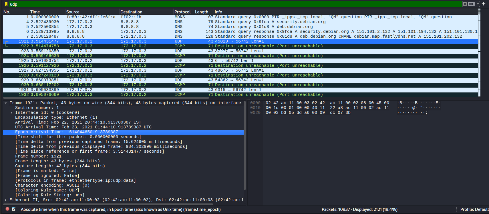
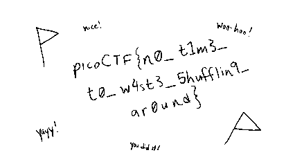

## Scrambled-bytes
### Đề bài
I sent my secret flag over the wires, but the bytes got all mixed up!

### Giải
Sau khi tải về thì được file `send.py` và `capture.pcapng`. Script `send.py` này nhận vào IP và port đích cùng với input, thực hiện lấy seed ngẫu nhiên dựa trên thời gian và thực hiện trộn các byte input, mỗi byte này được XOR ngẫu nhiên với 1 số từ 0 đến 255 và được gửi đi dưới dạng gói tin UDP với sport ngẫu nhiên.
``` python
#send.py

import argparse
from progress.bar import IncrementalBar

from scapy.all import *
import ipaddress

import random
from time import time

def check_ip(ip):
  try:
    return ipaddress.ip_address(ip)
  except:
    raise argparse.ArgumentTypeError(f'{ip} is an invalid address')

def check_port(port):
  try:
    port = int(port)
    if port < 1 or port > 65535:
      raise ValueError
    return port
  except:
    raise argparse.ArgumentTypeError(f'{port} is an invalid port')

def main(args):
  with open(args.input, 'rb') as f:
    payload = bytearray(f.read())
  random.seed(int(time()))
  random.shuffle(payload)
  with IncrementalBar('Sending', max=len(payload)) as bar:
    for b in payload:
      send(
        IP(dst=str(args.destination)) /
        UDP(sport=random.randrange(65536), dport=args.port) /
        Raw(load=bytes([b^random.randrange(256)])),
      verbose=False)
      bar.next()

if __name__=='__main__':
  parser = argparse.ArgumentParser()
  parser.add_argument('destination', help='destination IP address', type=check_ip)
  parser.add_argument('port', help='destination port number', type=check_port)
  parser.add_argument('input', help='input file')
  main(parser.parse_args())
```

Mở `capture.pcapng` thì có thể thấy có rất nhiều gói tin UDP với len=1 chính là những gói tin chứa byte của input từ script `send.py`


Để khôi phục input ban đầu thì cần xác định seed (dựa vào time của gói tin đầu tiên được gửi đi) và từ đó đảo ngược quá trình trộn của `send.py`

Epoch Arrival Time: `1614044650.913789387`


Script khôi phục input ban đầu
``` python
from scapy.all import rdpcap
import random

arrival_time = 1614044650.913789387

packets = rdpcap("capture.pcapng")

payload = []

for packet in packets:
    if packet.haslayer('UDP') and packet.haslayer('IP') and not packet.haslayer('ICMP'):
        if packet['IP'].src == '172.17.0.2' and packet['IP'].dst == '172.17.0.3':
            if packet.haslayer('Raw') and len(packet['Raw'].load) > 0:
                payload.append(packet['Raw'].load[0])
            else:
                payload.append(0)


random.seed(int(arrival_time))

control = [i for i in range(len(payload))]
random.shuffle(control)

decoded = bytearray([0 for i in range(len(payload))])

for i in range(len(payload)):
    port = random.randrange(65536)

    decoded[control[i]] = payload[i]^random.randrange(256)

with open('decoded', 'wb') as f:
    f.write(decoded)
```

Dùng file kiểm tra `decoded` thì đây là ảnh PNG trắng đen, thay đổi extension và mở ảnh thì tìm được flag


FLAG: **picoCTF{n0_t1m3_t0_w4st3_5hufflin9_ar0und}**


